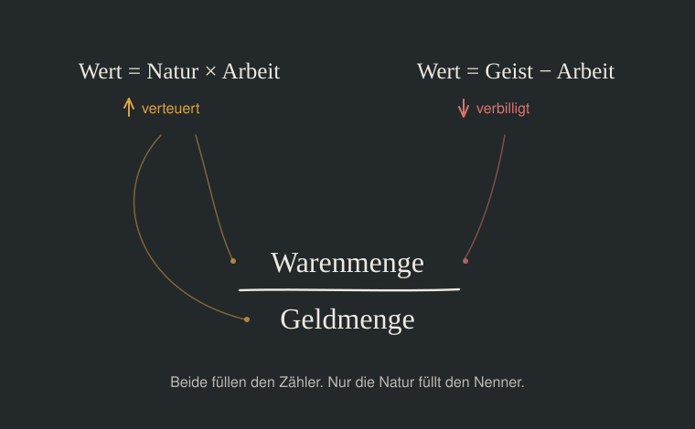

# Das Korn — Eine digitale Währung für die soziale Dreigliederung nach Rudolf Steiner

<!-- version: 1. September 2026 | Arbeitsstand -->

---

## I. Warum eine neue Währung Sinn macht?

### Warum überhaupt eine neue Währung?

Weil das heutige Geld lügt.

Alle Waren altern. Brot wird hart, Holz verrottet, Maschinen verschleißen. Nur das Geld macht diesen Verzehr nicht mit — es nutzt sich nicht ab. Damit verschafft es sich einen Vorteil gegenüber allem, was es angeblich abbildet. Wer Geld hortet, gewinnt; wer Waren hat, verliert. Das ist keine Marktverzerrung, sondern eine systematische Verzerrung im Fundament: Die Bilanz, die Regeln der doppelten Buchführung selbst tun so, als hätten Vermögenswerte einen festen Geldwert, der sich nie verzehrt. Keine Abschreibungen nach drei oder 30 Jahren. Geld, das nicht altert, wie ein Holzschuppen, der auf dem Hof verrottet, wird immer mehr Wert, ohne einen Beitrag zu leisten.

Daraus folgt alles Weitere. Der *Zins* — denn wer Geld verleiht, gibt etwas Beständiges weg und verlangt einen Preis für diesen Verzicht. Die *Spekulation* — denn was nicht altert, lässt sich stapeln und gegen die Zeit ausspielen. Das Sparen, Investieren, die Schatzbildung — denn wer genug hat, braucht nichts mehr zu tun, und das Geld "arbeitet" für ihn. Und am Ende die Entkopplung: Eine Geldmenge, die sich von dem löst, was sie abbilden soll, bis niemand mehr weiß, was ein Preis eigentlich aussagt.

Diese Diagnose ist nicht neu. Rudolf Steiner hat sie 1922 gestellt — in vierzehn Vorträgen über Nationalökonomie, in denen er nicht nur die Krankheit beschreibt, sondern auch die Therapie. Was er damals entwarf, war eine Währung, die altert wie die Waren, die sie abbildet, die drei Verwendungsarten kennt und die nicht vom Staat, sondern von wirtschaftlichen Gemeinschaften getragen wird. Die nicht in Zentralbanken geschaffen wird, sondern an der Naturgrundlage entspringt. Was ihm fehlte, war ein Medium, das diese Idee verwirklichen konnte.

Hundert Jahre später gibt es dieses Medium.

### Warum digital?

Steiner wollte, dass das Geld altert wie die Waren. Er verwarf aber sofort den bürokratischen Weg: Coupons, die abgerissen werden müssten, Ämter, die abstempeln — „dadurch würde ein sehr komplizierter bürokratischer Apparat herauskommen." Stattdessen wollte er, „dass der reale Verlauf der Dinge von selbst diese Wertigkeit bewirkt."

Programmierbares Geld ist genau dieses *von selbst*. Alterung und Auffrischung werden zu Protokollereignissen, die auf ökonomische Tatsachen reagieren, nicht auf Amtsgänge. Die digitale Form ist nicht Mittel zum Zweck — sie ist die Bedingung dafür, dass dieser Kerngedanke überhaupt verwirklicht werden kann.

Bitcoin und Ethereum haben bewiesen, dass eine staatsfreie Weltwährung technisch möglich ist. Aber sie sind in drei Punkten das genaue Gegenteil der Währung, die Steiner meint. Ihre Knappheit stammt nicht aus Fruchtbarkeit, sondern aus verbranntem Strom (Bitcoin, Proof of Work) bzw. aus hinterlegtem Kapital (Ethereum, Proof of Stake) — Geld schöpfen darf, wer schon welches hat. Sie belohnen das Halten statt das Geld altern zu lassen (Hortungsprämie statt Schwundgeld). Und sie sind restlos handelbar, statt an Menschen und deren Fähigkeiten gebunden zu sein (Fungibilität statt Kaufgeld, Leihgeld, Schenkungsgeld).

Bitcoin und Ethereum haben das Geld vom Staat gelöst — und es dabei umso vollständiger dem Kapitalmarkt überlassen (ETFs, Staking-Rendite, tokenisierte Staatsanleihen). Die Währung, die hier vorgestellt wird, löst es von beidem.

Ein weiterer wichtiger Aspekt dieser Währung wird sein, dass man als Käufer und Verkäufer anonym bleiben kann, und trotzdem kaufen und verkaufen und Steuern an den Staat bezahlen kann. Dazu später mehr. 

### Warum die Naturgrundlage als Basis für die Währung?

Weil der Anker etwas sein muss, das niemand beschließen kann.

Jede Währung hat eine Stelle, an der festgestellt wird, wie viel Geld es gibt. Beim heutigen Geld ist es ein Gremium, das setzen und verstellen kann. Bei Bitcoin ist es eine Zahl im Protokoll — die kann niemand verstellen, dafür weiß sie von der Welt auch nichts. Ein Anker darf weder das eine sein noch das andere: nicht beschließbar und trotzdem eine Aussage.

Steiner sucht deshalb nicht nach einer Zahl, sondern nach einem Bestand: Geld könne nichts anderes sein „als lediglich ein Ausdruck für die Summe der brauchbaren Produktionsmittel, die in irgendeinem Gebiet sind" — und eben diese Summe sei „die einzige gesunde Währung." Der Schwerpunkt liege vorzugsweise bei Grund und Boden, denn die Maschine habe eine begrenzte Lebensdauer und müsse aufgezehrt werden, der Boden nicht.

Was wir Naturgrundlage nennen, ist dieser bleibende Kern: der Teil, den kein Beschluss vermehrt und keine Abschreibung verzehrt. Der Ertrag des Feldes, das geförderte Erz, das geborene Kalb. Wie weit dieser Kern genau reicht — ob Maschinen dazugehören oder nicht — ist eine Frage der Abgrenzung, und sie wird in Kapitel II.4 beantwortet.

Entscheidend ist hier nur die eine Eigenschaft: Die Ernte lässt sich nicht vorhersagen. Was man vorhersagen kann, kann man ausrechnen, und wovor man sich rechtzeitig stellen kann, davon lebt die Spekulation. Die Unberechenbarkeit der Natur ist kein Mangel des Ankers. Sie ist sein Sinn.

Wie eine solche Währung aussehen würde, sagt Steiner selbst: Statt eines Goldgehalts solle auf dem Geld ein Naturwert stehen. Er wählt dafür ein Beispiel und schreibt es an die Tafel: so und so viel Weizen. Der Name der neuen Währung war damit, denke ich, schon vorgegeben. Für diesen Text heißt sie „Korn".

### Was ist mit den vielen anderen Versuchen?

Es hat sie gegeben, und einige haben funktioniert. Sie sind ein wichtiges Lernfeld. 

Was hat Korn, was sie nicht haben? Fast alle diese Versuche haben genau eine Eigenschaft des Geldes verändert und die übrigen gelassen. Meist war es die Alterung, manchmal die Regionalität, manchmal die Art der Ausgabe. Die beiden Eigenschaften, auf die es ankommt, blieben unberührt: der leere Anker und die Handelbarkeit. Wer nur eine Schraube dreht, bekommt ein besseres altes Geld — kein anderes.

**[Silvio Gesell](→)** hat das Altern erfunden: Geld mit Umlaufgebühr, das nicht mehr gehortet werden kann — aber es blieb frei handelbar und ohne Anker, und die Menge sollte eine Behörde nach Preisindex steuern.

**[Wörgl](→)** hat 1932 bewiesen, dass Schwundgeld in der Wirklichkeit funktioniert — es war jedoch ein Gutschein auf hinterlegte Schillinge, hatte also keine eigene Deckung, und die Nationalbank konnte es deshalb mit einem Federstrich beenden.

**[Der Chiemgauer](→)** bringt Regionalität und Umlaufgebühr zusammen und läuft seit über zwanzig Jahren stabil — aber er ist eins zu eins in Euro gedeckt und in Euro rücktauschbar, also ein Euro mit anderem Verhalten, keine eigene Währung.

**[Bristol Pound](→)** hat gezeigt, dass eine Regionalwährung eine ganze Stadt erreichen kann, inklusive Steuern und Nahverkehr — und er ist 2020 daran gestorben, dass ein Pfund-gedeckter Gutschein keinen Grund liefert, ihn zu behalten, wenn die Begeisterung nachlässt.

**[WIR Bank](→)** ist der langlebigste Beweis überhaupt: seit 1934 zinsfreie Verrechnung zwischen Schweizer Betrieben, nachweislich antizyklisch — aber der WIR-Franken altert nicht, hängt am Schweizer Franken und ist reine Binnenverrechnung ohne eigene Wertaussage.

**[Tauschringe](→)** machen sichtbar, dass Geld nichts weiter ist als Buchhaltung über gegenseitige Leistung — und sie bleiben klein, weil eine Buchhaltung ohne Anker und ohne Frist niemanden erreicht, der davon leben muss.

**[Terra TRC](→)** von Bernard Lietaer kommt dem Korn am nächsten: ein Warenkorb als Deckung, dazu eine Umlaufgebühr — aber der Korb bestand aus börsengehandelten Rohstoffen, deren Preise genau das tun, was ein Anker nicht tun darf, und die Währung war als handelbare Handelsreferenz gedacht und ist nie gestartet.

**[Grassroots Economics / Sarafu](→)** hat als einziges Projekt eine echte Deckung: die Leistungszusagen der beteiligten Produzenten, im Alltag kenianischer Gemeinden über Jahre erprobt — aber gedeckt wird durch das, was Menschen versprechen, nicht durch das, was die Natur gibt, und damit hängt der Anker wieder an Entscheidungen.

**[Circles / Aboutcircles](→)** bindet das Geld an Menschen statt an Konten — jeder gibt seine eigene Währung aus, Vertrauen verbindet sie, und sie altert sogar — aber ausgegeben wird pro Person und nicht an einer Naturgrundlage, und über Tauschbörsen wurde daraus schnell wieder ein handelbarer Kurs.

Was das Korn von jedem dieser Versuche unterscheidet, ist deshalb nicht eine Eigenschaft, sondern die Kombination: Es altert *und* es hat einen Anker, den niemand beschließen kann, *und* es ist nicht handelbar.

## II. Die Eigenschaften des "Korn"

### 1. Korn entsteht an der Naturgrundlage und es altert

Jede Einheit trägt ein Ablaufdatum — digital aufgedruckt und im Protokoll geführt. Mit jedem Tag schrumpft die Restlaufzeit. Am Ende erlischt die Einheit. „Immer-näher-Kommen seinem Sterben" nennt Steiner das, und gerade dadurch werde dem Geld ein Wert aufgedrückt „wie dem Menschen durch sein Altwerden". Damit hört das Geld auf, die Ausnahme zu sein. Es altert allerdings anders als das Brot. Was altert, ist nicht der Betrag. Ein Korn mit zwei Jahren Restlaufzeit kauft dieselbe Menge Brot wie ein frisch ausgegebenes. Was schrumpft, ist allein die Restlaufzeit — und damit die Reichweite in der Zeit. Ein Vorhaben auf zwanzig Jahre lässt sich nicht mit Korn finanzieren, das in fünf Jahren erlischt.

Die Geldmenge im Korn-System ist träge stabil — wie das Blutvolumen im Körper. Blut entsteht im Knochenmark und wird in etwa der Rate ersetzt, in der alte Zellen absterben. Die Gesamtmenge bleibt konstant, solange der Organismus gesund ist. Beim Korn ist die Naturgrundlage das Knochenmark.

Es gibt im ganzen System ein einziges Prinzip, mit dem Korn ein neues Ablaufdatum bekommen kann — und zwei Anlässe, an denen dieses Prinzip wirkt.

Der erste ist der **Ertrag** — dort, wo ein Naturprodukt in die Arbeit übergeht. Wiederkehrend, jedes Jahr aufs Neue. Wo geerntet, gefördert, gepflegt wird.

Ein zweiter Anlass steht daneben, und er ist derselbe. Auch der Mensch gehört zur Naturgrundlage — das Portfolio führt die Geburten mit, aus gutem Grund: Wie viele Kinder in einer Region zur Welt kommen, beschließt kein Vorstand. Wer neu in die Gemeinschaft eintritt, ist für sie dasselbe wie eine Geburt: einer mehr, der isst, arbeitet und gebraucht wird. Deshalb entsteht auch hier Korn. Nicht weil jemand es zuteilt, sondern weil die Grundlage gewachsen ist. Einmalig je Mensch.

Wie das praktisch abläuft, steht in Kapitel V.3.

Warum dort? Weil an beiden Stellen etwas in die Wirtschaft eintritt, das vorher nicht da war. Alles Weitere — mahlen, backen, fahren, verkaufen — formt um, was schon existiert. Ein neuer Mensch ist kein Umformen. Nur Zuwachs legt zu. Geld, das an einer anderen Stelle entstünde, entstünde aus einer Entscheidung.

Was der Naturbetrieb bekommt, ist deshalb kein Geldbetrag, sondern ein Erneuerungsrecht: Anspruch auf so und so viel frisches Ablaufdatum. Zu diesem Recht gehört ein Maß. Die regionale Assoziation legt für jedes Glied des Portfolios ein Verhältnis fest — so und so viel Korn je Einheit dessen, was in die Arbeit übergeht. Dieses Verhältnis ist kein Regler, sondern eine Maßeinheit. Wer daran drehte, würde nicht die Geldmenge verändern, sondern das Maß, in dem gemessen wird; das wäre, als definierte jemand den Meter neu, um kürzere Wege zu bekommen. Es wird einmal gesetzt und danach in Ruhe gelassen.

Eingelöst wird das Recht in zwei Schritten. Zuerst mit dem, was der Betrieb ohnehin schon hat. Korn, das er als Zahlung eingenommen hat und das nahe an seiner Sterbegrenze steht, bringt er zur Bank-Assoziation: gleicher Betrag, neues Datum, eins zu eins, ohne Ermessen. Das ist die Auffrischung. Reicht das nicht aus, um das Recht zu füllen, wird der Rest neu ausgegeben. Korn, das es vorher nicht gab, mit der vollen Frist der Region. Der Betrieb gibt es aus wie jedes andere — an die Menschen, die für ihn gearbeitet haben, an die Betriebe, bei denen er kauft. Von dort wandert es weiter. Ist zuviel altes Geld da, verfällt es.

Darin liegt das Atmen der Geldmenge. Wächst der Durchsatz an der Naturgrundlage, übersteigt das Erneuerungsrecht das sterbende Korn, das ankommt — es entsteht neues. Schrumpft er, reicht das Recht nicht mehr für alles, was ankommt, und der Überschuss stirbt einfach. Niemand beschließt das. Es ergibt sich aus zwei Zahlen, die beide niemandem gehören.

**Woher die Frist einer Region kommt**

Woher kommt eigentlich die Zahl? Warum fünfzehn Jahre und nicht dreißig?

Sie wird nicht beschlossen. Sie wird abgelesen — an der Haltbarkeit dessen, was in dieser Region hergestellt und gebraucht wird. Wie lange hält ein Apfel. Wie lange hält eine Maschine. Wann muss die Software einer Maschine aufgefrischt werden, damit sie weiterläuft. Jedes Glied des Portfolios trägt sein Maß bei, gewichtet nach seiner Bedeutung. Daraus entsteht ein Mittel. Das ist die Frist der Region.

Die Frist ist beweglich, aber träge. Wer haltbarer baut, dessen Frist steigt. In Krisenzeiten — wenn Dinge schneller verschleißen, weniger gepflegt, weniger repariert wird — sinkt sie. Auch das ist eine Anzeige und kein Eingriff.

Damit hängt die Frist an derselben Wurzel wie der Wert. Beides misst dieselbe Wirklichkeit, nur in zwei Richtungen — der Wert misst, was die Natur gibt, die Frist misst, wie lange das Gegebene trägt. Deshalb darf jede Region eine eigene Frist haben und nicht alle dieselbe.

Wer die Frist misst, in welchem Rhythmus neu misst und wie oft sie sich ändern darf — das ist noch offen.

Das Blut trägt als Bild weiter, als es zuerst scheint. Sein Volumen ist nicht fest: Wer über Jahre läuft, hat mehr davon; wer liegt, weniger. Es wird nirgends gesetzt, es stellt sich auf das ein, was der Organismus tut. Der Durchsatz an der Naturgrundlage ist das Laufen.

Der Naturbetrieb ist deshalb kein Durchlauferhitzer, sondern der Ort, an dem der Kreislauf sich schließt: Was am Ende seines Lebens steht, findet dort den Weg zurück zum Anfang, und was fehlt, kommt neu dazu. Quelle und Mündung sind nicht nur derselbe Knoten, sie sind derselbe Vorgang. Wie ein Korn: gesät, gewachsen, geerntet — und ein Teil der Ernte ist wieder Saatgut.

### 2. Kaufgeld, Leihgeld, Schenkgeld: Drei Verwendungsarten, nicht drei Sorten

Kaufgeld, Leihgeld, Schenkgeld — das sind keine drei Geldsorten, sondern drei Gebrauchsweisen desselben Geldes. Das Korn wird zur jeweiligen Art „erst im Moment, wo es eben eintritt in den volkswirtschaftlichen Prozess oder von einer Art in eine andere übertritt." Der Halter wählt die Verwendung, nicht die Uhr.

Jede Korn-Einheit trägt zwei voneinander unabhängige Eigenschaften:

- **Das Ablaufdatum** — ein fester Stempel, eine Richtung, ein einziger Reset-Punkt.
- **Die Verwendungsart** — ein Gebrauchszustand, der sich in jedem Augenblick ändern kann.

Junges Korn kann alles drei: kaufen, leihen, schenken. Mit dem Altern fällt zuerst das lange Leihen weg, dann das kurze. Am Ende bleibt nur noch das Schenken. Der einzige Sortenwechsel, den das Protokoll selbst auslöst, ist der Übergang zu Schenkgeld an der Sterbegrenze.

**Kaufgeld** ist Korn im Augenblick des Tauschs. Es wechselt den Besitzer, und dafür geht eine Ware oder Leistung in die andere Richtung. Der Betrag schrumpft dabei nie — ein Korn kauft am letzten Tag dieselbe Menge Brot wie am ersten. Was der Empfänger mit übernimmt, ist die Restlaufzeit. Deshalb wird Korn mit knapper Frist nur annehmen, wer es rasch weitergeben kann. Nicht der Wert sinkt, sondern die Bereitschaft, es liegen zu lassen.

**Leihgeld** ist Korn, das einem Vorhaben auf Zeit überlassen wird. Der Betrag wird dabei nicht geschmälert. Was zählt, ist die Frist. Eine Leihe lautet deshalb nicht auf eine Summe, sondern auf eine Summe mit Fristplan. Wer eine Million mit fünfzehn Jahren Restlaufzeit aufnimmt, schuldet im ersten Jahr eine Rate im Alter von vierzehn Jahren, im zweiten eine mit dreizehn, und so fort. Das ist keine willkürliche Staffelung. Es ist genau der Weg, den das Korn genommen hätte, wenn es liegen geblieben wäre. Deshalb ist auf diesem Pfad der Zinssatz null — und jede Abweichung von ihm ist einer: nach oben, wenn jüngeres Korn zurückverlangt wird, als der Pfad hergibt, nach unten, wenn älteres genügt.

Daraus folgt eine Obergrenze von selbst: Ein Rückzahlungsplan kann nicht länger sein als die Restlaufzeit des Geliehenen. Mit Zweijahres-Korn lassen sich keine fünfzehn Jahre verabreden — ab dem dritten Jahr gäbe es keine Frist mehr, die man schulden könnte. Das ist keine Vorschrift. Das ist Rechnen. Für jede Rate muss der Schuldner bei seiner Assoziation Korn im passenden Alter anfragen. Und die hält Korn in allen Altersstufen, so wie eine Werkstatt Material in allen Stärken hält. Falls es nicht genügend Korn eines Alters gibt, muss man mit dem Verleiher absprechen, ob dieses Jahr Geld mit einer anderen Laufzeit in einem der nächsten ausgeglichen werden kann.

Einen Ansturm auf das jüngste Korn gibt es dabei nicht. Junges Korn kauft nicht mehr als altes — wer nur kaufen will, hat keinen Grund, es zu wollen. Die lange Frist braucht nur, wer lange plant, und das ist eine Bedarfsmeldung, kein Wettbewerb. Ein Bündel trägt dabei immer nur so weit wie seine kürzeste Frist; gemittelt wird nicht.

Und die Frage an den Geber ist nicht: Was bringt mir das an Rendite? Sondern: Will ich, dass dieses Vorhaben entsteht? Eine durchaus spannendere Frage als die Frage nach einer bloßen Zahl.

**Schenkgeld** ist Korn, das ohne Gegenleistung gegeben wird — für Erziehung, Bildung, Kunst, Forschung. In einem alternden Geldsystem erreicht jede Einheit irgendwann die Restlaufzeit null. Dann ist sie Schenkgeld — nicht weil jemand es so bestimmt hat, sondern weil nichts anderes mehr möglich ist. Aber auch junges Korn kann geschenkt werden. Wer in einem Vortrag Gedanken hört, die sein Leben verändern, kann frisches Korn schenken — und dieses behält seine Jahreszahl.

### 3. Korn ist nicht handelbar

Es gibt keinen Wechselkurs, keine Börse, kein Orderbuch. In das Korn-System hinein kommt man nur durch Leistung oder durch Schenkung: indem man für einen Betrieb arbeitet, der in Korn zahlt, oder indem man an jemanden verkauft, der in Korn zahlt. Wer geistige Arbeit tut oder nicht arbeiten kann, kommt über die Schenkung hinein. Neu entsteht Korn nur an der Naturgrundlage — beim Ertrag und beim Eintritt eines Menschen. → Kapitel II.1, V.3. In Korn einkaufen kann man sich nicht.

Kaufen darf man mit Korn alles, was aus der Ausübung menschlicher Fähigkeiten kommt: Waren, Leistungen, Werke — auch die Naturerträge, sobald sie durch Ernte, Förderung, Pflege in die Arbeit übergegangen sind. Nicht kaufen darf man mit Korn: anderes Geld, Gold, Anteile, Ansprüche, Rechte — und Korn selbst.

Der Unterschied ist nicht moralisch, sondern buchhalterisch. Gibt jemand Korn für ein Werkzeug, sagt die Nachricht, was sie sagen soll: Hier hat einer etwas gekonnt, dort hat es einer gebraucht. Gibt er Korn für Gold, sagt sie gar nichts mehr. Dann ist eine Wertaufbewahrung gegen eine andere gewechselt worden, und aus dem Preis ist ein Kurs geworden.

Zwei Prüffragen genügen. Kommt das, was zurückkommt, aus menschlicher Fähigkeit? Und altert es? Beim Brot: ja und ja. Beim Werkzeug: ja und ja. Beim Barren Gold: nein und nein.

Der gefährlichste Fall ist der unauffälligste: Korn gegen Korn. Wer tausend Korn mit fünfzehn Jahren Restlaufzeit gegen elfhundert Korn mit zwei Jahren hergibt, hat keinen Handel getrieben — er hat einen Zinssatz gebildet. Die Frist ist die knappe Größe im System; sobald sie einen Preis bekommt, ist der Zins durch die Hintertür wieder da. Deshalb wird Restlaufzeit nie bezahlt, sondern nur gesucht. Man fragt die Assoziation nach passendem Korn, man kauft es ihr nicht ab.

Wer Korn gegen etwas weitergibt, das diese Prüfung nicht besteht, betrügt, und die Transaktion wird rückgängig gemacht. Keine dauerhafte Schatzbildung, kein Zinseszins, keine Derivate. Auf ein befristetes, nicht konvertierbares, personengebundenes Gut lassen sich keine Futures bauen.

**Zwischen zwei Korn-Regionen**

Über die Regionsgrenze hinweg kauft man wie zu Hause. Man geht auf die Seite des Herstellers, bestellt, bezahlt in Korn. Was sich ändert, ist nicht die Erlaubnis, sondern die Frist: Das Korn kommt im anderen Gebiet mit dem dortigen Zeitmaß an.

Die Grenze zwischen zwei Korn-Gebieten ist keine Tür, sondern eine Zeitumstellung. Nach außen bleibt die Membran dicht für fremdes Geld — nach innen, zwischen verbundenen Regionen, wechselt nur die Uhr. Man tritt hinüber und geht nach dem Rhythmus des anderen Gebiets.

Auffrischung gibt es nur am Naturbetrieb — in beiden Regionen. Ein Kauf über die Grenze frischt nichts auf.

Leihgeld wandert am wenigsten — nur als gemeinsames Vorhaben beider Assoziationen, nie als Kredit einer Region an eine andere.

Schenkgeld wandert am freiesten. Es trägt keinen Anspruch zurück, und sein Ziel — die Kultursphäre — ist von Natur aus überregional.

Die Umkehrung zum heutigen System: In der alten Welt reist das Kapital frei und die Schenkung ist die Ausnahme. Im Korn reist die Schenkung frei und das Kapital fast gar nicht.

**Wie die Frist übersetzt wird**

Zwischen zwei verbundenen Gebieten steht ein Vergleich der Portfolios, der regelmäßig — etwa monatlich — erneuert wird. Er läuft im Hintergrund. Kein Käufer sieht ihn je.

Jedes Produkt, das es in beiden Portfolios gibt, wird in seiner Haltbarkeit gewichtet. Was es nur auf einer Seite gibt, bleibt außen vor. Aus dem Vergleichbaren entsteht ein Mittel — und daraus für jede Richtung ein Verhältnis. Dieses Verhältnis wird prozentual angewandt: Der Betrag bleibt gleich, die Restlaufzeit wird übersetzt.

Die Töpferin im Fünfzehn-Jahre-Gebiet bestellt einen Drehteller aus dem Zwölf-Jahre-Gebiet. Ihr Korn geht ab — und trifft drüben mit kürzerer Restlaufzeit ein, übersetzt nach dem laufenden Portfolio-Vergleich. Sie merkt davon nichts.

Der Vorgang wird in eine Bilanz eingetragen, die zwischen beiden Gebieten geführt wird: Was in die eine Richtung fließt und was in die andere. Monatlicher Ausgleich.

Es gibt keine Währungskurse zwischen Korn-Gebieten. Es gibt keinen Handel Korn gegen Korn über die Grenze — das wäre genau der Fall, den dieses Kapitel wenige Absätze vorher als den gefährlichsten beschreibt, weil dabei ein Zinssatz entstünde. Es gibt nur den Blick auf die Bilanz.

**Und trotzdem: ein Verhältnis**

Zwei Gebiete vergleichen nicht ihre Kaufkraft. Sie vergleichen ihre Zeit.

Das ist die positive Seite desselben Gedankens, der beim Außenhandel schon gilt: → oben, „Ein Verhältnis entsteht dabei trotzdem." Ein Vergleichsmaßstab ist kein Kurs. Ein Kurs entsteht erst dort, wo jemand zu ihm handeln kann — und diese Tür gibt es zwischen Korn-Gebieten nicht, weder im Betrag noch in der Frist.

**Und nach außen**

Hier kommt der Einwand, der ernster ist als alle anderen. Eine Korn-Ökonomie baut auf mittlere Sicht keine Traktoren und keine Rechner. Wer einen Betrieb errichten will, braucht Produktionsmittel, die es für Korn nicht zu kaufen gibt. Für den Besitz nicht, aber für die Errichtung wird über eine lange Phase altes Geld gebraucht. Das ist auch der Grund, warum fast alle früheren Versuche eine Handelbarkeit eingebaut haben.

Die Schwelle liegt allerdings nicht dort, wo sie zuerst scheint. Sie liegt zwischen Material und Arbeit. Wer eine Halle baut, braucht Stahl von draußen — aber die Hälfte der Bausumme oder mehr ist Arbeit, und die wird in Korn bezahlt, sobald die Handwerker im System sind. Beim Traktor dasselbe: Kauf in Euro, aber Wartung, Reparatur, Umbau in Korn. Was von außen kommen muss, ist nicht der Kapitalbedarf, sondern nur dessen importierter Materialkern. Er schrumpft mit jeder Fertigkeit, die ins System hineinwächst.

Und er kommt herein, ohne dass Korn handelbar wird. Handelbarkeit hieße: Geld gegen Geld. Was hier geschieht, ist etwas anderes: Der Naturbetrieb verkauft einen Teil seiner Ernte nach außen und nimmt Euro ein; denselben Weizen gibt er nach innen gegen Korn. Damit überquert nie eine Geldeinheit die Grenze — nur Waren tun es, und zwar in beide Richtungen. Praktisch bündelt man das an einer Stelle: eine Import-Assoziation hält den Außenkontakt, kauft draußen ein und übergibt das Produktionsmittel nach innen gegen Korn. Innen kennt niemand Euro. Die Membran ist ein Organ, kein Loch — durchlässig für Stoffe, dicht für Geld.

Ein Verhältnis entsteht dabei trotzdem. Wenn ein Kilogramm Weizen in dieser Region derzeit sechs Korn und draußen sechs Euro kostet, kann man rechnen. Die Korn-Preise liegen generell niedriger als in der alten Währung — sie enthalten keine Renten mehr. Aber ein Vergleichsmaßstab ist kein Kurs. Ein Kurs entsteht erst dort, wo jemand zu ihm handeln kann, und diese Tür gibt es nicht. Wer Korn hält, kann daraus keinen Euro machen — also kauft auch niemand Korn, um es später teurer wieder herzugeben.

Genau daran sind die Vorgänger gescheitert. Chiemgauer und Bristol Pound haben nicht Waren über die Grenze gelassen, sondern Geld: Rücktausch garantiert. Damit war das Ding ein Gutschein und der Anker der Euro. Man sollte ihnen zugutehalten, dass der Rücktausch nicht aus Kapitalnot eingebaut wurde, sondern aus Vertrauen — Menschen nehmen ungern ein Geld an, aus dem sie nicht wieder herauskommen. Das Korn hat darauf eine eigene Antwort: Wer ein Geld hält, das altert, will ohnehin nicht halten. Die Furcht, auf etwas sitzenzubleiben, entsteht gar nicht erst. Der Ausgang wird entbehrlich, weil das Verweilen entfällt.

Für die Produktionsmittel selbst sieht Steiner ohnehin keinen Kauf vor, sondern die Schenkung. Beim Aufbau heißt das schlicht: Das alte Geld für den Stahl kommt als Gabe herein — Stiftung, Genossenschaftseinlage, Sammlung. Auch dabei bildet sich kein Kurs, weil nichts zurückfließt. Die Schenkung ist nicht nur der Endpunkt des Kreislaufs, sie ist auch sein Anfang.

Eine Grenze bleibt, und sie ist keine Schwäche, sondern die Bedingung jeder Parallelökonomie: Kapitalbildung im Korn ist auf das begrenzt, was das Korn-System selbst hervorbringen kann. Alles Übrige muss importiert und geschenkt werden. Daraus folgt die Reihenfolge des Aufbaus — man beginnt dort, wo die Wertschöpfungskette kurz und der Importanteil klein ist: Nahrung, Pflege, Handwerk, Reparatur, Bildung. Nicht bei der Halbleiterfertigung. [→ Kapitel zum Phasenmodell]

Bleibt die Frage, die jeder Markt beantwortet und die hier kein Markt mehr beantwortet: Wie kommt der Preis zustande?

### 4. Wie der Preis zustande kommt

Es gibt zwei Arten von Gütern, und für jede gilt ein anderes Prinzip. Das Preisgesetz der Dreigliederung — ein Preis ist richtig, wenn er dem Erzeuger erlaubt, dasselbe Produkt noch einmal herzustellen — gilt für das, was menschliche Arbeit hervorbringt. Da bestimmt der Mensch die Bedingungen der Reproduktion: Werkzeug, Material, Lebensunterhalt, Ausbildung. Das lässt sich kalkulieren.

Naturprodukte aber sind gerade dadurch definiert, dass ihre Reproduktion nicht in menschlicher Hand liegt. Ob der Weizen wächst, hängt an Boden, Wetter, Lebenskräften — an dem Übermenschlichen im Portfolio. Kein Bauer kann den Ertrag beschließen. Deshalb kann es für Naturprodukte keinen Preis geben, der aus der Reproduktionsformel folgt.

Und genau das macht sie zum Anker: Weil ihr Ertrag nicht plan- und nicht manipulierbar ist, taugt er als Thermometer. Das Korn misst, was die Natur gibt und was es kostet, es zu heben. Ein Kilogramm Weizen kostet in dieser Region derzeit sechs Korn — nicht weil jemand es so angesetzt hat, sondern weil die Ernte und die Nachfrage es so zeigen. Schrumpft die Ernte, kauft dasselbe Korn weniger Weizen — weil weniger Weizen da ist, nicht weil jemand den Preis gesetzt hat. Menschliche Produkte: Preis nach Reproduktionskosten. Naturprodukte: Wert nach tatsächlichem Ertrag. Das eine regelt den Binnenverkehr der Arbeit. Das andere verankert das Ganze in der Wirklichkeit.

**Die zwei Richtungen, aus denen Wert entsteht**

Dahinter steht eine Unterscheidung, die Steiner als zwei Formeln nebeneinander an die Tafel schreibt. Die eine: Wert gleich Natur mal Arbeit. Die andere: Geist minus Arbeit. Genau entgegengesetzt gerichtet, sagt er.

Die erste Richtung verteuert. Arbeit muss an die Natur herangebracht werden, sie wird aufgewendet, sie steckt am Ende im Produkt. Die zweite verbilligt. Der Geist erspart Arbeit, und eine geistige Leistung ist genau so viel wert, wie sie an Arbeit erspart. Daher das Minus: Ersparte Arbeit geht negativ in die Rechnung ein.

Effizienz, Erfindung, Maschine, KI liegen vollständig auf der zweiten Seite. Sie bringen keinen neuen Naturertrag hervor, sie ersparen Arbeit. Deshalb sind sie kein Auffrischungsanlass, und sie sollen auch keiner sein. Sie machen nicht mehr Geld. Sie machen die Waren billiger.

**Wo die Geldmenge hineinspielt**

Das wird deutlich, wenn man Steiners Bruch danebenlegt: oben steht die Warenmenge, unten die Geldmenge. Die Geldmenge ist der Divisor. Wächst die Produktivität durch Geist, während die Naturgrundlage bleibt, wo sie ist, dann wächst der Zähler, und der Nenner rührt sich nicht. Dasselbe Korn kauft mehr. Die gewachsene Produktionskapazität erscheint nicht als mehr Geld, sondern als sinkender Preis. Das ist die richtige Buchung — sie ist ja auch nicht an der Naturgrundlage entstanden.

Fallende Preise sind sonst das Gefährlichste, was einer Währung zustoßen kann. Wer weiß, dass sein Geld nächstes Jahr mehr kauft, hält es fest, und die Wirtschaft erstickt an lauter vernünftigen Einzelentscheidungen. Im Korn kostet Warten Restlaufzeit. Damit verliert die Deflation ihren Stachel: Der Fortschritt kommt bei allen an, statt denen zuzufallen, die am längsten stillhalten können.

Aber es bleibt gar nicht bei den fallenden Preisen. Verfolge den Weg weiter: Billigere Ware wird mehr gekauft. Mehr Kauf heißt mehr Durchsatz. Mehr Durchsatz heißt mehr Rohstoff, mehr weiterverarbeiteter Rohstoff — und irgendwann steht diese Nachfrage am Feld. Dort werden mehr Menschen eingesetzt, es geht mehr Naturprodukt in die Arbeit über, und genau dort entsteht Korn. Die Menge wächst also mit, nachlaufend und ohne dass jemand sie erhöht hätte. Die Effizienz selbst macht kein Geld. Aber die Nachfrage, die sie auslöst, kommt unten an, und unten ist die Quelle.

Deshalb gibt es im Korn keine Abwärtsspirale. Fallende Preise ziehen die Nachfrage nach, die Nachfrage zieht die Naturgrundlage nach, die Naturgrundlage zieht die Geldmenge nach. Die Bewegung nach unten schafft sich ihren eigenen Boden.

Und irgendwann kommt sie an eine Wand. Der Boden gibt nicht mehr her, die Nachfrage steigt weiter, der Durchsatz nicht — und die Naturgüter werden teurer, während die verarbeiteten Güter billig bleiben. Das ist keine Störung des Systems, das ist seine wichtigste Anzeige. Das Korn sagt an dieser Stelle etwas, das keine andere Währung sagen kann: Bis hierher und nicht weiter. Es sagt es nicht als Verbot, sondern als Preis.

Der ganze Kreis läuft langsam. Ernten kommen einmal im Jahr, und was an der Naturgrundlage ankommt, kommt Monate nach dem, was es ausgelöst hat. Auch das ist richtig so. Ein Geld, das sofort auf jede Bewegung antwortet, verstärkt sie; ein Geld, das ein Jahr braucht, dämpft.

Und umgekehrt. Sinkt die Naturproduktion dauerhaft — Dürre, Missernte, Rückgang der Primärproduktion —, gibt es weniger Auffrischungsanlässe, es stirbt mehr Korn als nachkommt, und die Menge schrumpft. Das heißt nicht, dass die Wirtschaft geschrumpft ist; sie kann im selben Zeitraum durch Geist gewachsen sein. Geschrumpft ist die Naturgrundlage. Genau das und nichts anderes soll das Korn anzeigen.

Die Naturgrundlage ist keine Branche, sondern die Ebene, auf der alle stehen. Jeder isst und trinkt, der Programmierer wie der Bauer. Was einer verdient, geht zu einem Teil für Nahrung wieder hinaus, und dieser Teil findet früher oder später zum Naturbetrieb zurück, wo er aufgefrischt werden kann. Manche arbeiten unmittelbar an der Natur, andere sind zehn Glieder davon entfernt — abgekoppelt ist niemand. Deshalb trägt ein schmaler Anker eine breite Wirtschaft: Er ist nicht ihr größter Teil, sondern ihr Boden.

**Die eine Größe, die niemand setzt**

Ließe sich nicht wenigstens am Umlauf drehen — schneller zirkulieren lassen, wenn es klemmt? Steiner nennt das einmal als mögliche Maßnahme und hängt sofort den Vorbehalt an, es genüge nicht. Und in der Tat bewegt sich hier etwas, das niemand setzt: Wenn die Menschen mutiger werden und schneller kaufen, dann arbeitet dasselbe Korn öfter, und die Preise steigen — ohne dass ein einziges Korn dazugekommen wäre. Umgekehrt genauso. Die Umlaufgeschwindigkeit ist die einzige Größe im System, die die Preise bewegt, ohne dass jemand etwas beschlossen hätte. Sie sitzt nicht im Protokoll, sondern in der Verfassung der Menschen.

Ein Hebel ist sie deshalb nicht. Mut lässt sich nicht anordnen, nur verdienen. Was das Korn tun kann, ist der Furcht ihren Preis zu geben: Im heutigen Geld kostet Zögern nichts, deshalb zögern in unsicheren Zeiten alle gleichzeitig und der Umlauf bricht ein. Im Korn kostet Zögern Restlaufzeit. Das macht niemanden mutig — aber es zieht einen Boden ein, unter den der Umlauf nicht fallen kann.

**Warum niemand am Thermometer drehen darf**

Jeder Eingriff in die Geldmenge ist derselbe Fehler. Steiner nimmt sich dafür die Freigeldleute vor: Wer das Geld verknappt, damit die Preise sinken, verstelle das Thermometer, statt zu heizen. Er kuriert an einem Symptom herum und schafft nichts Wirkliches.

Man kann diesen Fehler aber auch von der anderen Seite machen. Bitcoin hat die Menge ein für alle Mal ins Protokoll geschrieben: Niemand kann sie setzen, nicht einmal die Entwickler. Nur zeigt sie dafür auch nichts mehr an. Die Säule ist festgeschweißt. Ein Instrument, das unabhängig vom Raum immer dasselbe sagt, misst nicht, es behauptet. Und weil jedes Halving auf Jahrzehnte im Kalender steht, ist die Menge vollkommen vorhersagbar — genau die Eigenschaft, die Spekulation erst möglich macht. Die Ernte kennt kein Halving.

Beim Korn gibt es keine Stelle, an der sich die Menge setzen ließe. Nicht weil sie festgeschrieben wäre, sondern weil sie von etwas abgelesen wird, das niemandem gehört. Das Thermometer ist an den Raum angeschlossen.

Eine Abweichung von der Quelle sei hier offengelegt. Steiner nennt als Deckung nicht die Naturproduktion, sondern die Summe der brauchbaren Produktionsmittel eines Gebiets, worin, wie er sagt, vorzugsweise Grund und Boden bestehen werde. Maschinen sind aber auch Produktionsmittel. Bei ihm dürfte gewachsene Kapazität die Geldmenge also mitwachsen lassen. Das Korn verengt den Anker bewusst auf das, was der Mensch nicht beschließen kann. Der Preis dieser Verengung sind die dauerhaft fallenden Preise; ihr Gewinn ist, dass niemand am Anker drehen kann, indem er Maschinen zählt.

**Was stattdessen gesteuert wird**

Gesteuert wird am Ende nur eines, und es ist kein Geld. Steiner sagt, der Preis hänge an der Zahl der Menschen, die auf einem bestimmten Feld arbeiten. Wird ein Gut zu teuer, fehlen dort Hände; wird es zu billig, sind zu viele da. Das ist die Aufgabe der Assoziationen — nicht, Menschen zu verteilen, sondern es auszusprechen. Wer hingeht, geht selbst. Was die Assoziation dazu tun kann, ist, den Weg dorthin zu öffnen: Schenkgeld für die Ausbildung, die dort gebraucht wird. Man rührt das Thermometer nicht an. Man heizt — und geheizt wird mit Einladung, nicht mit Zuteilung.

### 5. Die einzige Steuer: Verkaufsteuer (nicht Mehrwertsteuer!)

## III. Das Korn in der Praxis (wie wäre das?)

### Ein Haus entsteht

Nicht mit Geld fängt ein Haus an. Es fängt mit jemandem an, der etwas kann.

Da ist ein Mensch, der eine Architektur im Kopf hat. Damit er diese Fähigkeit überhaupt entwickeln konnte, hat er über Jahre Schenkgeld bekommen — Korn, für das niemand eine Gegenleistung erwartet hat. Man kann nicht kreativ werden, während man beweist, dass man es schon ist.

Jetzt entwirft er. Und rechnet: Bauzeit ein Jahr, Kosten eine Million Korn. Zehn Menschen sollen darin wohnen, und mit zehn Menschen ist diese Million in fünfzehn Jahren zurückzuzahlen. Dann sagt er einen Satz, der im heutigen System keinen Sinn ergäbe: *Ich brauche Korn, das noch mindestens fünfzehn Jahre lebt. Und hier ist der Plan.*

Wer gibt das Korn? Die Erzeuger-Verwender-Gemeinschaften der Region — die Assoziationen. Was sie über das Jahr an Überschuss erwirtschaftet haben, liegt in ihrer Geldtasche, und dieses Korn hat unterschiedliche Ablaufdaten. Sie suchen heraus, was zu diesem Plan passt: möglichst genau die fünfzehn Jahre. Die Frage lautet nicht: Was bringt uns das an Rendite? Sie lautet: Wollen wir, dass dieses Haus dort entsteht?

Die zehn Bewohner einigen sich, wie die Rückzahlung gestaffelt wird. Jeder geht zu seiner eigenen Assoziation und sagt: Um meine Arbeit weiter machen zu können, brauche ich Leihgeld. Fürs erste Jahr welches mit fünfzehn Jahren Restlaufzeit. Fürs zweite vierzehn. Fürs dritte dreizehn. So weiter. Es ist nicht der Einzelne, der eine Schuld abträgt. Es sind die produktiven Gemeinschaften, in denen diese Menschen arbeiten, die das Wohnen tragen.

Das Korn kommt älter zurück, als es hingegangen ist. Mit vierzehn Jahren lässt sich das nächste Haus mittragen. Mit fünf eine Werkstatt. Mit zwei eine Anschaffung, die sich schnell rechtfertigt. Es entsteht eine Kaskade: Korn wandert im Lauf seines Lebens von den langen zu den kurzen Vorhaben, weil es gar nicht anders kann.

Und der Zins? Er hat einfach nichts mehr zu tun.

### Import von Getreide — zwei Fälle

Eine Region braucht Weizen. Der eigene Boden gibt nicht genug her. Zwei Nachbarregionen können liefern.

**Fall 1: Beide Regionen arbeiten mit Korn.**

Die importierende Region kauft Weizen beim Naturbetrieb der exportierenden Region — ein Kauf wie jeder andere über die Grenze. Das Korn wechselt beim Übertritt sein Zeitmaß nach dem laufenden Portfolio-Vergleich; wie das geschieht, steht in Kapitel II.3. Die Auffrischung ist ein getrennter, späterer Vorgang beim Naturbetrieb. Ein realer Warenfluss — Weizen hierher, Korn dorthin — und das Korn wechselt seine Heimat, ohne dass ein Kurs nötig wäre. Die importierende Region verliert Kaufgeld; der Verlust drückt auf die Leih- und Schenksphäre. Die exportierende Region gewinnt frisches Korn; der Überschuss drängt in die Schenkung. → Kapitel VII, Sechstens.

**Fall 2: Die exportierende Region arbeitet nicht mit Korn.**

Der Weizenbauer in dieser Region nimmt kein Korn an — er kennt es nicht, er braucht es nicht, er lebt in Euro. Also muss ein anderer Weg gefunden werden.

Hier greift die Schenkung. Die importierende Region kann Schenkgeld an Menschen oder Einrichtungen der anderen Region geben — an eine Schule, eine Forschungsstelle, eine Ausbildungswerkstatt. Der Beschenkte kauft damit beim Weizenbauern. Der Bauer hat sein Euro-Äquivalent, die importierende Region hat ihren Weizen, und das Schenkgeld hat seinen letzten Dienst getan. Es ist kein Handel, sondern ein Dreischritt: Schenken, Kaufen, Liefern.

Dieser Weg ist langsamer, indirekter und teurer als der erste. Das ist gewollt. Er erzeugt den Druck, den Nachbarn ins Korn-System einzuladen — nicht durch Zwang, sondern durch den Vorteil, den die direkte Verbindung bietet. Und er macht sichtbar, was in einer Welt ohne Korn unsichtbar bleibt: dass jeder Import eine Beziehung ist, nicht eine Transaktion.

---

### Eine Erbschaft von 21 Milliarden Franken

## IV. Geld als Weltbuchhaltung für Fähigkeiten und Bedürfnisse

Das Korn ist kein Ding. Es ist eine Nachricht.

Jede Korn-Einheit sagt: Irgendwo hat ein Mensch etwas hervorgebracht, das ein anderer Mensch braucht. Der Betrag sagt, wie viel. Das Ablaufdatum sagt, wie lange die Nachricht gilt. Die Verwendungsart sagt, in welcher Beziehung die beiden zueinander stehen — Tausch, Zusammenarbeit oder Geschenk.

Das ist keine Metapher. Steiner nennt Geld „fliegende Buchhaltung der Weltwirtschaft." Es bildet ab, was Menschen können und was sie brauchen — und wenn es gut funktioniert, sorgt es dafür, dass beides zusammenfindet. Ein Preis ist dann kein Machtinstrument, sondern eine Nachricht: Hier fehlt etwas. Dort ist etwas da.

### Fähigkeiten

Eine Fähigkeit kann man nicht kaufen. Man kann sie nur erwerben — durch Übung, durch Zeit, durch Hingabe. Deshalb steht am Anfang jeder Fähigkeit die Schenkung: Jemand muss den Raum schaffen, in dem ein Mensch etwas lernen kann, ohne schon liefern zu müssen. Das Schenkgeld ist die ökonomische Form dieser Einsicht.

Und deshalb ist die Statistik der Baum-Stufe (Kapitel V) nicht nur ein Dashboard, sondern ein Wahrnehmungsorgan: Sie zeigt, welche Fähigkeiten in der Region da sind und welche fehlen. Was als Lücke sichtbar wird, zeigt, wohin das Schenkgeld fließen müsste.

**Produktionsmittel sind geronnene Fähigkeit**

Ein Produktionsmittel ist nichts anderes als eingefrorenes Können. Jemand konnte etwas — eine Schmiede bauen, eine Maschine entwerfen, eine Software schreiben — und dieses Können steht jetzt als Werkzeug da und kann von anderen benutzt werden. Deshalb erspart die Maschine Arbeit: In ihr steckt Geist, der bereits aufgewendet wurde. → Kapitel II.4, „Geist minus Arbeit."

Eine ungenutzte Maschine ist deshalb kein Effizienzproblem, sondern ein Verlust. Da liegt geronnene Fähigkeit brach, die andere brauchen könnten.

### Bedürfnisse

Ein Bedürfnis ist nicht dasselbe wie ein Wunsch. Ein Bedürfnis ist etwas, das ein Mensch braucht, um seine Fähigkeiten entfalten zu können. Wohnen, Essen, Kleidung, Werkzeug, Bildung — das sind Bedingungen, nicht Konsum. Das Korn bildet Bedürfnisse ab, indem es dort zirkuliert, wo sie gedeckt werden. Und es bildet Lücken ab, indem es dort fehlt, wo sie nicht gedeckt werden.

### Der Gleichklang

Der tiefste Gedanke hinter dem Korn ist dieser: Auf der Erde gibt es genau so viele Fähigkeiten, wie es Bedürfnisse gibt. Nicht annähernd — genau. Jedes Bedürfnis des einen ist die Fähigkeit des anderen. Was fehlt, ist nicht die Substanz, sondern die Verbindung.

Das heutige Geldsystem zerreißt diese Verbindung, indem es dem Geld erlaubt, sich von den Fähigkeiten und Bedürfnissen zu lösen — zu wandern, wohin der Gewinn lockt, statt dorthin, wo es gebraucht wird. Das Korn bindet das Geld an die Wirklichkeit zurück: an die Natur, an die Zeit, an die Menschen. Es ist der Versuch, das Buchhaltungssystem so wahrhaftig zu machen wie die Welt, die es abbildet.

Das ist eine andere Art, über Geld und Wirtschaft zu denken — nicht von der Knappheit her, sondern von Fähigkeiten und Bedürfnissen her.

Nach außen: seine Fähigkeiten ausstrahlen lassen. Es ist gut, wenn Können eingesetzt wird — gleich wo auf der Welt.

Nach innen: seine Bedürfnisse offenlegen dürfen. Ein offengelegtes Bedürfnis ist keine Schwäche, sondern eine Einladung an einen anderen, seine Fähigkeit auszuüben. Es gibt einem anderen die Gelegenheit auszustrahlen.

Was fehlt, ist nie die Substanz. Es ist die Verbindung.

---

## V. Einführung des Korn — sieben Entwicklungsstufen

### 1. Samen

Bevor ein Korn keimen kann, muss es ein Korn geben.

Die erste Aufgabe ist nicht wirtschaftlich, sondern geistig: Den Gedanken so weit ausarbeiten, dass er tragfähig ist. Das Konzeptpapier schreiben, das Protokoll entwerfen, die erste Assoziation gründen — zehn bis zwölf Menschen, die den Gedanken verstanden haben und bereit sind, ihn zu tragen. In dieser Phase gibt es noch kein Korn. Es gibt nur den Entschluss.

### 2. Keim

Die erste regionale Assoziation beginnt in einer Region mit dem Portfolio und bekommt von der zentralen Assoziation die Verbindung. Bevor das erste Korn ausgegeben wird, legt sie dieses Portfolio fest: das Unberechenbarste und am wenigsten Menschen Beeinflussbare — Getreide, Rohstoffe, Geburten, das, was eine Region als ihr Eigenes kennt. Das Kriterium ist nicht Vollständigkeit, sondern Unberechenbarkeit: Was niemand vorhersagen kann, kann niemand spekulieren.

Von Anfang an gelten die Regeln, die das Korn vom Kapitalmarkt fernhalten: Korn kommt nur über Mitgliedschaft oder Schenkung ins Netz. Wer Korn gegen etwas weitergibt, das die Prüfung nicht besteht — anderes Geld, Gold, Korn gegen Korn — verliert die Mitgliedschaft. Nicht als Strafe, sondern weil die Gemeinschaft nur bestehen kann, wenn jeder sie trägt.

Das erste Korn wird ausgegeben — an einen anerkannten Naturbetrieb, der ein Naturprodukt in die Arbeit überführt. Von dort wandert es in die Hände derer, die mit ihm kaufen wollen.

Die eigentliche Arbeit: Menschen überzeugen, mit diesem Geld zu kaufen und zu verkaufen. Am wirksamsten sind die, die etwas Einzigartiges herstellen. Wenn ein solcher Mensch sagt: *Ich verkaufe das nur für Korn* — dann entsteht eine Anziehung, die nicht im Gut liegt, sondern in der Verbindung.

### 3. Pflanze

Die Geldmenge nimmt zu mit der Zahl der Menschen, die mitmachen, und mit dem Anteil des eigenen Lebens, den sie in Korn abbilden. In dieser Phase ist Korn noch ein Nebenher — man lebt in zwei Währungen, kauft manches in Korn, manches in Euro.

Meilenstein: **Alle Grundbedürfnisse der Gruppe sind in Korn deckbar.** Bis dahin ist das Korn ein individuelles Weitergeben, kein Wirtschaftsraum.

### 4. Baum

Ausweitung auf die ganze Region: alle Menschen dort in die Gemeinschaft einladen. Parallel dazu wächst das Korn über die Grundbedürfnisse hinaus: Transport und Verkehr, Technologie, Kultur — und die Bedürfnisschichten, die das Geistesleben der Region als notwendig, als berechtigt und als überflüssig unterscheidet. Noch ist alles Möglichkeit, keine Pflicht.

Es entsteht eine regionale, für jeden sichtbare, laufende Statistik: was hier als Grundbedürfnis gilt, wie gut es gedeckt wird, was übrig ist, was fehlt, was zugekauft werden muss. Die Statistik zeigt Bedarf, Fähigkeiten und die Auslastung der Produktionsmittel — nie Menschen. Diese Statistik ist das Wahrnehmungsorgan der Assoziation — sie macht das Sehen kollektiv.

Aber Steiner warnt: Selbst eine ganz neue Statistik gelte nur für ein Jahr, im nächsten sei sie „wiederum ein Plunder"; was über den Konsum zu sagen sei, müsse „fortwährend in lebendiger Weise aufgefasst werden." Eine Statistik, die niemand liest, ist Plunder. Das Dashboard rechtfertigt sich nur dadurch, dass Menschen laufend hineinschauen und Konsequenzen ziehen.

Meilenstein: **Alle Grundbedürfnisse der Region sind in Korn deckbar** — noch als Möglichkeit, nicht als Pflicht.

### 5. Wald

Grundbedürfnisse dürfen **nur noch** mit Korn gedeckt werden. Die regionale Assoziation legt fest, was Grundbedürfnisse sind; andere Währungen sind von diesen Gütern ausgeschlossen. Der Ausschluss ist keine staatliche Vorschrift, sondern eine Selbstbindung der Assoziation — Mitgliedschaft ist freiwillig; wer nicht will, geht oder wechselt die Region.

Damit der Ausschluss tragfähig ist, müssen die Wege bezahlbar sein: Transport und die Infrastruktur, die Grundbedürfnisse erst erreichbar macht, werden in Korn finanzierbar. Was man nicht erreichen kann, kann man nicht ausschließlich in Korn decken.

Das Korn setzt sich durch, weil die anderen Währungen uninteressant werden — keine Verdrängung durch Verbot, sondern durch Bedeutungslosigkeit im wichtigsten Bereich des Lebens. Der Charakter der Stufe wendet sich: Nicht mehr überzeugen, sondern leben — so, dass die alte Ordnung im Kerngebiet irrelevant wird. Die Mangelangst, die jedes Parallelgeld begleitet, lässt nach, weil die Grundlage steht. Was sichtbar wird, ist Wirtschaft als gemeinsame Sache — ähnlich dem, was in der Open-Source-Kultur schon angelegt ist.

Meilenstein: **Grundbedürfnisse sind nur noch in Korn deckbar.** Damit ist das Korn in seinem Kerngebiet Leitwährung. Alles andere im Leben darf noch in anderer Währung laufen.

### 6. Klima

Ein einzelner Wald ist dem Wetter ausgesetzt. Genug Wälder nebeneinander machen ihr eigenes Klima. Die sechste Stufe beginnt, wenn sich Regionen zusammenschließen und das Korn überregional wird. Der Austausch zwischen den regionalen Assoziationen, der in der Wald-Stufe möglich war, wird hier zur Norm: Wo Verbindung nötig ist, wird sie nicht improvisiert, sondern institutionell getragen.

Mit dem Zusammenschluss bekommt das System eine zweite Ausgleichsachse: Ungleichgewichte können jetzt zwischen den drei Verwendungsarten (innerhalb der Region) *und* zwischen den Regionen (innerhalb einer Verwendungsart) abgebaut werden. Handelsüberschüsse entladen sich als Schenkung — → Kapitel VII, Sechstens.

Zusammen wachsen die Verrechnung und das Regelwerk. Nicht zusammen wachsen die Portfolios: Jede Region behält ihr Selbstporträt, ihre Frist, ihre Definition der Grundbedürfnisse. Der Verbund ist ein Netz von Assoziationen, keine Zentralbank in groß.

Warum sollte eine Region sich anschließen? Nicht primär aus ökonomischem Vorteil, sondern aus demselben Grund, der das Korn überhaupt trägt: um die eigenen Fähigkeiten in eine größere Welt ausstrahlen zu können — und die eigenen Bedürfnisse offenlegen zu dürfen, damit andere ihre Fähigkeiten daran ausüben. → Kapitel IV, „Der Gleichklang."

### 7. Erde

Die letzte Stufe ist keine Stufe mehr, sondern ein Zustand: Das Korn ist die Weltwährung. Nicht nur für Grundbedürfnisse — alles, was Menschen täglich brauchen und tauschen, läuft in dieser Währung. Nicht weil es sich durchgesetzt hat, sondern weil die alte Ordnung aufgehört hat, gebraucht zu werden. Keine Konvertierung, kein Wechselkurs, kein Paralleldasein mehr — nur noch eine Buchhaltung der menschlichen Fähigkeiten und Bedürfnisse, getragen von einem weltweiten Netz regionaler Assoziationen, die einander kennen, ohne einander zu regieren.

Diese Stufe ist nicht planbar. Sie ist das Ergebnis der sechs vorangegangenen — oder sie kommt nicht. Und wenn sie kommt, wird sie anders aussehen, als irgendjemand es sich vorgestellt hat.

---

## VI. Das Korn in der Welt

### Wer trägt das Korn?

Drei Ebenen. Zwei davon sind Leitungs-Assoziationen, für die die Regel der Zwanzig gilt; die dritte ist die breite Basis.

**Die zentrale Assoziation** — zehn bis zwölf Menschen. Maintainer nach dem Vorbild offener Software: Sie besitzen nichts, sie können nichts verbieten, durch ihre Hände laufen die Änderungsvorschläge der Weltversorgung. Ihre Macht ist reines Vertrauen: unkaufbar, aber sterblich. Sie macht die Grundregeln, vergibt das Auffrischungsrecht, bewertet den Naturanker — und schreibt keiner Region ihr Portfolio vor.

**Die regionalen Assoziationen** — je eine pro Region, höchstens zwanzig Menschen. Sie pflegen das Portfolio, erkennen die Betriebe an, definieren die Grundbedürfnisse, verwalten den Eintritt. Die Regel der Zwanzig bezieht sich auf die Leitung, nicht auf die Teilnehmerzahl: Eine Assoziation von zwanzig Menschen kann eine Region mit Millionen Einwohnern tragen. Das macht das Netz enthauptungsresistent — es gibt keine große Organisation, die man übernehmen könnte, nur viele kleine Kreise und eine Basis, die niemandem gehört.

**Die Bank-Assoziation** — das Institut zwischen dem Ende und dem Anfang. Sie verleiht nicht, sie verwahrt nicht, sie verdient nichts. Ihre einzige Aufgabe ist die Auffrischung: Sie nimmt von anerkannten Naturbetrieben eingenommenes Korn entgegen und gibt denselben Betrag mit neuem Ablaufdatum zurück. Eins zu eins, ohne Ermessen — jede Abweichung wäre ein Griff an den Geldwert.

**Das Recht** schützt den Rahmen, ohne die Währung zu besitzen. Fälschungsschutz, Anerkennung der Assoziationsverträge, Schutz der Mitglieder. Keinerlei Zugriff auf Emission, Regelwerk oder Frist.

### Woran hängt der Wert?

An einem regionalen Portfolio brauchbarer Naturproduktion — zusammengestellt und gepflegt von der regionalen Assoziation. Zwei Auswahlkriterien:

Erstens: das, was am meisten übermenschlichen Gehalt trägt. Nicht das, was Menschen gemacht haben, sondern das, worin etwas hereinwirkt, das nicht aus menschlicher Planung stammt.

Zweitens: das, was am wenigsten durch den Menschen beeinflussbar ist. Kein Vorstand, kein Kartell, keine Zentralbank darf am Anker drehen können. Wer einen Anker vorhersagen kann, kann sich vor ihn stellen — genau das ist Spekulation. Die Unberechenbarkeit ist die Spekulationssperre auf der Ebene der Messung selbst.

Was ins Portfolio gehört: Naturerträge. Geburten. Rohstoffproduktion. Regionale Signaturen — das, was eine Region tut, wie es keine andere tut. Fähigkeiten und Geschicklichkeiten, besonders die regionaltypischen. Was nicht hineingehört: alles, was ein Vorstand beschließen kann.

**Der Produktstrauß**

Das Portfolio ist die Auswahl — welche Naturprodukte und Grundproduktionsmittel den Anker bilden. Der Produktstrauß ist ihre bepreiste Gestalt: die typischen Grundnahrungsmittel und Grundproduktionsmittel des Bodens dieses Gebiets, zusammengefasst und in Korn ausgedrückt. Er hat einen Gesamtpreis und ist damit ablesbar. Er ist zugleich das Selbstporträt einer Region — das, was sie zeigt, wenn man sie fragt, was sie ist.

**Der Netzausgleich**

Manche Produkte sind für mehrere Gebiete systemrelevant — Weizen etwa steht in beiden Produktsträußen. Fließt davon dauerhaft viel von einem Gebiet ins andere, zeigt die Bilanz das an.

Steht Weizen in einem Gebiet bei sieben Korn und im anderen bei sechs, ist das kein Kursproblem, sondern eine Anzeige. Der Netzausgleich geht dann über alle zusammengeschlossenen Gebiete hinweg die systemrelevanten Produkte durch und stellt sie nebeneinander.

Ein Preisunterschied ist der Anlass einer Untersuchung, nicht ihr Ergebnis. Die Frage lautet: Woran liegt es? Fehlen an dem einen Ort Hände, sind an dem anderen zu viele — oder liegt es gar nicht an Menschen, sondern an Maschinen, die verbessert werden müssten?

Der Netzausgleich verschiebt keine Menschen. Er stellt eine Frage. Was folgt, entscheiden die Menschen und die Assoziationen selbst — mit Einladung, nicht mit Zuteilung. → Kapitel II.4.

**Ausstrahlung statt Überlegenheit**

Ein Gebiet, das effizient ist, gute Technologie hat und über Rohstoffe verfügt, ist im heutigen System überlegen — es zieht ab. Im Korn kann es das nicht. Sein Überschuss altert und drängt in die Schenkung. Aus Überlegenheit wird Ausstrahlung — und ein Gebiet, das mehr leistet, wird nicht zum Gläubiger der anderen, sondern zu ihrem Beleber. → Kapitel VII, Sechstens.

Das trägt nur, wenn nicht gehortet wird. Nicht in Geld, denn das geht nicht mehr, sondern in Waren und Produktionsmitteln. Wenn Waren verderben, weil sie liegen. Wenn Maschinen und Fahrzeuge ungenutzt in Reihen stehen. Das ist die Ausweichbewegung, die ein alterndes Geld auslöst, und sie muss sichtbar bleiben.

Keine Überwachung. Keine Kontrolle von Personen. Was offen liegt, ist der Besitz an Produktionsmitteln und deren Auslastung — als Angabe, nicht als Aufsicht. Wer ein Produktionsmittel hält, das brachliegt, hält geronnene Fähigkeit fest, die andere brauchen könnten. Das muss man nicht verbieten. Es muss nur sichtbar sein. → Kapitel IV, „Produktionsmittel sind geronnene Fähigkeit"; Kapitel V, Stufe 4.

### Was das Korn von allem unterscheidet, was vorher war

| | Heutiges Geld | Bitcoin | Freigeld (Gesell) | Korn |
|---|---|---|---|---|
| Altert? | Nein | Nein | Ja (Gebühr) | Ja (Ablaufdatum) |
| Anker | Versprechen | Rechenleistung | Keiner | Naturproduktion |
| Handelbar? | Ja | Ja | Ja | Nein |
| Zins? | Ja | Nein (aber Deflation) | Nein | Überflüssig |
| Herausgeber | Staat/Zentralbank | Niemand (Mining) | Staat | Assoziation |
| Drei Verwendungsarten? | Nein | Nein | Nein | Ja |
| Gebunden an Menschen? | Nein | Nein | Nein | Ja |

### Die Empfängerregel

Für die weltweite Schenkung gilt ohne Ausnahme: Die Geberregion entscheidet über das Ob und das Wieviel. Die Empfängerregion entscheidet über das An-wen — durch ihre eigenen Assoziationen des Geisteslebens. Der Schenkstrom ist ein Volumen, kein Programm. Was ankommt, ist Geld ohne Adresse; die Adresse vergibt, wer es empfängt.

Das ist die Bedingung dafür, dass Schenken nicht in Lenken umschlägt. Ein freies Geistesleben, dessen Geldgeber die Empfänger auswählt, ist nicht frei.

---

## VII. Was bleibt

Sieben Beobachtungen aus den vorangegangenen Kapiteln — für die, die genau hingeschaut haben.

### Erstens: Das Korn löst kein einziges Problem.

Es beseitigt die Lüge im Fundament. Das ist etwas anderes. Ein Geldsystem, das altert, macht den Zins überflüssig, die Spekulation unmöglich und die Schatzbildung gegenstandslos — aber es schafft keine Gerechtigkeit, keine Weisheit und keinen Frieden. Es entfernt nur das Hindernis, das alle drei verhindert. Was Menschen mit einem wahrhaftigen Buchhaltungssystem anfangen, ist ihre Sache, nicht die Sache des Systems.

### Zweitens: Die Frist ist alles.

Nicht der Betrag entscheidet, was mit dem Korn geschehen kann — die Restlaufzeit entscheidet. Ein Korn mit zwanzig Jahren Restlaufzeit kann ein Haus bauen. Dasselbe Korn mit zwei Jahren kann eine Werkbank kaufen. Dasselbe mit zwei Wochen kann verschenkt werden. Der Betrag bleibt gleich. Die Möglichkeit ändert sich. Woher die Frist einer Region kommt, steht in Kapitel II.1. Das ist die tiefste Eigenschaft des Korn: Geld wird zu etwas, das einen Lebensweg hat — jung, reif, alt, und am Ende ein letzter Dienst und die Rückkehr zum Ursprung.

### Drittens: Zins verschwindet, weil die Frage verschwindet.

Im heutigen System fragt man: Zu welchem Satz bekomme ich das Geld? Im Korn fragt man: Passt die Frist? Es gibt keinen Ertrag, den man für das Verleihen bekommen könnte — das Korn wird ja nicht mehr, wenn es arbeitet. Was der Geber bekommt, ist nicht Geld, sondern ein Vorhaben, das er für richtig hält. Der Zins wird nicht verboten. Er hat einfach nichts mehr zu tun.

### Viertens: Rückzahlung ist kein Schuldendienst.

Die Rückzahlung des Hauses tilgt keine Schuld. Sie stellt ein Gleichgewicht wieder her. Das geliehene Korn wurde zu Arbeit — es steckt in Mauern. Dem steht auf Seiten der Bewohner zunächst nichts gegenüber. Der Rückfluss gleicht diese Unwucht aus. Und weil das Korn älter zurückkommt, als es hingegangen ist, fließt es von selbst in die nächsten, kürzeren Vorhaben — eine Kaskade, die niemand steuern muss.

### Fünftens: Wer verjüngen darf, ist der Anker.

Die eleganteste Stelle des ganzen Konzepts: Das Auffrischungsrecht gehört denen, die ein Naturprodukt in die Arbeit überführen — und genau dieses Portfolio ist auch der Wertanker. Emissionsberechtigt = wer die nicht-manipulierbare Naturgrundlage bearbeitet = genau das, woran der Korn-Wert hängt. Der Missbrauchsschutz ist nicht drangeklebt, sondern folgt aus der Definition. Geld kann nur dort neu entstehen, wo realer Naturertrag in Arbeit übergeht.

### Sechstens: Handelsüberschüsse entladen sich als Schenkung — Beleber statt Zahler.

Das ist der Satz, an dem die ganze Weltwirtschaft des Korn hängt. Eine Region, die dauerhaft mehr liefert als bezieht, sammelt Korn an — das alternd in die Schenksphäre drängt und als einzige Verwendungsart frei über die Grenze geht. Der Überschuss fließt dorthin zurück, wo er herkam: in das Geistesleben der Region, die im Rückstand ist. Nicht aus Moral, sondern aus der Mechanik der Sortenregeln. Ein Gebiet, das mehr leistet, wird nicht zum Gläubiger der anderen, sondern zu ihrem Beleber. Das verhindert, dass aus Leistungsunterschieden Machtverhältnisse werden.

### Siebtens: Das Korn kann man nur an einer Stelle angreifen — an der Wahrheit.

Die Mechanik läuft von selbst. Was angreifbar ist, ist die Frage, wer den Anker liest und wer auffrischen darf. Wer die Ernte fälscht, fälscht das Geld. Der Krieg gegen das Korn wird kein Krieg ums Geld, sondern ein Krieg um die Wahrheit über die Natur. Und genau darin liegt die letzte Eigenschaft des Korn: Es macht die Wahrheit zum ökonomischen Grundbedürfnis. Nicht als Ideal — als Überlebensbedingung.

In der Aufbauzeit kommt eine zweite, vorübergehende Stelle hinzu: die zentrale Abwicklungsstelle, die altes Geld hält. Wem es gehört und wer es prüft — das ist noch offen. → Kapitel V.3.
