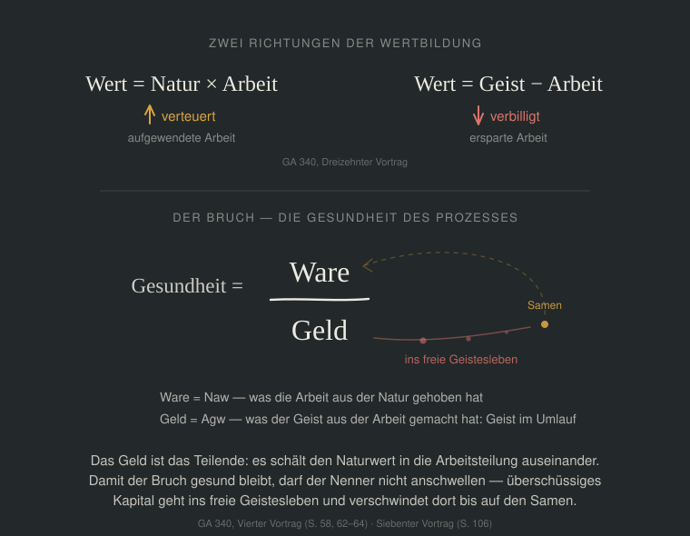

# Das Korn — Eine digitale Währung für die soziale Dreigliederung nach Rudolf Steiner

<!-- version: 1. September 2026 | Arbeitsstand -->

---

## I. Warum eine neue Währung Sinn macht

### Warum überhaupt eine neue Währung?

Weil das heutige Geld lügt.

Alle Waren altern. Brot wird hart, Holz verrottet, Maschinen verschleißen. Nur das Geld macht diesen Verzehr nicht mit — es nutzt sich nicht ab. Damit verschafft es sich einen Vorteil gegenüber allem, was es angeblich abbildet. Wer Geld hortet, gewinnt; wer Waren hat, verliert. Das ist keine Marktverzerrung, sondern eine systematische Verzerrung im Fundament: Die Bilanz, die Regeln der doppelten Buchführung selbst tun so, als hätten Vermögenswerte einen festen Geldwert, der sich nie verzehrt. Keine Abschreibungen nach drei oder 30 Jahren. Geld, das nicht altert, wie ein Holzschuppen, der auf dem Hof verrottet, wird immer mehr Wert, ohne einen Beitrag zu leisten.

Daraus folgt alles Weitere. Der *Zins* — denn wer Geld verleiht, gibt etwas Beständiges weg und verlangt einen Preis für diesen Verzicht. Die *Spekulation* — denn was nicht altert, lässt sich stapeln und gegen die Zeit ausspielen. Das Sparen, Investieren, die Schatzbildung — denn wer genug hat, braucht nichts mehr zu tun, und das Geld “arbeitet“ für ihn. Und am Ende die Entkopplung: Eine Geldmenge, die sich von dem löst, was sie abbilden soll, bis niemand mehr weiß, was ein Preis eigentlich aussagt.

Diese Diagnose ist nicht neu. Rudolf Steiner hat sie 1922 gestellt — in vierzehn Vorträgen über Nationalökonomie, in denen er nicht nur die Krankheit beschreibt, sondern auch die Therapie. Was er damals entwarf, war eine Währung, die altert wie die Waren, die sie abbildet, die drei Verwendungsarten kennt und die nicht vom Staat, sondern von wirtschaftlichen Gemeinschaften getragen wird. Die nicht in Zentralbanken geschaffen wird, sondern an der Naturgrundlage entspringt. Was ihm fehlte, war ein Medium, das diese Idee verwirklichen konnte.

Hundert Jahre später gibt es dieses Medium.

### Warum digital?

Steiner wollte, dass das Geld altert wie die Waren. Er verwarf aber sofort den bürokratischen Weg: Coupons, die abgerissen werden müssten, Ämter, die abstempeln — „dadurch würde ein sehr komplizierter bürokratischer Apparat herauskommen.“ Stattdessen wollte er, „dass der reale Verlauf der Dinge von selbst diese Wertigkeit bewirkt.“

Programmierbares Geld ist genau dieses *von selbst*. Alterung und Auffrischung werden zu Protokollereignissen, die auf ökonomische Tatsachen reagieren, nicht auf Amtsgänge. Die digitale Form ist nicht Mittel zum Zweck — sie ist die Bedingung dafür, dass dieser Kerngedanke überhaupt verwirklicht werden kann.

Dazu kommt ein zweiter Grund. Was Steiner beschreibt, ist eine Buchhaltung über die ganze Weltwirtschaft. Auf Papier ist die nicht zu führen.

Bitcoin und Ethereum haben bewiesen, dass eine staatsfreie Weltwährung technisch möglich ist. Aber sie sind in drei Punkten das genaue Gegenteil der Währung, die Steiner meint. Ihre Knappheit stammt nicht aus Fruchtbarkeit, sondern aus verbranntem Strom (Bitcoin, Proof of Work) bzw. aus hinterlegtem Kapital (Ethereum, Proof of Stake) — Geld schöpfen darf, wer schon welches hat. Sie belohnen das Halten statt das Geld altern zu lassen (Hortungsprämie statt Schwundgeld). Und sie sind restlos handelbar, statt an Menschen und deren Fähigkeiten gebunden zu sein (Fungibilität statt Kaufgeld, Leihgeld, Schenkungsgeld).

Bitcoin und Ethereum haben das Geld vom Staat gelöst — und es dabei umso vollständiger dem Kapitalmarkt überlassen (ETFs, Staking-Rendite, tokenisierte Staatsanleihen). Die Währung, die hier vorgestellt wird, löst es von beidem.

Ein weiterer wichtiger Aspekt dieser Währung wird sein, dass man als Käufer und Verkäufer anonym bleiben kann, und trotzdem kaufen und verkaufen und Steuern an den Staat bezahlen kann. Das steht nicht im Widerspruch zu der weitgehenden Öffentlichkeit, die weiter hinten beschrieben wird: Offengelegt wird, was fließt — Preise, Kosten, Portfolios, Einkommen aus Leistung. Nicht offengelegt wird der einzelne Vorgang. → Kapitel VI, „Was öffentlich ist und was nicht“. 

### Warum die Naturgrundlage als Basis für die Währung?

Weil der Anker etwas sein muss, das niemand beschließen kann.

Jede Währung hat eine Stelle, an der festgestellt wird, wie viel Geld es gibt. Beim heutigen Geld ist es ein Gremium, das setzen und verstellen kann. Bei Bitcoin ist es eine Zahl im Protokoll — die kann niemand verstellen, dafür weiß sie von der Welt auch nichts. Ein Anker darf weder das eine sein noch das andere: nicht beschließbar und trotzdem eine Aussage.

Steiner sucht deshalb nicht nach einer Zahl, sondern nach einem Bestand: Geld könne nichts anderes sein „als lediglich ein Ausdruck für die Summe der brauchbaren Produktionsmittel, die in irgendeinem Gebiet sind“ — und eben diese Summe sei „die einzige gesunde Währung.“ Der Schwerpunkt liege vorzugsweise bei Grund und Boden, denn die Maschine habe eine begrenzte Lebensdauer und müsse aufgezehrt werden, der Boden nicht.

Was wir Naturgrundlage nennen, ist keine engere Auswahl daraus, sondern dieselbe Summe von der anderen Seite gesehen. Steiners entscheidendes Wort ist *brauchbar*. Ein Bohrer, der nirgends Wasser findet, ist kein brauchbares Produktionsmittel, gleich was er gekostet hat — und ein guter Bohrer zeigt sich nicht an sich selbst, sondern an dem Wasser, das kommt. Wer keinen hat, erreicht die Quelle nicht; wer den besten hat, bekommt das meiste.

Deshalb wird die Summe der brauchbaren Produktionsmittel nicht an den Produktionsmitteln gemessen, sondern an dem, was sie aus der Natur herausholen: am Ertrag des Feldes, am geförderten Erz, am geborenen Kalb. Die Fähigkeiten der Menschen und die in Maschinen eingefrorenen Fähigkeiten sind darin enthalten — sie sind der Grund, warum überhaupt etwas herauskommt.

Und diese Messung hat die Eigenschaft, auf die es ankommt: Maschinen kann man beschließen, aber nicht, dass Wasser kommt. Entscheidend ist hier nur die eine Eigenschaft: Die Ernte lässt sich nicht vorhersagen. Was man vorhersagen kann, kann man ausrechnen, und wovor man sich rechtzeitig stellen kann, davon lebt die Spekulation. Die Unberechenbarkeit der Natur ist kein Mangel des Ankers. Sie ist sein Sinn.

Wie eine solche Währung aussehen würde, sagt Steiner selbst: Statt eines Goldgehalts solle auf dem Geld ein Naturwert stehen. Er wählt dafür ein Beispiel und schreibt es an die Tafel: so und so viel Weizen. Und er schreibt es nicht für ein Gebiet an die Tafel, sondern als Aufschrift auf allem Geld — es ist ein Maß für die ganze Welt. Der Name der neuen Währung war damit, denke ich, schon vorgegeben. Für diesen Text heißt sie „Korn“.

### Was ist mit den vielen anderen Versuchen?

Es hat sie gegeben, und einige haben funktioniert. Sie sind ein wichtiges Lernfeld. 

Was hat Korn, was sie nicht haben? Fast alle diese Versuche haben genau eine Eigenschaft des Geldes verändert und die übrigen gelassen. Meist war es die Alterung, manchmal die Regionalität, manchmal die Art der Ausgabe. Die beiden Eigenschaften, auf die es ankommt, blieben unberührt: der leere Anker und die Handelbarkeit. Wer nur eine Schraube dreht, bekommt ein besseres altes Geld — kein anderes.

**[Silvio Gesell](→)** hat das Altern erfunden: Geld mit Umlaufgebühr, das nicht mehr gehortet werden kann — aber es blieb frei handelbar und ohne Anker, und die Menge sollte eine Behörde nach Preisindex steuern.

**[Wörgl](→)** hat 1932 bewiesen, dass Schwundgeld in der Wirklichkeit funktioniert — es war jedoch ein Gutschein auf hinterlegte Schillinge, hatte also keine eigene Deckung, und die Nationalbank konnte es deshalb mit einem Federstrich beenden.

**[Der Chiemgauer](→)** bringt Regionalität und Umlaufgebühr zusammen und läuft seit über zwanzig Jahren stabil — aber er ist eins zu eins in Euro gedeckt und in Euro rücktauschbar, also ein Euro mit anderem Verhalten, keine eigene Währung.

**[Bristol Pound](→)** hat gezeigt, dass eine Regionalwährung eine ganze Stadt erreichen kann, inklusive Steuern und Nahverkehr — und er ist 2020 daran gestorben, dass ein Pfund-gedeckter Gutschein keinen Grund liefert, ihn zu behalten, wenn die Begeisterung nachlässt.

**[WIR Bank](→)** ist der langlebigste Beweis überhaupt: seit 1934 zinsfreie Verrechnung zwischen Schweizer Betrieben, nachweislich antizyklisch — aber der WIR-Franken altert nicht, hängt am Schweizer Franken und ist reine Binnenverrechnung ohne eigene Wertaussage.

**[Tauschringe](→)** machen sichtbar, dass Geld nichts weiter ist als Buchhaltung über gegenseitige Leistung — und sie bleiben klein, weil eine Buchhaltung ohne Anker und ohne Frist niemanden erreicht, der davon leben muss.

**[Terra TRC](→)** von Bernard Lietaer kommt dem Korn am nächsten: ein Warenkorb als Deckung, dazu eine Umlaufgebühr — aber der Korb bestand aus börsengehandelten Rohstoffen, deren Preise genau das tun, was ein Anker nicht tun darf, und die Währung war als handelbare Handelsreferenz gedacht und ist nie gestartet.

**[Grassroots Economics / Sarafu](→)** hat als einziges Projekt eine echte Deckung: die Leistungszusagen der beteiligten Produzenten, im Alltag kenianischer Gemeinden über Jahre erprobt — aber gedeckt wird durch das, was Menschen versprechen, nicht durch das, was die Natur gibt, und damit hängt der Anker wieder an Entscheidungen.

**[Circles / Aboutcircles](→)** bindet das Geld an Menschen statt an Konten — jeder gibt seine eigene Währung aus, Vertrauen verbindet sie, und sie altert sogar — aber ausgegeben wird pro Person und nicht an einer Naturgrundlage, und über Tauschbörsen wurde daraus schnell wieder ein handelbarer Kurs. Was das Korn von jedem dieser Versuche unterscheidet, ist deshalb nicht eine Eigenschaft, sondern die Kombination: Es altert *und* es hat einen Anker, den niemand beschließen kann, *und* es ist nicht handelbar.

## II. Die Eigenschaften des “Korn“

**Fünf Wörter vorweg**

Die folgenden Begriffe stehen in diesem Kapitel dicht nebeneinander und sind nicht von derselben Art. Zwei bezeichnen einen Ort im Prozess, einer eine Liste, zwei ein Ding, zwei ein Ergebnis.

- **Naturgrundlage** — kein Ding und keine Liste, sondern eine Schwelle: die Stelle, an der ein Naturprodukt in die Arbeit übergeht. Hier entsteht alles Korn, das über die Existenzgrundlage hinausgeht.
- **Naturprodukt** — das Konkrete, das über diese Schwelle geht: geernteter Weizen, gefördertes Erz, geschlagenes Holz.
- **Produktionsmittel** — Maschine, Gebäude, Werkzeug, Anlage. Geronnene Fähigkeit. Grundproduktionsmittel sind die bodengebundenen Grundformen: Mühle, Pflug, Bewässerung.
- **Portfolio** — die Liste, die eine regionale Assoziation als ihren Anker führt. Naturerträge, Rohstoffe, Geburten, regionale Signaturen, Fähigkeiten und die Grundproduktionsmittel. Das Selbstporträt eines Gebiets.
- **Geldmenge** — wie viel Korn existiert. Das Grundvolumen ergibt sich aus der Zahl der Menschen mal der Existenzgrundlage, das Mehr aus dem Durchsatz an der Naturgrundlage mal dem Weltmaß.
- **Frist** — die Laufzeit. Ergibt sich aus der Haltbarkeit der Glieder des Portfolios.

Am Beispiel: Ein Sack Weizen überschreitet die Naturgrundlage, daraus entsteht Geldmenge. Er steht außerdem im Portfolio und trägt dort zur Frist bei. Die Mühle daneben überschreitet keine Schwelle — sie ist selbst schon Ergebnis von Arbeit — und erzeugt deshalb kein Korn; sie steht aber im Portfolio und trägt dort den größten Teil der Frist. Beide sind im Portfolio, und sie liefern Verschiedenes.

### 1. Wie das Korn entsteht und warum es altert

Jede Einheit trägt ein Ablaufdatum — digital aufgedruckt und im Protokoll geführt. Mit jedem Tag schrumpft die Restlaufzeit. Am Ende erlischt die Einheit. „Immer-näher-Kommen seinem Sterben“ nennt Steiner das, und gerade dadurch werde dem Geld ein Wert aufgedrückt „wie dem Menschen durch sein Altwerden“. Damit hört das Geld auf, die Ausnahme zu sein, die nicht stirbt wie alles andere. Es altert allerdings anders als das Brot. Was altert, ist nicht der Betrag. Ein Korn mit zwei Jahren Restlaufzeit kauft dieselbe Menge Brot wie ein frisch ausgegebenes. Was schrumpft, ist allein die Restlaufzeit — und damit die Reichweite in der Zeit. Ein Vorhaben auf zwanzig Jahre lässt sich nicht mit Korn finanzieren, das in fünf Jahren erlischt.

Die Geldmenge im Korn-System ist träge stabil — wie das Blutvolumen im Körper. Blut entsteht im Knochenmark und wird in etwa der Rate ersetzt, in der alte Zellen im Körper absterben und neue hinzukommen. Die Gesamtmenge bleibt konstant, solange der Organismus gesund ist und sich Körpergröße und -leistung gleich bleiben. Und sie wird nirgends gemessen: Der Körper kennt keine Sollmenge Blut, er kennt nur den Sauerstoff- und Nahrungsmangel im Gewebe und antwortet darauf. Bestand ist immer Ergebnis, nie Ziel.

Korn entsteht an zwei Stellen, und die beiden tun Verschiedenes. Das **Grundvolumen** kommt aus dem Recht: Jedem Bewohner steht eine Existenzgrundlage zu, und sie wird nicht umverteilt, sondern geschöpft. Das **Mehr** kommt aus der Natur: Was über diese Grundlage hinaus entsteht, entsteht dort, wo ein Naturprodukt in die Arbeit übergeht. Das eine hängt an der Zahl der Menschen und ändert sich langsam. Das andere hängt daran, was die Produktionsmittel aus der Natur herausholen, und atmet.

Beim Mehr gibt es einen einzigen Anlass, an dem Korn ein neues Ablaufdatum bekommen kann: den **Ertrag** — dort, wo ein Naturprodukt in die Arbeit übergeht, wo geerntet, gefördert, gepflegt wird. Wiederkehrend, jedes Jahr aufs Neue. Wer an dieser Stelle steht, heißt in diesem Text **Naturbetrieb**: eine Werkstatt, ein Hof, eine Fischerei — jeder, der unmittelbar mit dem arbeitet, was die Natur hergibt.

Sonst nirgends. Alles Weitere — mahlen, backen, fahren, verkaufen — formt um, was schon da ist, und Geld, das an einer anderen Stelle entstünde, entstünde aus einer Entscheidung. Wer neu in die Gemeinschaft eintritt, bekommt deshalb keinen Willkommensbetrag: Er bekommt, was jedem zusteht, die Existenzgrundlage — und alles Weitere über Leistung oder Schenkung. → Kapitel II.3.

Was der Naturbetrieb bekommt, ist kein Geldbetrag, sondern ein Erneuerungsrecht: Anspruch auf so und so viel frisches Ablaufdatum. Wieviel, sagt ein Maß — und dieses Maß ist eines für die ganze Welt: so und so viel Korn je Einheit dessen, was in die Arbeit übergeht, überall gleich. Die regionale Assoziation entscheidet, **was** in ihr Portfolio gehört; die Rechenstellen rechnen es in dieses eine Maß um und veröffentlichen die Umrechnung. Woraus das Maß gewonnen wird, steht in Kapitel IV.

Das Weltmaß bestimmt keinen Preis. Es bestimmt, wieviel Korn anlässlich einer Einheit Naturdurchsatz frisch datiert werden darf, und diese Zahl ist überall dieselbe, weil überall dieselbe Menge Natur dieselbe Menge Natur ist. Was der Sack Weizen dann kostet, entsteht an einem ganz anderen Ort: in der Preisbildung des Gebiets, und dort spielen Arbeit, Werkzeug, Boden und Können hinein. → Kapitel IV.

**Das Grundvolumen: die Existenzgrundlage**

Jedem Bewohner eines Gebiets steht eine Existenzgrundlage zu — nicht als Zuschuss für Bedürftige, sondern als Recht für alle. Dafür gibt es keine Kasse. Der Staat weist die Wirtschaft an, das Geld für jeden Bewohner bereitzustellen; er hält es nicht selbst in Händen und verteilt es nicht. Er hat nur die Zahl.

Diese Zahl wird nicht politisch gesetzt, sondern gerechnet: Was kostet der Warenkorb, den jeder braucht, zu den Preisen, welche die Assoziationen ohnehin offenlegen? Die Rechenstellen rechnen es nach, wie sie das Weltmaß nachrechnen.

Beschlossen wird etwas anderes, und zwar von den Menschen selbst: **wieviel in einem Gebiet höchstens gearbeitet werden soll.** Aus dieser Zeit und aus dem, was in ihr hervorgebracht wird, ergibt sich, was jedem zusteht. Über eine Geldzahl lässt sich nicht abstimmen, ohne dass sie zum Wunsch wird; über die eigene Arbeitszeit schon, denn jeder weiß, was er dabei hergibt. Steiner weist diese Frage ausdrücklich dem Rechtsleben zu — wieviel wollen wir in der nächsten Periode arbeiten, und wie leben wir dafür. Wie der Beschluss zustande kommt, steht in Kapitel VI.

Damit steht die Grundmenge des Geldes fest, ohne dass jemand sie festsetzt: Zahl der Menschen mal Existenzgrundlage. Es ist das Volumen, das der Kreislauf braucht, um überhaupt zu laufen — und alles Weitere kommt aus der Natur dazu.

Bleibt die zweite Zahl: die Frist, wie alt das Geld wird. Auch sie wird nicht beschlossen, sondern abgelesen — an der Haltbarkeit dessen, was hergestellt und gebraucht wird. Und sie hängt an der einzelnen Einheit, nicht am Gebiet: Korn behält die Frist, mit der es entstanden ist, egal wohin es wandert. Woran gemessen und wie gewichtet wird, steht in Kapitel IV.

Eingelöst wird das Recht in zwei Schritten. Zuerst mit altem Korn, das der Betrieb ohnehin eingenommen hat: gleicher Betrag, neues Datum — das ist die Auffrischung. Reicht das nicht, um das Recht zu füllen, wird der Rest neu ausgegeben: Korn, das es vorher nicht gab.

Darin liegt das Atmen der Geldmenge. Wächst der Durchsatz an der Naturgrundlage, übersteigt das Erneuerungsrecht das sterbende Korn, das ankommt — es entsteht neues. Schrumpft er, reicht das Recht nicht mehr für alles, was ankommt, und der Überschuss stirbt einfach. Niemand beschließt das. Es ergibt sich aus zwei Zahlen, die beide niemandem gehören.

Das Bild vom Blut, mit dem dieses Kapitel anfing, trägt weiter, als es zuerst scheint. Sein Volumen ist nicht fest: Wer über Jahre läuft, hat mehr davon; wer liegt, weniger. Es wird nirgends gesetzt, es stellt sich auf das ein, was der Organismus tut. Der Durchsatz an der Naturgrundlage ist das Laufen.

Und wie das Blut nicht dort bleibt, wo es entsteht, sondern zurückkehrt, ist auch der Naturbetrieb kein Durchlauferhitzer, sondern der Ort, an dem der Kreislauf sich schließt: Was am Ende seines Lebens steht, findet dort den Weg zurück zum Anfang, und was fehlt, kommt neu dazu. Quelle und Mündung sind nicht nur derselbe Knoten, sie sind derselbe Vorgang. Wie ein Korn: gesät, gewachsen, geerntet — und ein Teil der Ernte ist wieder Saatgut.

### 2. Kaufgeld, Leihgeld, Schenkgeld: Drei Verwendungsarten, nicht drei Sorten

Kaufgeld, Leihgeld, Schenkgeld — das sind keine drei Geldsorten, sondern drei Gebrauchsweisen desselben Geldes. Das Korn wird zur jeweiligen Art „erst im Moment, wo es eben eintritt in den volkswirtschaftlichen Prozess oder von einer Art in eine andere übertritt.“ Der Halter wählt die Verwendung, nicht die Uhr.

Jede Korn-Einheit trägt zwei Angaben, und nur zwei:

- **Den Betrag** — er schrumpft nie.
- **Das Ablaufdatum** — ein fester Stempel, eine Richtung, ein einziger Reset-Punkt.

Die Verwendungsart ist keine dritte Angabe. Sie ist der Zustand, in dem das Korn gerade gebraucht wird, und der kann sich in jedem Augenblick ändern, ohne dass sich an der Einheit selbst etwas ändert.

Junges Korn kann alles drei: kaufen, leihen, schenken. Mit dem Altern fällt zuerst das lange Leihen weg, dann das kurze. Das Kaufen fällt nie weg — der Betrag schrumpft ja nicht. Was mit der Frist schwindet, ist nicht die Kaufkraft, sondern die Bereitschaft, das Korn anzunehmen, und deshalb bleibt zuletzt das Schenken als die einzige Verwendung, die sicher trägt. Sicher trägt außerdem noch ein Weg: der zum Naturbetrieb, der als einziger auffrischen darf. Dorthin wandert sterbendes Korn, und wer rechtzeitig ankommt, kauft nicht nur ein, sondern rettet es. → Kapitel II.1. Der einzige Sortenwechsel, den das Protokoll selbst auslöst, ist der Übergang zu Schenkgeld an der Sterbegrenze.

**Kaufgeld** ist Korn im Augenblick des Tauschs. Es wechselt den Besitzer, und dafür geht eine Ware oder Leistung in die andere Richtung. Der Betrag schrumpft dabei nie — ein Korn kauft am letzten Tag dieselbe Menge Brot wie am ersten. Was der Empfänger mit übernimmt, ist die Restlaufzeit. Deshalb wird Korn mit knapper Frist nur annehmen, wer es rasch weitergeben kann. Nicht der Wert sinkt, sondern die Bereitschaft, es anzunehmen.

**Leihgeld** ist Korn, das einem Vorhaben auf Zeit überlassen wird. Der Betrag wird dabei nicht geschmälert. Was zählt, ist die Frist. Eine Leihe lautet deshalb nicht auf eine Summe, sondern auf eine Summe mit Fristplan. Wer eine Million mit fünfzehn Jahren Restlaufzeit aufnimmt, schuldet im ersten Jahr eine Rate im Alter von vierzehn Jahren, im zweiten eine mit dreizehn, und so fort. Das ist keine willkürliche Staffelung. Es ist genau der Weg, den das Korn genommen hätte, wenn es liegen geblieben wäre. Deshalb ist auf diesem Pfad der Zinssatz null — und jede Abweichung von ihm ist einer: nach oben, wenn jüngeres Korn zurückverlangt wird, als der Pfad hergibt, nach unten, wenn älteres genügt.

Daraus folgt eine Obergrenze von selbst: Ein Rückzahlungsplan kann nicht länger sein als die Restlaufzeit des Geliehenen. Mit Zweijahres-Korn lassen sich keine fünfzehn Jahre verabreden — ab dem dritten Jahr gäbe es keine Frist mehr, die man schulden könnte. Das ist keine Vorschrift. Das ist Rechnen. Für jede Rate muss der Schuldner bei seiner Assoziation Korn im passenden Alter anfragen. Und die hält Korn in allen Altersstufen, so wie eine Werkstatt Material in allen Stärken hält. Fehlt eine Altersstufe, wird nicht verhandelt — eine Absprache über Frist wäre nach der Definition dieses Textes ein Zinssatz. Stattdessen wird das Vorhaben gestreckt oder geteilt. Steiner beschreibt die positive Form derselben Regel: Die Assoziationen sorgen dafür, dass in Unternehmungen gleicher Art nur Geld eines bestimmten Alters verwendet wird. Altersklassen werden Vorhabenarten zugeordnet, im Voraus und für alle gleich. Weil das Korn weltweit eines ist, führt der gemeinsame Bestand ohnehin alle Altersstufen, und der Fall tritt selten ein.

Einen Ansturm auf das jüngste Korn gibt es dabei nicht. Junges Korn kauft nicht mehr als altes — wer nur kaufen will, hat keinen Grund, es zu wollen. Die lange Frist braucht nur, wer lange plant, und das ist eine Bedarfsmeldung, kein Wettbewerb. Ein Bündel trägt dabei immer nur so weit wie seine kürzeste Frist; gemittelt wird nicht.

Und die Frage an den Geber ist nicht: Was bringt mir das an Rendite? Sondern: Will ich, dass dieses Vorhaben entsteht? Eine durchaus spannendere Frage als die Frage nach einer bloßen Zahl.

**Schenkgeld** ist Korn, das ohne Gegenleistung gegeben wird — für Erziehung, Bildung, Kunst, Forschung. In einem alternden Geldsystem läuft jede Einheit irgendwann auf die Restlaufzeit null zu. Auf der letzten Strecke davor ist sie Schenkgeld — nicht weil jemand es so bestimmt hat, sondern weil kaum noch jemand sie annimmt. Bei null ist sie nichts mehr: Sie erlischt. Schenkgeld ist die letzte Verwendung, kein Zustand danach. Aber auch junges Korn kann geschenkt werden. Wer in einem Vortrag Gedanken hört, die sein Leben verändern, kann frisches Korn schenken — und dieses behält seine Jahreszahl.

### 3. Korn ist nicht handelbar

Es gibt keinen Wechselkurs, keine Börse, kein Orderbuch. In das Korn-System hinein kommt man auf drei Wegen: durch die Existenzgrundlage, weil einem zusteht, was jedem zusteht; durch Leistung, indem man für einen Betrieb arbeitet, der in Korn zahlt; oder durch Schenkung, indem jemand gibt, ohne eine Gegenleistung zu erwarten. Wer geistige Arbeit tut, kommt über den dritten Weg herein. Neu geschöpft wird Korn nur an zwei Stellen: für die Existenzgrundlage und am Ertrag. → Kapitel II.1. In Korn einkaufen kann man sich nicht.

Kaufen darf man mit Korn alles, was aus der Ausübung menschlicher Fähigkeiten kommt: Waren, Leistungen, Werke — auch die Naturerträge, sobald sie durch Ernte, Förderung, Pflege in die Arbeit übergegangen sind. Nicht kaufen darf man: anderes Geld, Gold, Anteile, Ansprüche, Rechte, Korn selbst — und das fertige Produktionsmittel. Seine Herstellung dagegen ist eine Leistung wie jede andere und wird bezahlt: Wer eine Maschine baut, bekommt dafür Korn. Nur der Übergang von einer Hand in die andere, wenn sie fertig dasteht und arbeitet, ist kein Kauf mehr.

Der Unterschied ist nicht moralisch, sondern buchhalterisch. Gibt jemand Korn für eine Leistung, sagt die Nachricht, was sie sagen soll: Hier hat einer etwas gekonnt, dort hat es einer gebraucht. Gibt er Korn für Gold, sagt sie gar nichts mehr — dann ist eine Wertaufbewahrung gegen eine andere gewechselt worden, und aus dem Preis ist ein Kurs geworden.

Zwei Prüffragen genügen für alles, was gekauft werden darf. Kommt das, was zurückkommt, aus menschlicher Fähigkeit? Und altert es? Beim Brot: ja und ja. Beim verbrauchbaren Werkzeug: ja und ja. Beim Barren Gold: nein und nein. Beim fertigen Produktionsmittel fällt die Prüfung aus — es wird nicht gekauft, sondern übertragen. Seine Herstellung wird sehr wohl bezahlt.

Der gefährlichste Fall ist der unauffälligste: Korn gegen Korn. Wer tausend Korn mit fünfzehn Jahren Restlaufzeit gegen elfhundert Korn mit zwei Jahren hergibt, hat keinen Handel getrieben — er hat einen Zinssatz gebildet. Die Frist ist die knappe Größe im System; sobald sie einen Preis bekommt, ist der Zins durch die Hintertür wieder da. Deshalb wird Restlaufzeit nie bezahlt, sondern nur gesucht. Man fragt die Assoziation nach passendem Korn, man kauft es ihr nicht ab.

Wer Korn gegen etwas weitergibt, das diese Prüfung nicht besteht, betrügt, und die Transaktion wird rückgängig gemacht. Keine dauerhafte Schatzbildung, kein Zinseszins, keine Derivate. Auf ein befristetes, nicht konvertierbares, personengebundenes Gut lassen sich keine Futures bauen.

**Das fertige Produktionsmittel wird übertragen, nicht verkauft**

Das ist keine Nebenregel, sondern die Bedingung dafür, dass die Frist überhaupt bindet. Eine Maschine altert sehr wohl: Sie muss gewartet, repariert und schließlich ersetzt werden, und dieser Aufwand geht in den Preis dessen ein, was sie herstellt. Was sie nicht trägt, ist ein Ablaufdatum. Deshalb altert das Geld, das in ihr steckt, nicht von selbst mit — und wer sie verkauft, tauscht eine alte, festsitzende Position gegen Korn ein, das der Käufer gerade hat: Ware gegen Geld, völlig regelkonform, und trotzdem ist die Uhr zurückgestellt.

An die Stelle des Verkaufs tritt die Übertragung an Fähige: Ein Betrieb bleibt nur so lange mit einem Menschen verbunden, wie sich das aus dessen Fähigkeiten rechtfertigt. Es ist kein Notfallverfahren, sondern ein laufender Kreislauf. Maschinen bleiben nicht stehen, wo sie nicht mehr gebraucht werden — sie wandern, nur nicht über den Preis. → Kapitel IV; Kapitel VI.

**Es gibt nur ein Korn**

Innerhalb des Korn-Systems gibt es keine Währungsgrenze. Ein Kauf in einem anderen Gebiet ist ein Kauf: Man geht auf die Seite des Herstellers, bestellt, bezahlt in Korn. Die Assoziationen sind regional, das Geld ist es nicht — eine Währungsgrenze holte die Staatsgrenze in den Wirtschaftsprozess zurück, und als Wirtschaftsorganismus gilt bei Steiner nur die ganze Erde. → Kapitel IV.

Auffrischung gibt es nur am Naturbetrieb. Ein Kauf über ein Gebiet hinweg frischt nichts auf.

Schenkgeld wandert dabei am freiesten. Es trägt keinen Anspruch zurück, und sein Ziel — die Kultursphäre — ist von Natur aus überregional. Die Umkehrung zum heutigen System: In der alten Welt reist das Kapital frei und die Schenkung ist die Ausnahme. Im Korn reist die Schenkung frei.

**Und nach außen**

Zu Wirtschaften, die kein Korn kennen, gilt eine einzige Regel: Waren dürfen die Grenze überqueren, Geld nicht. Der Naturbetrieb verkauft einen Teil seiner Ernte nach außen und nimmt Euro ein; denselben Weizen gibt er nach innen gegen Korn. Damit überquert nie eine Geldeinheit die Grenze. Praktisch bündelt man das an einer Stelle: Die Clearingstelle hält den Außenkontakt. Sie hält Euro draußen und Korn drinnen und gibt nach innen weiter, was sie draußen gekauft hat — Produktionsmittel wie Waren. Zweierlei begrenzt sie, und beides ist Mechanik, keine Vorschrift. Sie kann nach innen nur so viel Korn weiterreichen, wie ihr vorher für Importe gegeben wurde; sie schöpft nichts, sie gleicht ab. Und sie sieht auf das Alter: Das Korn muss zu dem passen, was dafür hereinkommt. Verderbliche Ware wird nicht mit fünfzehnjährigem Korn bezahlt, eine Maschine nicht mit zweijährigem, und mehr Korn hilft nicht, wenn die Frist nicht stimmt. Restlaufzeit wird auch an der Membran gesucht und nicht bezahlt. Innen kennt niemand Euro.

Die Membran ist ein Organ, kein Loch — durchlässig für Stoffe, dicht für Geld. Sie ist die einzige Grenze im ganzen System, und wie sie beschaffen ist, steht in Kapitel IV.

Von außerhalb kommen Produktionsmittel als Gabe herein — Stiftung, Genossenschaftseinlage, Sammlung; von innen über Leihgeld. Bei der Gabe bildet sich kein Kurs, weil nichts zurückfließt. Die Schenkung ist nicht nur der Endpunkt des Kreislaufs, sie ist auch sein Anfang.

Bleibt die Frage, die jeder Markt beantwortet und die hier kein Markt mehr beantwortet: Wie kommt der Preis zustande?

### 4. Wie der Preis zustande kommt

Preise werden im Korn weder ausgehandelt noch angeordnet. Es gibt einen dritten Weg, und er ist der einzige, den dieses System kennt: Sie werden gerechnet, und die Rechnung liegt offen.

Gerechnet wird dort, wo Erzeuger, Handel und Verwender zusammensitzen — in der Assoziation. Wer verkauft, weist aus, woraus sein Preis sich zusammensetzt: was die Produktionsmittel an Erneuerung kosten, was die Arbeit kostet, was zugekauft werden musste. Wer kauft, kann nachrechnen. Damit ist der Preis kein Ergebnis von Macht, sondern eine Aussage, die jeder prüfen kann — und erst dadurch wird aus „gerechnet“ mehr als eine Behauptung.

Eine Stelle, die Preise festsetzt, gibt es nirgends im ganzen System — auch keine zentrale.

Gerechnet wird nach einem einzigen Gesetz, und es gilt für alles:

> *Ein Preis ist richtig, wenn er dem Erzeuger erlaubt, dasselbe noch einmal zu tun.*

Das lässt sich kalkulieren, auch beim Weizen. Vier Posten stehen darin, und jeder hat seine Eigenart.

**Arbeit und Lebensunterhalt** — ein Posten, kein Stundenlohn. Was in die Rechnung eingeht, wird in der Assoziation vorab vereinbart und aus zwei Größen gebildet: aus dem, was ein Mensch zum Leben braucht — er und die, die von ihm abhängen —, und daraus, wieviel seiner Arbeitszeit er dem Betrieb zur Verfügung stellt. Wer halbtags mitarbeitet, bringt die Hälfte seines Bedarfs in die Rechnung ein.

Das ist keine Bezahlung von Arbeit. Arbeit ist keine Ware und hat keinen Preis; was hier aussieht wie ein Lohn, ist ein Anteil, bemessen am Bedarf und an der eingebrachten Zeit. Steiner fasst das Preisgesetz genau so: Der Preis muss den Erzeuger und die Seinen befriedigen, bis er das gleiche Produkt wieder hergestellt hat.

Zweierlei folgt daraus. Was zwischen Menschen verschieden ist, ist der Bedarf und die Zeit — nicht die Begabung; die erscheint an anderer Stelle. Und weil die Existenzgrundlage den Sockel dieses Bedarfs ohnehin deckt, steht im Preis nur, was darüber hinaus nötig ist.

**Die Produktionsmittel** — die Maschine, das Gebäude, das Werkzeug. Sie sind geronnene Fähigkeit, und sie verbrauchen sich. Zwei Beträge stehen dafür in der Rechnung, und sie haben nichts miteinander zu tun.

Der eine ist die **Rückzahlung des Leihgeldes**, mit dem das Produktionsmittel gebaut wurde. Sie steht in der Höhe darin, in der sie vereinbart wurde, Jahr für Jahr über die Laufzeit — so wie die Bewohner ihr Haus abtragen. → Kapitel III. Der Anschaffungswert steht nirgends; gekauft und verkauft werden fertiggestellte Produktionsmittel ohnehin nicht.

Der andere ist die **Pflege**: Wartung, Reparatur, Ersatzteile. Sie steht in der Höhe darin, in der sie tatsächlich anfällt. Mit den Jahren wird sie teurer, und irgendwann lohnt sie nicht mehr — dann ist die Maschine am Ende.

Ansparen für den Nachfolger gibt es nicht. In einem Geld, das altert, lässt sich für eine spätere Anschaffung nichts beiseitelegen; ein Vorrat verfällt, während er wartet. Ist ein Produktionsmittel am Ende, wird der Nachfolger mit neuem Leihgeld gebaut, und von da an steht wieder eine Rückzahlung in der Rechnung. Kein Sparen, kein Vorrat, nur eine Passung in der Zeit — das Leihgeld soll höchstens so lange laufen, wie die Sache trägt.

Das hat eine sichtbare Folge: Ein Betrieb, der gerade neu ausgestattet hat, rechnet höher als einer, dessen Maschinen abgetragen sind. Der Preis zeigt also auch, wo im Erneuerungszyklus ein Betrieb steht — und das ist keine Verzerrung, sondern wieder eine Aussage.

**Vorleistungen** — was zugekauft werden musste: Energie, Futter, Material, Saatgut, und was der Weg kostet, sie herzubringen. Jedes davon bringt seinen eigenen Preis mit, und in dem stecken wieder Arbeit, Lebensunterhalt, Abschreibung und Vorleistungen. Der Preis eines Brotes enthält so die halbe Wirtschaft, Glied für Glied zurück bis zum Feld. Stammt das Material aus einem nicht nachwachsenden Bestand, trägt es zusätzlich den Entnahmepreis.

Was der Weg kostet, bleibt in diesem Posten — er ist eine Vorleistung wie jede andere. Was eigens mitgeführt wird, ist die Entfernung: Jede Stufe gibt weiter, wie weit das Gut und was darin steckt schon gereist sind. Zwei Güter zum gleichen Preis können sehr verschieden weit gekommen sein; die akkumulierte Transportentfernung macht das sichtbar, ohne den Preis zu spalten. Ob etwas aus der Region kommt oder von weit her, ist keine Rechenfrage, sondern eine Wahl — und die Assoziation kann sie nur treffen, wenn die Strecke neben dem Betrag dasteht.

**Der Anteil für das Weiterkommen** — der einzige Posten, der nicht die Wiederholung deckt, sondern das, was darüber hinausgeht. Er geht in zwei Richtungen: in die Weiterentwicklung der Fähigkeiten, also ins Geistesleben, und in die Ausweitung der Produktion, also in die Wirtschaft. Wie groß er ist und wohin er geht, hängt am Produkt und wird in der Assoziation entschieden.

Beides wäre sonst nicht finanziert. Die Rückzahlung deckt den Ersatz eines Produktionsmittels, nicht das Wachstum; und die Ausbildung eines Menschen kann ohnehin niemand in Rechnung stellen, sie kann nur ermöglicht werden. Deshalb steht dafür ein Anteil in jedem Preis, statt beides dem Zufall zu überlassen.

Zu Vermögen kann dieser Anteil nicht werden. Ein Betrieb kann ihn nicht einbehalten und wachsen lassen, weil sich in einem alternden Geld nichts ansammelt. Er muss ausgegeben werden, solange er lebt — und die beiden Richtungen sind die einzigen, für die er gedacht ist. Wie der Anteil zustande kommt und wie sich hinterher zeigt, ob er getragen hat, steht in Kapitel IV.

Und drei Dinge stehen ausdrücklich **nicht** darin.

Die **Natur** selbst. Die Substanz hat, wie Steiner sagt, keinen volkswirtschaftlichen Wert — was sie kostet, ist allein die Arbeit, sie zu heben. Das Wachstum ist umsonst, und genau deshalb kann es der Anker sein.

Der **Geist** als eigener Posten. Fähigkeiten werden nicht in Rechnung gestellt. Sie erscheinen zweimal an anderer Stelle: als weniger Arbeitsstunden, weil sie Arbeit ersparen, und als Abschreibung, soweit sie in Maschinen eingefroren sind. Was lebendig ist, wird nicht bezahlt, sondern ermöglicht. → Kapitel IV.

Die **Ausbildung** als Einrichtung. Schule, Hochschule, Forschung gehören in die Kultursphäre und leben von Schenkgeld, nicht vom Preis. Was ein arbeitender Mensch braucht, um sein Können zu erhalten, steht dagegen im Lebensunterhalt.

Was ebenfalls fehlt, fällt erst auf, wenn man es sucht: kein Zins, keine Rente, kein Gewinn. Drei der vier Posten kommen aus der Vergangenheit — sie decken, was schon einmal war. Nur der vierte kommt aus dem, was einer vorhat.

**Was an die Stelle der Preissteuerung tritt**

In der heutigen Ordnung ist der Preis das Steuerrad. Er steigt, wenn etwas knapp wird, und lenkt damit, wer produziert und wer verzichtet. Im Korn kann er das nicht mehr, weil er gerechnet wird und nicht gebildet. Damit fällt eine Steuerung weg, und es muss eine andere an ihre Stelle treten.

Sie ist bei Steiner benannt, und sie greift nicht am Geld an, sondern an den Menschen. Der Preis, sagt er, hänge an der Zahl derer, die auf einem bestimmten Feld arbeiten. Wird ein Gut zu teuer, fehlen dort Hände. Wird es zu billig, sind zu viele da.

Der Preis hört damit auf, ein Hebel zu sein, und wird eine Anzeige. Was auf ihn folgt, ist keine Rechenoperation, sondern eine Bewegung von Menschen: mehr Arbeit dort, wo es klemmt, weniger dort, wo zu viele stehen. Aufgabe der Assoziation ist es nicht, das anzuordnen — sie spricht es aus. Wer hingeht, geht selbst. Was sie dazu tun kann, ist den Weg zu öffnen: Schenkgeld für die Ausbildung, die dort gebraucht wird.

Man rührt das Thermometer nicht an. Man heizt — und geheizt wird mit Einladung, nicht mit Zuteilung.

### 5. Wovon der Staat lebt. Die einzige Steuer: Verkaufsteuer

Die Abgrenzung im Titel ist Steiners eigene. In den Leitsätzen für die Dreigliederungsarbeit heißt es, die allgemeinen Steuern sollen Ausgabensteuern sein — ausdrücklich nicht zu verwechseln mit indirekten Steuern. Einnahmen als solche werden nicht steuerpflichtig; sie werden es in dem Augenblick, wo die Allgemeinheit dafür Interesse hat, also beim Übertritt in die Verkehrszirkulation.

Das passt zum Korn genauer als zu jedem anderen Geld. Besteuert wird nicht, was einer hat, sondern was er in Bewegung setzt. Ein Geld, das nur durch Bewegung Sinn hat, kann kaum anders besteuert werden. Und weil nichts liegenbleiben kann, gibt es keinen Bestand, an den eine Vermögenssteuer anknüpfen könnte.

**Wofür die Steuer da ist.** Für das, was ein Gemeinwesen gemeinsam braucht und niemand einzeln bezahlt: Infrastruktur, Wege, was der Staat für seine Erhaltung fordert. **Nicht** für die Existenzgrundlage — die wird geschöpft und nicht umverteilt, und sie steht als Anweisung an die Wirtschaft in Kapitel II.1. Das ist ein wesentlicher Unterschied: Eine Steuer, die das Dasein sichern muss, wird immer zu knapp sein, weil sie von der Kasse abhängt. Eine Zusage, die aus dem Recht kommt, hängt an der Arbeitszeit, die dieselben Menschen beschlossen haben.

**Warum das Dreigliederung ist.** Die Anzeige gehört ins Wirtschaftsleben, die Sicherung des Daseins in Politik und Recht. Hätte die Emission eine soziale Nebenaufgabe, würde am Thermometer gedreht — aus dem sympathischsten Motiv, aber mit demselben Ergebnis wie bei jedem anderen Eingriff. Steiner ordnet das Steuerwesen entsprechend zu: Was der Staat für seine Erhaltung fordert, wird durch das Steuerrecht aufgebracht, das sich aus einer Harmonisierung des Rechtsbewusstseins mit den Forderungen des Wirtschaftslebens bildet. Die Verteilung der Steuerforderungen auf die einzelnen Wirtschaftsgebiete obliegt dabei den Assoziationen, die Regelung des Bedarfs dem Rechtsleben.

**Was offenliegt.** Einnahmen, Verwendung und die Regel sind öffentlich. → Kapitel VI, „Was öffentlich ist und was nicht“.

*Ausarbeitung steht aus.* Steuersatz, Bemessungsgrundlage und die Frage, ob Grundbedürfnisse anders behandelt werden als anderes, sind nicht bestimmt.

Damit stehen die Eigenschaften beisammen: woher das Korn kommt, wie es gebraucht wird, was es nicht darf, wie ein Preis entsteht und wovon der Staat lebt. Wie sich das anfühlt, wenn Menschen darin wirtschaften, zeigt sich am besten an Beispielen.

## III. Wie lebt es sich mit Korn?

### Die Rutsche (oder wie man sich eine Wohnung kauft)

Der September war einer von den freundlichen. Die Sonne stand schon tief über den Dächern und legte sich flach über den Sandkasten, so dass jede Schaufel einen langen Schatten warf. Jule saß auf der Kante, die Jacke im Schoß, und sah zu, wie Leon einen Kuchen baute, der jedes Mal zusammenfiel, bevor er fertig war. Mika hing kopfüber im Klettergerüst und behauptete, das sei Training.

Anton kam über den Kies, zwei Becher in der Hand, und setzte sich neben sie.

„Du musst dir was ansehen“, sagte er.

Sie sah ihn an: „Guten Morgen!“

Er nickte: „Moin. Du musst dir das ansehen.“

Er hielt ihr sein Telefon hin. Ein Foto, ein Eckhaus, Stuck über den Fenstern, ein Erker, der wie ein Ausrufezeichen in die Kreuzung ragte. Über dem Erdgeschoss noch die Reste einer alten Ladenbeschriftung.

„Das kenne ich, das hat Charakter“, sagte Jule. „Das ist zwei Straßen weiter. Wo unten die Bretter drin sind.“

„Nicht mehr lange.“

Anton wischte weiter. Grundrisse, ein Schnitt durchs Treppenhaus, eine Ansicht von der Straße, auf der die Kastanie eingezeichnet war, die tatsächlich dort steht. Dann eine Seite mit Zahlen.

„Ein Architekt hat das auf die Plattform gestellt. Hakan Ceylan. Sagt dir wahrscheinlich nichts. Aber er hat die Ausschreibung gewonnen. Er hat das Haus für den Ausbau zugesprochen bekommen.“

„Er sagt mir nichts. Aber ist noch etwas frei?“

„Fast alles. Ich habe angefangen zu lesen, und dann habe ich zwei Stunden gelesen.“ Er zeigte auf den Schnitt. „Er nimmt das Haus komplett auseinander. Wirklich von Grund auf. Fundament, Leitungen, Dach. Was bleibt, ist die Fassade und die Treppe. Zehn Parteien, alle unterschiedlich groß. Ganz unten zwei große mit Zugang zum Hof, oben zwei kleine, und dazwischen alles, was man sich vorstellen kann. Er baut mit Naturmaterialien, Lehm innen. Das Haus wird atmen.“

Jule nahm sein Telefon und scrollte selbst weiter. Sie blieb bei einer Stelle hängen, an der stand, wie lange er an dem Entwurf gesessen hatte.

„Vier Jahre?“

„An diesem einen Haus zwei. Vorher war er lange Assistent. Aber er hat für sich immer wieder Sachen gezeichnet, die aber nie gebaut wurden.“

„Aber jetzt ist er an der Reihe. Cool. Er kann was, das kann man sehen. Und Materialien, die er verbauen will, sind super. Wovon hat er in der Zeit gelebt?“

„Ganz normal, Schenkgeld.“ Anton zuckte die Schultern. „Steht auch drin. Zwölf Jahre lang Korn, für das keiner was zurückwollte. Er schreibt einen Satz dazu, den ich mir aufgeschrieben habe: Man kann nicht kreativ werden, während man gleichzeitig beweisen muss, dass man es schon ist.“

Jule sah auf den Erker im Foto. „Und jetzt kommt dabei so ein Haus raus.“

„Er hat als Student ein paar Preise gewonnen. Er ist auch einige Jahre in Dubai und Sydney gewesen, aber er wollte einfach seine Dinge in seiner Stadt machen. Und jetzt kommt dabei so ein Haus raus.“

„Das ist das Schöne“, sagte Anton. „Er rechnet es einfach vor. Bauzeit ein Jahr. Eine Million Korn. Zehn Parteien wohnen drin, und mit zehn Parteien kriegt man diese Million in fünfzehn Jahren zurück ins Netz. 15 Jahre, da braucht man Korn, das nicht älter ist als drei Jahre. 18 bekommt gerade frische Korn, nicht?“

Sie nickte.

„Also, ich glaube, ich versuche das. Ich frage meine Assoziation, ob die da mitmachen.“

Leon kam angelaufen und legt ihr eine schöne Vogelfeder auf den Schoß. Sie nahm sie, ohne sie anzuschauen.

„Wie sieht es bei euch aus?“

„Gut.“ Anton grinste kurz. „Sehr gut sogar. Wir hatten ein starkes Jahr, die Obstwiesen im Osten haben geliefert wie lange nicht, wir konnten jede Menge Korn frisch datieren. Der Naturanteil bei Äpfeln ist 70%. Alles Korn mit achtzehn Jahren Restlaufzeit. Ich habe gestern in die Geldtasche geschaut, er ist bei weitem mehr, als wir für unseren Plan brauchen und große Unfälle sind auch nicht passiert. Und der Rest muss ja weg. Der kann ja nicht einfach rumliegen und vor sich hin altern. Warum dann nicht in ein Haus stecken, das um die Ecke ist und einen Mitarbeiter im Team ein Zuhause gibt.“

Er sah sie an. „Ich glaube, ich habe eine gute Chance, dass sie mitgehen. Das sieht cool aus, was der Architekt da vorschlägt.“

„Willst du nach dem ganzen Betrag fragen, eine Million über 15 Jahre?“

„Erst einmal mein Anteil ungefähr. Das ist ja immer die Frage, ob die Assoziation das gibt als freies Geld, das ich ausgeben kann, oder ob sie einfach selbst ein Projekt draus machen und direkt ins Haus investieren. Ich denke eher, dass ich nur meinen Teil bekomme und dass sie das andere überschüssige Korn an ein Lieferanten-Projekt geben oder an den Mitmach-Supermarkt bei uns um die Ecke. Aber das kommt schon zusammen. Fünfzehnjähriges Korn kann ja von überall her kommen.“ Er trank einen Schluck. „Wahrscheinlich wird es sowieso ein Flickenteppich. Ein Stück von uns, ein Stück von den Holzleuten, ein Stück von irgendwoher.“

**„Ich wollte eigentlich weniger melden“**

Jule schwieg eine Weile. Mika war inzwischen vom Klettergerüst geklettert und verhandelte mit einem anderen Kind über die Nutzungsrechte an einer Schaufel. Sie dachte: „Produktionsmittel sind frei. Sie sollen immer in der Hand von dem sein, der sie am besten einsetzen kann. Mal sehen, ob sie herausfinden, wer das ist.“

„Weißt du, was lustig ist“, sagte sie dann und schaute Anton an. „Ich wollte diese Woche sowieso zu meiner Assoziation. Sagen, dass ich weniger brauche.“

„Weniger?“

„Ole arbeitet ja wieder. Seit sechs Wochen, in der Tischlerei an der Bahn, und es läuft gut.“ Sie machte eine Handbewegung, die Leon, den Sandkasten und ungefähr das ganze Leben umfasste. „Die letzten zwei Jahre hing das hier komplett an mir. Er war raus, wegen der Kinder, und was ich bekommen habe, war für vier Leute gerechnet. So ist die Regel ja: du kriegst, was du brauchst, um deine Sache nächstes Jahr wieder machen zu können — du und die, die an dir hängen.“

„Und jetzt hängt er nicht mehr an dir.“

„Jetzt hängt er an seiner Assoziation, zu 60 Prozent und sucht noch für den Rest.“ Jule zuckte die Schultern. „Also gehe ich hin und sage: ein bisschen weniger bitte. Das ist ja keine Großzügigkeit. Es stimmt einfach nicht mehr, wenn ich für vier ansetze.“

„Und ausgerechnet jetzt komme ich mit meinem Telefon, und du bekommst Ideen, verstehe.“

„Und jetzt kommst du mit deinem Telefon.“

Jule drehte den Becher in den Händen. „Ich finde das Projekt gut. Und besser noch, wenn wir in einem Haus wohnen können. Ich gehe morgen hin. Ich sage nur zwei Sätze statt einem.“ Sie hob den Daumen. „Erstens: mein laufendes Korn wird kleiner. Ganz normale Frist, wie immer, wie bei jedem — nur weniger davon, weil ich nicht mehr für vier ansetzen muss.“

Der Zeigefinger kam dazu.

„Zweitens: dazu, extra, obendrauf, brauche ich Korn mit fünfzehn Jahren.“

Er nickte. „Ja, es muss so alt werden können wie das, was daraus wird.“

Sie sah ihn an. „Mit dem Korn, von dem ich morgen Milch kaufe, musst du kein Haus bauen können. Und mit dem Korn, das dein Haus baut, würde ich morgen keine Milch kaufen wollen, das wäre ja Verschwendung.“ Sie hielt kurz inne. „Außer der Mitmach-Supermarkt will selbst was bauen. Dann gebe ich es genau da hin.“

„Die wollen die Kühlung neu machen. Reden seit einem Jahr davon.“

„Na also. Dann wäre es keine Verschwendung, dann wäre es genau richtig.“ Jule zog die Schultern hoch. „Wenn ich das Korn nicht für eine Wohnung brauche.“

„Und im nächsten Jahr fragst du dann nach Korn mit vierzehn Jahren.“

„Und im dritten nach dreizehn, ja, ich habe das Prinzip verstanden.“ Sie schüttelte den Kopf. „Es ist trotzdem jedes Mal seltsam. Es fühlt sich an wie Schulden, und es sind keine.“

„Es sind keine“, sagte Anton. „Du trägst das nicht allein. Du gehst jedes Jahr zu deinen Leuten und sagst: damit ich meine Arbeit weitermachen kann, brauche ich das. Und ich gehe zu meinen. Am Ende sind es zehn Assoziationen, die das Haus tragen, und nicht zehn Leute, die abstottern.“

„Und das Korn kommt älter zurück, als es losgegangen ist.“

„Genau. Was nach einem Jahr zurückfließt, hat noch vierzehn. Damit kann man das nächste Haus mitbauen. Mit fünf eine Werkstatt. Mit zwei eine Maschine, die sich in zwei Jahren rechtfertigt.“ Er stellte den Becher in den Sand. „Es rutscht von den langen Sachen zu den kurzen, ganz von selbst. Das kann gar nicht anders.“

„Und der Zins?“

„Der sitzt arbeitslos zu Hause.“

**Die Rutsche**

„Okay!“, meinte Jule. „Welche Wohnung willst du?“

Anton wischte, ohne zu zögern, zur vorletzten Seite. Eine kleine, zweieinhalb Zimmer, und darüber ein Streifen Dachterrasse, der über die ganze Breite ging.

„Die.“

„Die ist klein.“

„Ich bin einer. Ich brauche keine fünf Zimmer, ich brauche Himmel.“ Er zeigte auf die Fläche. „Da stehen dann Tomaten. Und ein Tisch für vier Leute, falls mal vier Leute da sind.“

„Ja, Dachgarten ist cool.“

Jule nahm ihm das Telefon aus der Hand und blätterte zurück, ganz nach vorn, zum Erdgeschoss. Zwei große Fenster zur Straße, tief runtergezogen, fast bis zum Boden. Dahinter ein Raum, in den man Fahrräder stellen könnte oder ein Klavier oder beides.

„Das hier könnte für mich sein.“

„Unten? An der Straße?“

„Anton.“ Sie tippte auf das linke Fenster. „Guck dir das an. Da geht dann eine Rutsche raus.“

„Eine was?“

„Eine Rutsche. Aus dem Fenster auf den Gehweg. Man macht das Fenster auf, das Kind setzt sich rein, wusch, unten steht es auf dem Bürgersteig und geht zur Schule.“ Sie sagte es vollkommen ernst.

„Das lässt der Architekt dir nie durchgehen.“

„Der Mann hat zwölf Jahre Schenkgeld bekommen, damit er sich Sachen ausdenkt, die es noch nicht gibt.“ Jule gab ihm das Telefon zurück. „Der wird mit einer Rutsche umgehen können.“

Auf dem Rückweg gingen sie den Umweg, zwei Straßen weiter, und blieben an der Ecke stehen. Das Haus stand da, wie es seit hundertzwanzig Jahren dastand, mit den Brettern unten und dem Erker oben und der Kastanie davor, die auf dem Plan eingezeichnet war.

Mika fragte, was sie da machen.

„Wir gucken uns was an“, sagte Anton.

Jule sagte nichts. Sie sah auf das linke Fenster im Erdgeschoss und rechnete nach, wie hoch das über dem Gehweg war, und ob das für eine Rutsche reichte.

Es reichte.

Dann entdeckte sie das Schild neben der Eingangstür. Ein Blatt in einer Klarsichthülle, mit Kabelbindern an den Handlauf gebunden, vom letzten Regen schon wellig. *Kennenlerntag für alle, die hier wohnen wollen. Donnerstag, 17 Uhr, im Hof. Bringen Sie Fragen mit.*

Sie zeigte drauf.

„Gehen wir übermorgen zusammen zum Kennenlerntag. Ich will den Architekten mal kennenlernen.“

„Ich bin schon angemeldet“, sagte Anton.

„Natürlich bist du das.“

### Die Lieferung - Chaos im Mitmach-Supermarkt

Fünf Studenten hatten vor nun 20 Jahren diesen Mitmach-Supermarkt aufgebaut. 3000 Menschen kaufen dort regelmäßig ein, und fast jeder machte alle vier Wochen eine Dreistunden-Schicht. Vordergründig um die Personalkosten niedrig zu halten, aber in Wirklichkeit, weil die Schichten in aller Regel cool Treffen mit wachen, hilfsbereiten und netten Leuten waren, und weil man anders mit einer Sache verbunden ist, wenn man dort mitarbeitet.

Der Supermarkt hatte nach der großen Währungskrise die Umstellung auf Korn von Anfang an mitgemacht. Er war zwar nicht ein „Naturbetrieb“ geworden, der Korn auffrischen konnte, aber er hatte jede Menge Lieferanten, die das konnten. Und so war es noch nicht einmal vorgekommen, dass altes Schenkgeld nicht angenommen wurde. Manchmal war jemand noch kurz vor Mitternacht zu einem Bauern herausgefahren, um für am nächsten Tag verfallendes Schenkgeld Kartoffeln zu kaufen.

Er lief gut. Durch die globale Finanzkrise war viel zu wenig Geld im Umlauf. Es gab genug Lebensmittel und die meisten anderen Waren, aber es gab nicht genug Geld. Die Banken stoppten die Auszahlungen, weil sie aufgrund der verrückten Forderungen des Finanzmarkts alles aufbringen mussten, um nicht in den Sog und damit in die Zahlungsunfähigkeit gesaugt zu werden. Sie hielten sich gerade so über Wasser, mehr ging nicht. Deswegen waren die Geldautomaten leer und man konnte auch kein Geld überweisen. „Kurzfristig gesperrt" stand bei vielen Funktionen, die sonst völlig normal und alltäglich waren.

Und da kam das erste Korn-Netzwerk ins Spiel, das schon fünf Jahre auf dem Buckel hatte. Viele Naturbetriebe hatten sich angeschlossen — nicht nur, weil ein Korn-Netzwerk zunächst die lebensnotwendigen Dinge braucht, sondern weil neues Korn nur dort entstehen kann, wo ein Naturprodukt in die Arbeit übergeht. Ohne Naturbetriebe kein Geld.

Die Clearingstelle, über die man Produktionsmittel aus dem Euro-Raum hereinholen konnte, hatte in ihren ersten drei Jahren zwanzig Millionen Euro bewegt. Das lag zum einen an drei Großschenkungen von Leuten, die mit Open-Source-Software ein Vermögen gemacht hatten und zurückgeben wollten, zum anderen daran, dass draußen immer öfter Menschen mit Euro überschüssige Waren aus dem Kornraum kaufen wollten. Dabei ging nie eine Geldeinheit über die Grenze. Waren gingen hinaus, Produktionsmittel kamen herein, und die Stelle konnte nach innen nur so viel Korn weitergeben, wie vorher jemand für einen Import bei ihr eingezahlt hatte. Sie schöpfte nichts. Sie glich ab.

Geschenkt bekam sie nichts. Wer ein Produktionsmittel wollte, brachte Korn für dieses eine Produktionsmittel, und die Stelle sah zuerst auf das Alter. Eine Maschine, die zwölf Jahre arbeiten würde, war mit zweijährigem Korn nicht zu haben, auch nicht mit doppelt so viel davon. Wie viel Restlaufzeit wofür genügt, war eine der Fragen, an denen die Korn-Assoziationen der einzelnen Gebiete in diesen Jahren am längsten saßen.

Und was an Euro liegen blieb, blieb nicht liegen. Man hatte der Stelle von Anfang an eine Frist mitgegeben, die der Euro selbst nicht hat: Was über den absehbaren Importbedarf der nächsten Jahre hinausging, wurde verschenkt, nach Regel und nicht nach Beschluss. Vorzugsweise an Open-Source-Projekte draußen.

Und an diesem Morgen passierte etwas überraschendes: Ein großer landwirtschaftlicher Betrieb hatte aufgegeben. Er hatte morgens um 6 Uhr bei dem Mitmach-Supermarkt angerufen und seinen gesamten Lagerbestand für einen Euro zum Verkauf angeboten. Er hatte mit diesem Anruf Ludger im Bett erwischt und der hatte verschlafen geantwortet: „Klar nehmen wir das. Aber warum alles an uns?“ „Ich schicke als nächstes die Konkursanzeige raus. Und dann wir alles gesperrt. Und mit euch hatte ich einmal einen Vertrag gemacht, dass ihr überschüssige Ware für einen Euro bekommt, bevor sie schlecht wird. Und jetzt ist alles überschüssig. Und ich mag euer Projekt und Korn sehr gerne. Es sind etwa vier Lastwagen voll.“ Ludger nickte und wollte sagen, dass das doch zu viel sei, aber dann sagte er es nicht, sondern: „Ja, wir schicken die Lastwagen.“ Der Landwirt legte auf. Ludger bat die anderen Mitglieder der Assoziation um ein dringendes Zoom-Treffen um acht Uhr. 

„Das ist kein Kornbetrieb, das geht nicht so einfach!“, meinte Frank. 
Ludger: „Meinst du wir bekommen an der Clearingstelle den einen Euro nicht?“
Anita: „Ja, ich denke, das wird kein Problem. Schwieriger wird sicherlich alles loszuwerden.“
Ludger: „Ich fahre raus und nehme das ganz normal in unseren Bestand. Dann sehen wir automatisch, wo wir zuviel haben. Und dann können wir einen Aufruf über Slack machen und das über unsere Mitglieder verteilen. Der Berliner Tisch nimmt sicherlich auf etwas.“
Anita: „Das war kein Kornbetrieb. Wir kennen für ihn die Aufteilung nicht — Arbeit und Lebensunterhalt, Produktionsmittel, Vorleistungen, Anteil fürs Weiterkommen. Und die Entfernung kennen wir für nichts davon. Ohne die Angaben können wir das nicht in unser System nehmen.“
Ludger: „Wir schätzen erst einmal. In den nächsten Wochen können wir das dann grade ziehen.“
Anita: „Vier Lastwagen schätzen.“
Ludger: „Vier Lastwagen schätzen.“
Frank: „Und woher nehmen wir um acht Uhr fünfundzwanzig vier Lastwagen?“

**Neun Uhr**

Sie nahmen drei. Der vierte war eine Spedition aus dem Netzwerk, die zusagte, aber erst ab zwei. Ludger fuhr voraus, und als er in den Hof einbog, stand der Landwirt schon da, mit einer handgeschriebenen Liste auf einem Klemmbrett, und die Liste war zwei Seiten lang. Elf Paletten Zwiebeln. Achthundert Kilo Möhren. Vier Kubikmeter Kartoffeln, teils gewaschen, teils nicht. Rapsöl in Kanistern. Sechzig Laibe Käse in einem Reifekeller, der um achtzehn Uhr versiegelt würde. Zwei Tonnen Saatgetreide. Neun Kisten Eier von heute.

Ganz unten, in anderer Schrift, als wäre es später dazugekommen: *Und die Hühner.*

Ludger sah hoch. „Was für Hühner?“

„Vierhundertzwölf.“ Der Landwirt schaute an ihm vorbei auf den Stall. „Lebend. Der Verwalter kann vieles versiegeln, aber ein Tier muss jemand füttern. Wenn sie um achtzehn Uhr noch hier sind, sind sie ein Problem, das keiner haben will.“

„Wir sind ein Supermarkt.“

„Ihr seid ein Mitmach-Supermarkt“, sagte der Landwirt.

**Elf Uhr**

Der Käse war das erste, was nicht aufging. Sechzig Laibe wollen kühl stehen, und im Laden gab es zwölf Meter Kühlregal und zwei Kühlräume, in dem an einem normalen Dienstag schon zu wenig Platz war. Die Spedition, die um zwei kommen sollte, hatte einen Kühlwagen, aber der Kühlwagen kühlte seit dem Frühjahr nur noch auf neun Grad, was für Bier reicht und für nichts sonst. Anita saß zu Hause vor zwei Bildschirmen und telefonierte einen Metzger, eine Kita und ein Restaurant durch, das seit vier Jahren in Korn abrechnete, und der Restaurantkoch sagte: „Ich habe Platz für zwanzig Laibe und keinen Anlass, zwanzig Laibe zu verarbeiten.“

Anita: „Den Anlass suchen wir noch.“

Verladen wurde ohne Rampe. Die Hühner kamen zuletzt, in Kisten, die für Hühner gebaut waren und für dreißig Jahre Gebrauch nicht mehr.

**Halb eins**

Der Laden hat keinen Hof. Er hat einen Parkplatz mit sieben Stellplätzen und eine Zufahrt, die für einen Lieferwagen gedacht ist. Der erste Lastwagen setzte zurück, der zweite wartete auf der Straße, und der dritte stand in zweiter Reihe vor der Apotheke. Der Hubwagen mit den Zwiebeln sank in den Kies ein und stand.

Dann brach die dritte Hühnerkiste.

Es waren, wie sich später herausstellte, nur elf Tiere, aber elf Hühner auf einem Parkplatz sehen aus wie sechzig, und Hühner laufen nicht weg, sie laufen hinein. Die automatische Tür machte, wofür sie gebaut ist. Ein Huhn saß binnen zwei Minuten auf der Kassenwaage, die 2,1 kg anzeigte und darauf wartete, dass jemand die Produktgruppe wählt. Eines stand in den Haferflocken, eines lief den Gang mit den Nudeln hoch und runter, als suche es etwas Bestimmtes, und eines ging in den offenen Kühlraum und wollte nicht mehr heraus, was der Einzige war, für den man Verständnis hatte.

Eine Frau aus der Vormittagsschicht, die eigentlich Regale einräumte, machte ein Foto von dem Huhn auf der Waage und stellte es in Slack.

**Zwei Uhr**

Der Kanal hatte dreitausend Mitglieder. Das Foto hatte innerhalb einer halben Stunde zweihundert Reaktionen und, was schlimmer war, achtzig Menschen, die schrieben: *Ich komme.*

Sie kamen. Sie kamen mit Fahrradanhängern, mit Bollerwagen, mit einem Lastenrad, in dem sonst zwei Kinder sitzen, und zwei kamen mit einem Kombi und der ehrlichen Absicht zu helfen. Die Zufahrt war um Viertel nach zwei dicht, die Straße um halb drei, und um Viertel vor drei stand ein Mitarbeiter des Ordnungsamts auf dem Parkplatz und sagte den Satz, den man in solchen Lagen sagt, nämlich dass das hier so nicht gehe. Ludger gab ihm recht. Das entwaffnete ihn kurz, aber nicht lange.

Der Berliner Tisch schrieb, er nehme zwei Paletten Möhren und die Kartoffeln, aber keine lebenden Tiere, unter keinen Umständen, das sei mehrfach besprochen worden.

**Vier Uhr**

Anita hatte inzwischen den Bestand offen und war bei Position 34 von 60. Jede Position will vier Angaben: Arbeit und Lebensunterhalt, Produktionsmittel, Vorleistungen, Anteil fürs Weiterkommen. Dazu die Entfernung. Sie hatte für nichts davon Zahlen, sie hatte einen Landwirt am Telefon, der aus dem Kopf schätzte, während er seinen Reifekeller ausräumte, und sie hatte eine Eingabemaske, die für „Huhn, lebend“ keine Produktgruppe kannte. Sie legte es unter *Sonstiges, lebend* an und trug bei Haltbarkeit acht Jahre ein, weil ein Huhn acht Jahre alt wird, und merkte im selben Moment, dass sie damit gerade ein Tier als Dauergut in einen Warenbestand geschrieben hatte, und ließ es trotzdem stehen.

Frank rief an. Frank hatte gerechnet.

„Ludger. Wir haben das für einen Euro gekauft.“

„Ich weiß.“

„Wenn wir das zu unseren Preisen in den Laden stellen, machen wir daraus einunddreißigtausend Korn. Für einen Euro und drei Lastwagen.“

Ludger stand zwischen zwei Paletten Zwiebeln und sah zu, wie zwei Leute versuchten, ein Huhn mit einem Wäschekorb zu fangen. „Und?“

„Und unsere Kostenrechnung ist öffentlich“, sagte Frank. „Jeder kann nachsehen, woraus ein Preis bei uns entsteht. Und da steht dann: Einkauf ein Euro, Preis einunddreißigtausend. Das ist kein Preis. Das ist eine Behauptung.“

Es war still in der Leitung. Es war der Moment, in dem die Sache kippte, und beide merkten es.

„Dann dürfen wir es nicht verkaufen“, sagte Ludger.

„Nein“, sagte Frank. „Dürfen wir nicht.“

„Dann verschenken wir es.“

„An dreitausend Mitglieder? Das isst die Straße nicht auf, bevor es schlecht wird.“

**Sechs Uhr**

Draußen war es inzwischen auch angekommen. Nicht nur in Slack — in der Straße. Vor dem Laden standen Leute, die keine Mitglieder waren und nie welche gewesen waren, die Nachbarin aus dem Haus gegenüber, zwei Handwerker, eine Familie, die zufällig vorbeikam, und sie alle wollten dasselbe: Möhren, Käse, und, in mindestens vier Fällen, ein Huhn. Und sie hielten Euro in der Hand.

Und an dieser Stelle steht die Regel, die man nicht biegt: Waren dürfen die Grenze überqueren, Geld nicht. Niemand kauft sich in Korn ein. Wer Korn gegen Euro verkauft, ist am nächsten Tag kein Mitglied mehr.

Anita sagte es im zweiten Zoom des Tages, um zehn nach sechs, in einem Satz: „Wir machen ein Fest.“

Frank: „Wir machen was?“

Anita: „Ein Fest. Samstag. Alles kommt auf Tische. Es wird nichts verkauft, es wird gekocht und ausgegeben. Und am Eingang stehen zwei Tische.“

Frank: „Warum zwei?“

Anita: „Weil sie nichts miteinander zu tun haben dürfen.“

**Samstag**

Sie hatten die Straße. Der Mann vom Ordnungsamt hatte am Donnerstag eine Sondernutzung ausgestellt und am Samstag zwei Hühner mit nach Hause genommen, in einem Karton, auf dem *Rapsöl 5 l* stand.

Der Restaurantkoch hatte seinen Anlass bekommen und stand seit sechs Uhr morgens über zwanzig Laiben Käse. Vierzig Meter Tapeziertisch, geliehen aus drei Kirchengemeinden und einem Sportverein. Zwei Feuerschalen. Kartoffeln in Mengen, die man nicht mehr in Kilo denkt, sondern in Kubikmetern. Möhren roh, Möhren geschmort, Möhrenkuchen, weil eine Frau aus der Donnerstagsschicht beschlossen hatte, dass es Möhrenkuchen geben müsse, und dreihundert Stück gebacken hatte. Jemand hatte ein Klavier auf den Gehweg gestellt. Es kamen elfhundert Menschen.

Am ersten Tisch stand eine Holzkiste mit Schlitz. Wer wollte, gab Euro hinein, und das Geld ging an die Clearingstelle. Es blieb draußen, wo es hingehört: Was die Kiste einnahm, konnte die Stelle später an Produktionsmitteln hereinholen. Waren gingen hinaus — als Abendessen, in Bäuchen, in Körben. Geld ging nicht hinein. Die Stelle schöpfte nichts. Sie glich ab.

Am zweiten Tisch standen zwei Laptops und vier Leute, die erklärten. Dort trat man ein. Eintritt kostete nichts, denn Mitgliedschaft ist nicht käuflich; sie kostete eine halbe Stunde Zuhören und eine Unterschrift unter vier Regeln, von denen die vierte lautet, dass man Korn nicht verkauft. Und wer eingetreten war, bekam sein erstes Kornpaket: bemessen am Produktstrauß dieses Gebiets, dem, was die Region an Grundnahrungsmitteln und Grundproduktionsmitteln hervorbringt, zusammengefasst und in Korn ausgedrückt. Ein Strauß, eine Woche. Junges Korn, zweijähriges. Man konnte davon Milch kaufen und kein Haus bauen, und das war genau die Absicht.

Zwischen den beiden Tischen war keine Linie, die man hätte ziehen können, und darauf hatte Anita bestanden. Niemand fragte am zweiten Tisch, ob jemand am ersten etwas gegeben hatte. Man konnte nichts in die Kiste tun und trotzdem eintreten. Man konnte zweihundert Euro in die Kiste tun und wieder nach Hause gehen. Hätte das eine am anderen gehangen, wäre es ein Verkauf von Korn gegen Euro gewesen, und der Laden wäre am Montag kein Mitglied mehr gewesen. Frank hatte vorhergesagt, dass dann die Hälfte nichts gibt.

In der Kiste waren am Ende neuntausendvierhundert Euro.

Dreihundertachtzig Menschen traten an diesem Abend ein. Von den vierhundertzwölf Hühnern gingen dreihundertneunundneunzig weg, meist zu zweit, in Kartons, Weinkisten und einem Kinderwagen; dreizehn blieben, weil sie sich hinter dem Altglascontainer versteckt hatten und niemand mehr Kraft hatte. Der Käse war weg. Das Saatgetreide war weg, das war das Erste, was weg war, weil Saatgetreide unter Leuten, die verstanden haben, wie Korn entsteht, das begehrteste Ding auf so einem Tisch ist.

Der Landwirt saß gegen zehn an einem der Tapeziertische, mit einem Teller Kartoffeln, und hörte einer Frau zu, die ihm erklärte, wie das mit dem Auffrischen funktioniert, ohne zu wissen, wer er war. Später ging er zum zweiten Tisch, hörte die halbe Stunde zu, unterschrieb die vier Regeln und bekam sein erstes Kornpaket, bemessen am Produktstrauß der Region, in der sein Hof lag, der seit achtzehn Uhr am Mittwoch versiegelt war. Er nahm zwei Hühner mit.

**Montag**

Anita zog die Schätzungen gerade. Es dauerte drei Wochen und nicht die vier, die sie befürchtet hatte, und zwei Positionen ließen sich nie klären; sie blieben als Schätzung im Bestand stehen, sichtbar als Schätzung, was der einzige ehrliche Umgang damit war.

In der Post der Assoziation lag ein Antrag auf Anerkennung als Naturbetrieb. Betriebsgröße: zwei Hühner. Standort: Balkon, zweiter Stock, Südseite. Die Assoziation lehnte ab und schrieb drei Sätze dazu, warum, und der Antragsteller stellte den Brief gerahmt in sein Fenster.

Von den neuntausendvierhundert Euro holte die Clearingstelle im November eine gebrauchte Kühlanlage aus dem Euroraum herein. Sie steht jetzt im Keller des Mitmach-Supermarkts und hält den Kühlraum auf zwei Grad. Sie ist das Einzige an diesem ganzen Vorgang, das genau das Problem gelöst hat, das um elf Uhr an jenem Mittwoch als erstes nicht aufgegangen war.

Mika kam am Samstagabend mit einem Huhn nach Hause. Es hieß von da an Kastanie, wie der Baum vor dem Haus, in das sie ziehen wollten, und Jule stellte nur die eine Frage, ob ein Huhn eine Rutsche benutzen könne.

### Der Wunderkoch - eine Parabel darüber, was Geld eigentlich ist

Es gab einen Koch, den nannten alle nur den Wunderkoch. Nicht, weil er zauberte. Sondern weil die Leute nach seinen Essen still wurden und nicht genau sagen konnten, warum.

Eines Tages kam eine Einladung. Ein Reeder wollte auf seinem Schiff ein Bankett geben, ein Buffet für zweihundert Gäste. Der Auftrag war schlicht: So gut, wie du nur kannst. Ein Jahr Zeit.

Der Wunderkoch sagte zu. Er stellte nur eine Bedingung: Er wollte von jedem Gast ein kleines Dossier. Woher er kommt. Was er im Leben macht. Wie sein Leben bisher war. Was ihm zugestoßen ist und was er daraus gemacht hat.

Der Gastgeber lachte, hielt es für eine Marotte — und ließ die Mappen anfertigen.

**Neun Monate über den Mappen**

Neun Monate saß der Wunderkoch über diesen Papieren. Er las, und wenn ihm etwas fehlte, schickte er seinen Assistenten los, der trug nach, was aufzutreiben war. Manchmal war es eine Kleinigkeit: dass einer als Kind auf einem Hof aufgewachsen war. Dass eine ihre Mutter früh verloren hatte. Dass einer nie satt geworden ist, obwohl immer genug da war. Am Ende hatte er ein Bild. Nicht von zweihundert Namen, sondern von zweihundert Menschen.

Dann fing er an zu planen. Und das machte er nicht mit dem Kopf. Er machte es aus dem Gefühl, aus den vielen Jahren, in denen er gekocht und dabei seine Gäste kennengelernt hatte. Bei einigen spekulierte er. Er wusste das. Und er hatte seinen Spaß daran, die Dinge nicht zu genau zu machen.

**Das Bild vom Buffet**

Was am Ende vor ihm stand, war kein Menü, sondern ein Bild: ein riesiges Buffet in Gängen, das sich über den Abend verwandeln würde. Etwas würde verschwinden, anderes würde nachwachsen. Es sollte atmen.

Jetzt suchte er sich die Köche zusammen — die, die genau das können würden, was er sich vorgestellt hatte. Mit ihnen ging er beides durch: die Menschen und die Speisen. Wer kommt. Was nach und nach erscheinen soll. In welcher Reihenfolge.

Drei Tage vor dem Ereignis begannen sie einzukaufen. Auf Märkten, bei Höfen, bei Leuten, die sie kannten. Es wurde gefeilscht und geflucht und wieder gut gemacht.

Alles, was sie in ihre Kisten legten, hatte vorher gelebt oder gestanden. Der Fisch war geschwommen. Der Weizen hatte ein Jahr lang auf einem Feld gestanden und dabei Regen abbekommen und Trockenheit. Das Lamm hatte einen Namen gehabt, den auf dem Markt niemand mehr wusste.
Dann lief das Schiff in den Hafen ein. Das Kochteam ging an Bord und hatte vierundzwanzig Stunden. Zwei kamen noch dazu, die nur für das Aussehen zuständig waren: dass das Buffet sinnvoll zugänglich ist, dass es sich wandeln kann, dass es geschmückt ist, ohne sich wichtig zu machen.

**Der Abend**

Am Abend sprach zuerst der Gastgeber. Dann der Koch. Nicht lang. Gerade so, dass die meisten Lust bekamen, das alles zu probieren.
Er sagte kein Wort davon, dass er sie studiert hatte. Kein Wort davon, dass er neun Monate lang überlegt hatte, was für wen auf diesen Tisch kommt. Die Leute schauten mit glänzenden Augen auf das Buffet. Dann setzte die Musik ein, und das Buffet war eröffnet.

Und dann, dann stürzten sie sich darauf. Es wurde eine Materialschlacht. Leute drängten, Leute räumten ab. Etwas fiel zu Boden. Einer hatte viel zu viel auf dem Teller und ließ die Hälfte liegen. Einem wurde schlecht. Manche bekamen nicht genug von dem, was sie wollten, weil ein anderer es leer gemacht hatte — einer, dem es gar nichts sagte, der es nur nahm, weil es gerade dastand. Denn das Buffet war nicht übermäßig voll. Es war genau auf die Anwesenden berechnet, vielleicht einen Tick mehr. Aber genug für alle — aber nur, wenn jeder das genommen hätte, was für ihn da war. Es passierte alles, was man sich vorstellen kann. Und es passierte tatsächlich.

**Danach**

Danach sah es aus wie nach einer Schlacht. Die Leute räumten auf. Was an diesem Abend in die Kübel ging — von den Tellern gekratzt, vom Boden aufgesammelt, angebrochen und stehengelassen —, hätte die Mannschaft des Schiffes drei Tage lang satt gemacht.

Der Vizekoch kam zu ihm, schaute ihn traurig an und sagte: „Wir haben so viel Aufwand und Liebe da reingesteckt. In jedes einzelne Ding. Und sie haben es einfach verschlungen. Jeder hat genommen, so viel er wollte.“

Der Wunderkoch nickte. Er schaute in den leeren Saal und sagte: „Ich bin ganz zufrieden damit, wie es ausgegangen ist. Eigentlich wollte ich diesen Auftrag gar nicht annehmen. Schiffsbuffets sind oft so. Aber dann kam mir etwas. Mich hat interessiert, wie es den Göttern dabei geht:
Sie geben uns Menschen die Fähigkeiten und die Talente, die wir entwickeln können. Und allen zusammen genau die Fähigkeiten und Talente, die jeder braucht, um die Bedürfnisse aller anderen zu erfüllen. Es ist ein wunderbares Netzwerk aus Fähigkeiten und Bedürfnissen, eines ins andere gepasst. Es ist immer genug für alle da. Es ist genau abgemessen.

Und dann, kommt der Egoismus dazwischen. Das ist der Mensch, und mir geht es gut damit. Es ist der Mensch auf dem Weg.“

Er schwieg. Der Vizekoch schaute ihn an.

Dann meinte er zum Vizekoch: „Ich denke, den Göttern geht es ein wenig genauso, wie uns heute. Und das wollte ich einmal erfahren.“

Der Vizekoch schaute ihn erstaunt an: „Ja! Fähigkeiten, Bedürfnisse, du meinst — das Buffet, das waren die Fähigkeiten. Für alles, was wir brauchen, bietet das Leben uns Menschen, die uns das geben können, nur a) wissen wir nicht so recht, was wir wirklich brauchen und b) ...“

„... haben wir nicht das Vertrauen, dass da jemand draußen ist, der uns das geben kann. Genau!“

„Und deswegen nehmen wir, was wir bekommen, und auch eher mehr davon.“ 

## IV. Korn, das neue Geld

Ein Korn ist kein Ding. Und auch keine Vereinbarung. Es ist eine Nachricht. Wer eines hat, hat es bekommen, weil er seine Fähigkeiten eingesetzt hat — oder weil er lebt und etwas braucht. Steiner nennt Geld die fliegende Buchhaltung der Weltwirtschaft, und er meint es wörtlich: Das Geld *ist* die Buchhaltung, nicht das, was man dazu aufschreibt. Eine Zahlung wird nicht anschließend verbucht. Sie ist die Buchung, und sie wandert von einem Ort zum nächsten. In einer dreigliedrigen Gesellschaft gehört sie allein der Wirtschaft an; das Rechtsleben hat an ihr keinen Anteil.

**Fähigkeit**

Zwei Strömungen laufen durch diese Buchhaltung, von entgegengesetzten Seiten. Die eine geht von der Natur aus: Arbeit wird an einem Naturprodukt aufgewendet, und dabei entsteht Wert — sie verteuert. Die andere kommt vom Geist: Eine geistige Leistung ist so viel wert, wie sie an Arbeit erspart — sie verbilligt.

Fähigkeit ist in beiden. Sie steht nur verschieden darin. Wer arbeitet, bringt sein Können in die Arbeit hinein — es steckt in ihr, und am Ende steckt es im Produkt. Wer etwas erdacht hat, hält sein Können der Arbeit entgegen: Es steht neben ihr und macht sie überflüssig. Dieselbe Fähigkeit also einmal in der Arbeit, einmal gegen sie.

Und weil in beiden Fällen Arbeit vorkommt, hat man etwas Vergleichbares in der Hand. Erst dadurch lassen sich die Dinge überhaupt zueinander in Beziehung setzen. Man kann nicht fragen, wie viele Nüsse eine Kartoffel wert ist; die Dinge haben in Wirklichkeit kein Verhältnis zueinander. Ein Verhältnis hat nur, was an ihnen getan oder durch sie erspart wurde.

Rein tritt keine der beiden Seiten auf. Wer beim Brombeerpflücken die bessere Stelle findet, hat schon etwas erdacht und erntet in derselben Zeit mehr; und auch der Maler muss den Pinsel in die Hand nehmen. Jeder wirkliche Fall liegt dazwischen und neigt nur zu der einen oder der anderen Seite. Deshalb, sagt Steiner, lassen sich diese Dinge nicht sauber quantitativ fassen, sondern nur im Geschehen — die Begriffe müssen in Bewegung bleiben.

**Bedürfnis**

Bis hierher sah es aus, als läge der Wert in der Fähigkeit. Er liegt aber nicht in ihr. Eine Fähigkeit, die niemand braucht, erspart niemandem Arbeit und hat volkswirtschaftlich keinen Wert — nicht weil sie geringer wäre, sondern weil es nichts gibt, woran sie sich bemisst. Gäbe es keinen Bedarf an Unterricht, müsste der Lehrer selbst auf dem Feld stehen, und die Frage nach dem Wert seines Unterrichts käme gar nicht auf.

So sind Bedürfnisse die Grundlage dafür, dass Fähigkeiten überhaupt etwas wert sind. Das macht Bedürfnisse zum dem großen Geschenk, das man bekommen kann, wenn man Fähigkeiten hat. Das ist die Triebfeder der Zusammenarbeit, der Kern der Brüderlichkeit im Wirtschaftsleben. Bedürfnisse sind der eigentliche Schatz der Gesellschaft.

Der Wert entsteht also nicht bei den Fähigkeiten, aber auch nicht bei den Bedürfnissen, sondern zwischen ihnen. Das Geld bildet ab, was Menschen können und was sie brauchen, und wenn es gut arbeitet, sorgt es dafür, dass beides immer wieder zusammenfindet. Das ist seine ganze Aufgabe.

**Preis**

Der Punkt, an dem es zusammenfindet, an dem es das harmonische Gleichgewicht bildet, dass heute in der Weltwirtschaft alle Menschen miteinander verbindet, ist der Preis. Steiner fragt, wo die beiden Strömungen sich ausgleichen, und antwortet: In der Buchhaltung der ganzen Wirtschaft heben sie sich gegeneinander auf, und genau dort entsteht der Preis. Er wird also nicht gesetzt, nicht ausgehandelt und nicht von außen gemessen. Er ist das Abbild eines wunderbares Netzwerks aus Fähigkeiten und Bedürfnissen in der Menschheit.

Wenn man den Preis mutwillig setzt, nach oben oder nach unten, dann verzerrt man diese Harmonie. Der Preis ist nichts, was man in der Wirklich setzen kann. Man muss ihn berechnen. Die einfach Formel lautet: "Der Preis muss so hoch sein, dass die beteiligten Menschen die gleich Ware oder Dienstleistung wieder erbringen können."

Damit hört der Preis auf, ein Machtinstrument zu sein, an dem sich nach oben oder unten drehen lässt.

**Geldbasis**

Auch Geld und Macht werden in einer dreigliedrigen sozialen Ordnung voneinander getrennt. Der Dollar und der Euro sind so genannte Fiat-Währungen. Das Wort kommt aus dem Lateinischen und heißt „es werde" — es bezeichnet Geld, das gilt, weil es für gültig erklärt wurde. Seine Grundlage ist kein Gold in einem Keller, sondern eine Anordnung: Der Staat bestimmt es zum gesetzlichen Zahlungsmittel, jeder muss es als Zahlung annehmen, und Steuern lassen sich in nichts anderem entrichten. Wer es nicht will, muss trotzdem.

Damit steht die Deckung dieses Geldes dort, wo sie nach der Dreigliederung am wenigsten hingehört: bei der Macht. Nicht die Wirtschaft trägt es, sondern das Recht — und zwar nicht, indem es Verträge sichert, sondern indem es Geltung verordnet. Politik und Recht haben in diesem System nicht nur Anteil an der Verwaltung des Geldes; sie sind seine Grundlage.

Das Korn hat seine Grundlage in der Wirtschaft selbst. Es entsteht, wo ein Naturprodukt in die Arbeit übergeht, und es gilt, solange dieser Übergang trägt. Niemand muss es annehmen. Es gilt nicht, weil es angeordnet wurde, sondern weil dahinter etwas gewachsen ist. Man kann es nur gegen reale Werte tauschen, etwas, was menschliche Arbeit enthält, nicht Gold oder anderes Geld, Wertpapiere, Rechte.

Damit hört das Geld auf, ein Machtinstrument zu sein, das man horten kann, an das man Bedingungen knüpfen kann.

**Lebensdauer**

Das neue Geld, Korn, bildet das nach, was zwischen Menschen an Waren fließt. bzw. das, was als menschliche Arbeit darin enthalten ist. Die Waren haben aber eine Eigenschaft, die Geld nicht ohne weiteres hat und was die Harmonie von Geben und Nehmen auf Dauer verzerren kann: Waren sind nicht unbegrenzt haltbar. Korn hängt an dem Wachstum von Naturprodukten, diese altern, und deswegen muss Korn auch altern.Jede Einheit Korn trägt ein Ablaufdatum, das sagt, wie lange die Nachricht gilt. Das führt auch dazu, dass Menschen, die sehr viel Geld haben, nach einiger Zeit doch wieder ihre Fähigkeiten für andere einsetzen müssen und arbeiten, in einem Korn-Währungsraum hat selbst ein Multimillionär nach so und so vielen Jahren, wenn er nicht arbeitet, wieder Null.

**Geldmenge**

Auch die Menge wird nicht gesetzt. Die vertraute Antwort auf die Frage nach einem Maßstab war ursprünglich Gold. Aber Gold ist ein Ding wie andere Dinge; dass es viel wert ist, beruht darauf, dass Menschen sich darauf geeinigt haben, und man kann diese Übereinkunft aufkündigen. Beim Weizen gibt es nichts aufzukündigen. Niemand kann sich darauf einigen, ihn nicht zu brauchen.

An diesem Nicht-Aufkündbaren hängt die Geldmenge in zwei Gliedern. Die Existenzgrundlage ist das Recht darauf: Jedem Bewohner steht zu, was er zum Leben braucht — geschöpft, nicht umverteilt. Das ist das Volumen, das der Kreislauf braucht, um überhaupt zu laufen, Zahl der Menschen mal diesem Recht, und es ändert sich langsam. Das Mehr ist das, was darüber hinausgeht, und dafür steht das Portfolio: die Liste der Naturerträge und Grundproduktionsmittel eines Gebiets. Korn entsteht dort, wo eines davon in die Arbeit übergeht. Dazu ein einziges Maß, überall gleich: so und so viel Korn je Einheit dessen, was in die Arbeit übergeht. Die Region entscheidet, was in ihr Portfolio gehört; gerechnet wird nach demselben Maß.

Die Geldmenge ist damit nicht festgesetzt, sondern angebunden — unten an die Menschen, die zu leben haben, oben an das, was die Natur hergibt. Jede Einheit zeigt auf etwas, das man benennen kann. Gold zeigte auf eine Übereinkunft.

----------

**Portfolio und Maß**

Im Korn steht dafür zweierlei. Das Portfolio sagt, was ein Posten bedeutet: die Liste der Naturerträge und Grundproduktionsmittel eines Gebiets. Korn entsteht nur dort, wo eines davon in die Arbeit übergeht, und jede Einheit zeigt damit auf etwas, das man benennen kann.

Das eine Maß sagt, wie sich diese Bedeutungen zueinander verhalten: so und so viel Korn je Einheit dessen, was in die Arbeit übergeht, überall gleich — damit Nuss und Kartoffel überhaupt in derselben Rechnung stehen können.

Die Region entscheidet, was in ihr Portfolio gehört; umgerechnet wird es überall nach demselben Maß. Steiners zwei Forderungen, auf zwei Stellen verteilt.

Daraus folgt etwas, das kürzer und tiefer begründet, warum es nur ein Korn geben kann als jede Effizienzüberlegung: Wenn Geld Buchhaltung ist, kann es davon nur eine geben. Zwei Buchhaltungen über denselben Vorgang sind keine Buchhaltung, sondern zwei Meinungen.

Steiner hat diese Buchhaltung in einer Zeile aufgeschrieben. Oben steht die Ware — das, was die Arbeit aus der Natur gehoben hat. Unten steht das Geld — das, was der Geist aus der Arbeit gemacht hat. Und über den Bruch schreibt er nicht „Preisniveau“, sondern **Gesundheit**.

Das Geld steht dort nicht als Menge, sondern als das Teilende: Es schält den Naturwert in die Arbeitsteilung auseinander. Und daraus folgt die Bedingung, an der das ganze Korn hängt. Ein Bruch bleibt nur gesund, wenn der Nenner nicht anschwillt. Steiner sagt, wie das geschieht: Überschüssiges Kapital darf nicht in Grund und Boden fixiert werden, sondern muss in freie geistige Unternehmungen übergehen, wo es bis auf den Rest verschwindet, der als Samen weiterbestehen soll.

Das ist, hundert Jahre vorher, die Alterung und die Schenkung. Das Geld muss sterben, damit die Buchhaltung stimmt.

### Fähigkeiten

Eine Fähigkeit kann man nicht kaufen. Man kann sie nur erwerben — durch Übung, durch Zeit, durch Hingabe. Deshalb steht am Anfang jeder Fähigkeit die Schenkung: Jemand muss den Raum schaffen, in dem ein Mensch etwas lernen kann, ohne schon liefern zu müssen. Das Schenkgeld ist die ökonomische Form dieser Einsicht.

Und deshalb ist die Statistik der Baum-Stufe (Kapitel V) nicht nur ein Dashboard, sondern ein Wahrnehmungsorgan: Sie zeigt, welche Fähigkeiten in der Region da sind und welche fehlen. Was als Lücke sichtbar wird, zeigt, wohin das Schenkgeld fließen müsste.

**Produktionsmittel sind geronnene Fähigkeit**

Ein Produktionsmittel ist nichts anderes als eingefrorenes Können. Jemand konnte etwas — eine Schmiede bauen, eine Maschine entwerfen, eine Software schreiben — und dieses Können steht jetzt als Werkzeug da und kann von anderen benutzt werden. Deshalb erspart die Maschine Arbeit: In ihr steckt Geist, der bereits aufgewendet wurde. → weiter unten in diesem Kapitel, „Die zwei Richtungen, aus denen Wert entsteht.“

Eine ungenutzte Maschine ist deshalb kein Effizienzproblem, sondern ein Verlust. Da liegt geronnene Fähigkeit brach, die andere brauchen könnten.

Und ein Produktionsmittel hat nie einen Wert an sich, sondern nur, solange es an einer lebendigen Stelle steht. Steiner sagt, die Produktionsmittel verlören ihren Wert, sobald sie Produktionsmittel geworden sind. Ein zweites Mal verlieren sie ihn, wenn die Natur unter ihnen aufhört: Versiegt die Quelle und lässt der Bohrer sich nicht an eine andere Stelle geben, wird er wertlos, und dort wird kein Geld mehr aufgefrischt.

**Was lebt, wird nicht bezahlt**

Hier liegt der Grund für die Schenkung, und er ist kein moralischer. Bezahlt werden kann nur das Geronnene — die Maschine, das Werkzeug, das fertige Werk. Die lebendige Fähigkeit ist mit einem Menschen verbunden und lässt sich nicht kaufen; sie lässt sich nur ermöglichen. Deshalb steht am Anfang jeder Fähigkeit die Schenkung, und deshalb ist das Schenkgeld keine Wohltätigkeit, sondern die ökonomische Form einer Einsicht: Was noch lebt, ist nicht bezahlbar.

**Warum das Geld in der Maschine mitaltert**

Steiner beschreibt den Vorgang genau. Geld, das in die Produktion gegangen ist, bleibt darin und behält sein Alter. Gemeint sind nicht die Scheine — die gehen an den Maschinenbauer und altern normal —, sondern die Position dessen, der investiert hat: Sie ist in Produktionsmitteln aufgegangen und altert mit der Maschine. Heute sei das nur kaschiert, weil Produktionsmittel weiterverkauft werden können; dadurch werde das Geld fortwährend wieder jung gemacht. Daneben die zweite Maßregel: Die Produktionsmittel verlieren ihren Wert, sobald sie Produktionsmittel geworden sind. Beides schließe sich zu einem zusammen.

Deshalb die Übertragung an Fähige, und Steiner fasst sie weiter, als es zunächst klingt: Die Rechtseinrichtungen sorgen dafür, dass ein Produktionsbetrieb nur so lange mit einer Person oder Personengruppe verbunden bleibt, wie sich diese Verbindung aus deren individuellen Fähigkeiten rechtfertigt. Statt Gemeineigentum trete ein Kreislauf dieser Mittel ein, der sie immer von neuem zu denjenigen bringt, deren Fähigkeiten sie der Gemeinschaft am besten nutzbar machen. Damit werde zeitweilig die Verbindung zwischen Persönlichkeit und Produktionsmittel hergestellt, die bisher der Privatbesitz bewirkt hat.

**Die Membran nach außen**

Der ernsteste Einwand gegen eine Parallelwährung lautet: Eine Korn-Ökonomie baut auf mittlere Sicht keine Traktoren und keine Rechner. Wer einen Betrieb errichten will, braucht Produktionsmittel, die es für Korn nicht zu haben gibt. Das ist auch der Grund, warum fast alle früheren Versuche eine Handelbarkeit eingebaut haben.

Die Schwelle liegt allerdings nicht dort, wo sie zuerst scheint. Sie liegt zwischen Material und Arbeit. Wer eine Halle baut, braucht Stahl von draußen — aber die Hälfte der Bausumme oder mehr ist Arbeit, und die wird in Korn bezahlt, sobald die Handwerker im System sind. Beim Traktor dasselbe: Kauf in Euro, aber Wartung, Reparatur, Umbau in Korn. Was von außen kommen muss, ist nicht der Kapitalbedarf, sondern nur dessen importierter Materialkern. Er schrumpft mit jeder Fertigkeit, die ins System hineinwächst.

Die Membran verläuft dabei nicht an Staatsgrenzen, sondern an der Mitgliedschaft. Ein Land ist nicht als Ganzes drinnen oder draußen; drinnen sind die Assoziationen und ihre Mitglieder. Sie läuft mitten durch jede Stadt, und die Clearingstelle ist kein Zollamt an einer Linie, sondern eine Schnittstelle am Rand der Mitgliedschaft.

Sie ist außerdem ein Übergangsorgan. Das Außen schrumpft, je mehr Gebiete dazukommen, und auf der letzten Stufe gibt es keines mehr. Die Membran ist eine Schale: nötig, solange etwas wächst, überflüssig, wenn es gewachsen ist. Und je größer die Korn-Welt wird, desto kleiner der Anteil des Handels, der sie überhaupt berührt.

Ein Verhältnis entsteht dabei trotzdem. Wenn ein Kilogramm Weizen drinnen sechs Korn und draußen sechs Euro kostet, kann man rechnen. Aber ein Vergleichsmaßstab ist kein Kurs. Ein Kurs entsteht erst dort, wo jemand zu ihm handeln kann, und diese Tür gibt es nicht. Wer Korn hält, kann daraus keinen Euro machen — also kauft auch niemand Korn, um es später teurer wieder herzugeben.

Genau daran sind die Vorgänger gescheitert. Chiemgauer und Bristol Pound haben nicht Waren über die Grenze gelassen, sondern Geld: Rücktausch garantiert. Damit war das Ding ein Gutschein und der Anker der Euro. Man sollte ihnen zugutehalten, dass der Rücktausch nicht aus Kapitalnot eingebaut wurde, sondern aus Vertrauen — Menschen nehmen ungern ein Geld an, aus dem sie nicht wieder herauskommen. Das Korn hat darauf eine eigene Antwort: Wer ein Geld hält, das altert, will ohnehin nicht halten. Die Furcht, auf etwas sitzenzubleiben, entsteht gar nicht erst. Der Ausgang wird entbehrlich, weil das Verweilen entfällt.

### Bedürfnisse

Ein Bedürfnis ist nicht dasselbe wie ein Wunsch. Ein Bedürfnis ist etwas, das ein Mensch braucht, um seine Fähigkeiten entfalten zu können. Wohnen, Essen, Kleidung, Werkzeug, Bildung — das sind Bedingungen, nicht Konsum. Das Korn bildet Bedürfnisse ab, indem es dort zirkuliert, wo sie gedeckt werden. Und es bildet Lücken ab, indem es dort fehlt, wo sie nicht gedeckt werden.

### Der Gleichklang: Das Geld

Der tiefste Gedanke hinter dem Korn ist dieser: Auf der Erde gibt es genau so viele Fähigkeiten, wie es Bedürfnisse gibt. Nicht annähernd — genau. Jedes Bedürfnis des einen ist die Fähigkeit des anderen. Was fehlt, ist nicht die Substanz, sondern die Verbindung.

Das heutige Geldsystem zerreißt diese Verbindung, indem es dem Geld erlaubt, sich von den Fähigkeiten und Bedürfnissen zu lösen — zu wandern, wohin der Gewinn lockt, statt dorthin, wo es gebraucht wird. Das Korn bindet das Geld an die Wirklichkeit zurück: an die Natur, an die Zeit, an die Menschen. Es ist der Versuch, das Buchhaltungssystem so wahrhaftig zu machen wie die Welt, die es abbildet.

Das ist eine andere Art, über Geld und Wirtschaft zu denken — nicht von der Knappheit her, sondern von Fähigkeiten und Bedürfnissen her.

Nach außen: seine Fähigkeiten ausstrahlen lassen. Es ist gut, wenn Können eingesetzt wird — gleich wo auf der Welt.

Nach innen: seine Bedürfnisse offenlegen dürfen. Ein offengelegtes Bedürfnis ist keine Schwäche, sondern eine Einladung an einen anderen, seine Fähigkeit auszuüben. Es gibt einem anderen die Gelegenheit auszustrahlen.

Was fehlt, ist nie die Substanz. Es ist die Verbindung.

### Wie findet man die richtige Geldmenge?

Gar nicht. Man findet das Maß — wieviel Korn je Einheit dessen entsteht, was in die Arbeit übergeht. Die Menge ergibt sich dann von selbst aus dem, was tatsächlich durch die Naturgrundlage geht, und niemand sieht sie an.

Eine Buchhaltung braucht eine Einheit. Steiner nennt sie und schreibt sie an die Tafel — und der genaue Wortlaut ist wichtiger, als er zuerst aussieht. Auf dem Geld solle stehen: so und so viel Arbeit an einem bestimmten Naturprodukt, nämlich der auf so und so viel Quadratmeter großer Bodenfläche herstellbare Weizen. An anderer Stelle sagt er, worauf diese Fläche zu beziehen ist: auf die produktionsfähige Bodenfläche geteilt durch die Einwohnerzahl, gerechnet auf ein Durchschnittsmaß der Fruchtbarkeit und Bearbeitbarkeit.

Die Fläche ist also Bestandteil der Einheit. Ein Korn ist nicht ein Kilogramm Durchsatz, sondern der Ertrag einer Fläche von Durchschnittsgüte. Das hat eine Folge, die eine Menge Arbeit erspart: Ein schlechter Boden braucht mehr Fläche für dasselbe Korn. Die Naturproduktivität schwankt im Maß mit, ohne dass irgendwo eine zweite Zahl erhoben werden müsste.

Und er schreibt es nicht für ein Gebiet an die Tafel, sondern als Aufschrift auf allem Geld. Daher der Name dieser Währung.

Der Weizen ist dabei ein Beispiel, nicht das Ganze. Ein Portfolio führt auch Fisch, Holz, Milch, Erz — und die Frage, wie diese aufeinander zu beziehen sind, ist die eigentliche Arbeit am Maß. Steiner gibt dafür keine Formel, sondern eine Richtung: Bei dieser Bewertung sei am Schluss alles durch den Konsum bewertet, und deshalb unterschieden sich die Werte der Leistungen nicht allzu sehr.

Gewichtet wird also nach dem, was konsumiert wird, und nach dem, was dafür gebraucht wird. Diese eine Gewichtung wird zweimal verwendet: einmal, um die Naturprodukte im Maß vergleichbar zu machen, und einmal, um die Frist zu bilden. Einmal bestimmt, zweimal gebraucht. Frei ist dabei die Zusammenstellung des Portfolios und der erste Schätzwert; die Umrechnung in das eine Maß macht kein Gebiet für sich, sonst hätte jedes wieder seinen eigenen Meter.

*Ausarbeitung steht aus.* Wie ein Kilogramm Fisch, ein Festmeter Holz und ein Liter Milch über den Konsum aufeinander bezogen werden, ist nicht bestimmt. Zu bestimmen ist dabei kein Rechenweg, der die Zahl hergibt, sondern ein erster Schätzwert und der Takt, in dem er korrigiert wird — für das Maß wie für die Frist.

Dieses Verhältnis ist kein Regler, sondern eine Maßeinheit. Wer daran drehte, würde nicht die Geldmenge verändern, sondern das Maß, in dem gemessen wird; das wäre, als definierte jemand den Meter neu, um kürzere Wege zu bekommen. Ein regional definierter Meter ist kein Meter.

Ein Fehler nach oben ist dabei der harmlosere. Wird die Existenzgrundlage zu großzügig bemessen, entsteht mehr Geld, als der Umlauf braucht — aber es bleibt nicht liegen, es altert und geht am Ende ins Geistesleben. Wird sie zu knapp bemessen, korrigiert sich das nicht von selbst: Zuwenig Geld zwingt nur zu schnellerem Umlauf, und der hat eine Grenze. Im Zweifel großzügig, lautet die Regel, und sie gilt nur in dieser einen Richtung.

Ein einheitliches Maß heißt auch, dass ein ertragsarmes Gebiet weniger Korn ausgibt. Das ist keine Ungerechtigkeit des Maßes, sondern seine Aussage — und sie hat eine Entsprechung auf der Preisseite, von der weiter unten die Rede ist.

**Die zwei Richtungen, aus denen Wert entsteht**

Dahinter steht eine Unterscheidung, die Steiner als zwei Formeln nebeneinander an die Tafel schreibt. Die eine: Wert gleich Natur mal Arbeit. Die andere: Geist minus Arbeit. Genau entgegengesetzt gerichtet, sagt er.

Die erste Richtung verteuert. Arbeit muss an die Natur herangebracht werden, sie wird aufgewendet, sie steckt am Ende im Produkt. Die zweite verbilligt. Der Geist erspart Arbeit, und eine geistige Leistung ist genau so viel wert, wie sie an Arbeit erspart. Daher das Minus: Ersparte Arbeit geht negativ in die Rechnung ein.

Effizienz, Erfindung, Maschine, KI liegen zunächst auf der zweiten Seite: Sie ersparen Arbeit, und deshalb machen sie die Waren billiger und nicht das Geld mehr. Soweit sie aber an der Naturgrundlage angreifen — der Bohrer, der die Quelle erreicht, das Verfahren, das den Boden fruchtbarer macht —, bringen sie mehr herein, und dann wächst die Geldmenge mit. Nicht weil eine Maschine dasteht, sondern weil mehr durch die Schwelle geht. Ein Auffrischungsanlass ist immer nur der Ertrag, nie das Gerät.

**Wo die Geldmenge hineinspielt**

Wächst die Produktivität durch Geist, während die Naturgrundlage bleibt, wo sie ist, dann wächst die Warenmenge, und die Geldmenge rührt sich nicht — sie entsteht ja nur an der Naturgrundlage. Dasselbe Korn kauft mehr. Die gewachsene Produktionskapazität erscheint nicht als mehr Geld, sondern als sinkender Preis. Das ist die richtige Buchung. Warum das Geld in Steiners Bruch überhaupt unten steht — und was daraus folgt —, steht am Anfang dieses Kapitels.

Fallende Preise sind sonst das Gefährlichste, was einer Währung zustoßen kann. Wer weiß, dass sein Geld nächstes Jahr mehr kauft, hält es fest, und die Wirtschaft erstickt an lauter vernünftigen Einzelentscheidungen. Im Korn kostet Warten Restlaufzeit. Damit verliert die Deflation ihren Stachel: Der Fortschritt kommt bei allen an, statt denen zuzufallen, die am längsten stillhalten können.

Aber es bleibt gar nicht bei den fallenden Preisen. Verfolge den Weg weiter: Billigere Ware wird mehr gekauft. Mehr Kauf heißt mehr Durchsatz. Mehr Durchsatz heißt mehr Rohstoff, mehr weiterverarbeiteter Rohstoff — und irgendwann steht diese Nachfrage am Feld. Dort werden mehr Menschen eingesetzt, es geht mehr Naturprodukt in die Arbeit über, und genau dort entsteht Korn. Die Menge wächst also mit, nachlaufend und ohne dass jemand sie erhöht hätte. Die Effizienz selbst macht kein Geld. Aber die Nachfrage, die sie auslöst, kommt unten an, und unten ist die Quelle.

Deshalb gibt es im Korn keine Abwärtsspirale. Fallende Preise ziehen die Nachfrage nach, die Nachfrage zieht die Naturgrundlage nach, die Naturgrundlage zieht die Geldmenge nach. Die Bewegung nach unten schafft sich ihren eigenen Boden.

Und irgendwann kommt sie an eine Wand. Der Boden gibt nicht mehr her, die Nachfrage steigt weiter, der Durchsatz nicht — und die Naturgüter werden teurer, während die verarbeiteten Güter billig bleiben. Das ist keine Störung des Systems, das ist seine wichtigste Anzeige. Das Korn sagt an dieser Stelle etwas, das keine andere Währung sagen kann: Bis hierher und nicht weiter. Es sagt es nicht als Verbot, sondern als Preis.

Der ganze Kreis läuft langsam. Ernten kommen einmal im Jahr, und was an der Naturgrundlage ankommt, kommt Monate nach dem, was es ausgelöst hat. Auch das ist richtig so. Ein Geld, das sofort auf jede Bewegung antwortet, verstärkt sie; ein Geld, das ein Jahr braucht, dämpft.

Und umgekehrt. Sinkt die Naturproduktion dauerhaft — Dürre, Missernte, Rückgang der Primärproduktion —, gibt es weniger Auffrischungsanlässe, es stirbt mehr Korn als nachkommt, und die Menge schrumpft. Das heißt nicht, dass die Wirtschaft geschrumpft ist; sie kann im selben Zeitraum durch Geist gewachsen sein. Geschrumpft ist die Naturgrundlage. Genau das und nichts anderes soll das Korn anzeigen.

Die Naturgrundlage ist keine Branche, sondern die Ebene, auf der alle stehen. Jeder isst und trinkt, der Programmierer wie der Bauer. Was einer verdient, geht zu einem Teil für Nahrung wieder hinaus, und dieser Teil findet früher oder später zum Naturbetrieb zurück, wo er aufgefrischt werden kann. Manche arbeiten unmittelbar an der Natur, andere sind zehn Glieder davon entfernt — abgekoppelt ist niemand. Deshalb trägt ein schmaler Anker eine breite Wirtschaft: Er ist nicht ihr größter Teil, sondern ihr Boden.

**Die eine Größe, die niemand setzt**

Ließe sich nicht wenigstens am Umlauf drehen — schneller zirkulieren lassen, wenn es klemmt? Steiner nennt das einmal als mögliche Maßnahme und hängt sofort den Vorbehalt an, es genüge nicht. Und in der Tat bewegt sich hier etwas, das niemand setzt: Wenn die Menschen mutiger werden und schneller kaufen, dann arbeitet dasselbe Korn öfter, und die Preise steigen — ohne dass ein einziges Korn dazugekommen wäre. Umgekehrt genauso. Die Umlaufgeschwindigkeit ist die einzige Größe im System, die die Preise bewegt, ohne dass jemand etwas beschlossen hätte. Sie sitzt nicht im Protokoll, sondern in der Verfassung der Menschen.

Ein Hebel ist sie deshalb nicht. Mut lässt sich nicht anordnen, nur verdienen. Was das Korn tun kann, ist der Furcht ihren Preis zu geben: Im heutigen Geld kostet Zögern nichts, deshalb zögern in unsicheren Zeiten alle gleichzeitig und der Umlauf bricht ein. Im Korn kostet Zögern Restlaufzeit. Das macht niemanden mutig — aber es zieht einen Boden ein, unter den der Umlauf nicht fallen kann.

**Warum niemand am Thermometer drehen darf**

Jeder Eingriff in die Geldmenge ist derselbe Fehler. Steiner nimmt sich dafür die Freigeldleute vor: Wer das Geld verknappt, damit die Preise sinken, verstelle das Thermometer, statt zu heizen. Er kuriert an einem Symptom herum und schafft nichts Wirkliches.

Man kann diesen Fehler aber auch von der anderen Seite machen. Bitcoin hat die Menge ein für alle Mal ins Protokoll geschrieben: Niemand kann sie setzen, nicht einmal die Entwickler. Nur zeigt sie dafür auch nichts mehr an. Die Säule ist festgeschweißt. Ein Instrument, das unabhängig vom Raum immer dasselbe sagt, misst nicht, es behauptet. Und weil jedes Halving auf Jahrzehnte im Kalender steht, ist die Menge vollkommen vorhersagbar — genau die Eigenschaft, die Spekulation erst möglich macht. Die Ernte kennt kein Halving.

Beim Korn gibt es keine Stelle, an der sich die Menge setzen ließe. Nicht weil sie festgeschrieben wäre, sondern weil sie von etwas abgelesen wird, das niemandem gehört. Das Thermometer ist an den Raum angeschlossen.

Ein Wort zum Verhältnis zur Quelle. Steiner nennt als Deckung die Summe der brauchbaren Produktionsmittel eines Gebiets. Das klingt nach etwas anderem als der Naturertrag, ist es aber nicht: Es ist dieselbe Summe, nur anders gemessen. Gemessen wird sie an dem, was die Produktionsmittel aus der Natur herausholen, denn daran und nirgends sonst zeigt sich, ob sie brauchbar sind. → Kapitel I.

Zwei Dinge folgen daraus, die der Text sonst nicht sagen könnte. Gewachsene Kapazität lässt die Geldmenge sehr wohl mitwachsen — aber nur, soweit sie sich in dem zeigt, was tatsächlich hereinkommt. Eine Halle voller Maschinen, die nichts hervorbringt, erhöht nichts. Und der Anker bleibt unbeschließbar, obwohl das Gemessene beschlossen wird: Wer mehr Bohrer anschafft, hat nicht mehr Geld, sondern erst dann, wenn mehr Wasser kommt.

Der Preis dafür sind die dauerhaft fallenden Preise. Effizienz, die keinen zusätzlichen Naturertrag bringt, erhöht die Geldmenge nicht, sondern verbilligt die Ware — bis die gestiegene Nachfrage unten ankommt.

### Wie findet man die richtige Lebensdauer?

Woher kommt eigentlich die Zahl? Warum fünfzehn Jahre und nicht dreißig?

Sie wird abgelesen — an der Haltbarkeit dessen, was hergestellt und gebraucht wird. Jedes Glied des Portfolios trägt sein Maß bei, gewichtet nach seiner Bedeutung; es ist dieselbe Gewichtung, die auch das Maß trägt. Daraus entsteht ein Mittel.

**Was Haltbarkeit misst**

Für die Frist zählt nicht die Lagerfähigkeit, sondern der Verbrauch: wie lange ein Gut in Äquivalenz mit dem Geld bleibt. Steiners Bild dafür sind Kartoffeln. Man muss zusehen, dass man sie losbringt, und nach einiger Zeit sind sie verbraucht und weg. Stünde das Geld in Äquivalenz mit den Gütern, müsste es sich ebenso abnutzen. Nicht der Verderb ist der Maßstab, sondern die Abnutzung.

Daraus folgt eine Arbeitsteilung im Portfolio. Die verzehrbaren Güter liefern das Prinzip: Geld muss sterben, weil Waren sterben. Die Dauergüter liefern die Zahl. Ein Mittel über alle Glieder nach Stückzahl käme nahe null heraus; die Gewichtung nach Bedeutung legt das Gewicht auf die Grundproduktionsmittel. Ein gehaltener Getreide- oder Saatgutvorrat geht dabei als Dauergut ein, nicht als Nahrungsmittel im Umlauf.

**Es gibt keine Formel**

Steiner sagt zum Endtermin des Geldes, er lasse sich nicht in abstracto berechnen; man setze ihn anfangs nur annähernd fest und korrigiere dann. Der Messrhythmus ist deshalb nicht eine Verwaltungsroutine neben dem Verfahren — er ist das Verfahren. Gemessen wird in großem Abstand, Größenordnung vier Jahre. Die Rechenstellen leiten die Frist nicht her; sie korrigieren sie gegen das, was sich gezeigt hat. Steiners Warnung daneben: Eine Abnutzung, die durch abzureißende Coupons von einem Amt herbeigeführt würde, ergäbe einen komplizierten bürokratischen Apparat. Es geht darum, dass der reale Verlauf der Dinge die Wertigkeit von selbst bewirkt. Wer wie oft misst und wo es veröffentlicht wird, steht in Kapitel VI.

Eine Abweichung von Steiner sei hier offengelegt. Er nennt in seinem Kurs fünfundzwanzig Jahre als Beispiel und weist im selben Atemzug darauf hin, dass die Zahl nebensächlich sei. Im Seminar nimmt er das althebräische Jubeljahr zum Vorbild — alle siebzig Jahre, aus dem Menschenalter bestimmt, weil darin alle drei Kapitalformen angelegt seien: Schenkung in der Jugend, dann Leihe, dann Verkehr. Für die Weltwirtschaft erwartet er, dass sich die Zeitperioden eher verlängern. Dieser Text rechnet mit fünfzehn.

**Die Frist hängt an der Einheit**

Korn, das an einem Portfolio entsteht, bekommt dessen Frist mit auf den Weg und behält sie, egal wohin es wandert. Es wird nie etwas umgerechnet, weil es keinen Ort gibt, an dem eine Frist in eine andere übersetzt werden müsste. Ein Mensch bringt sein Alter auch nicht aus dem Land mit, in dem er gerade ist, sondern aus dem Jahr, in dem er geboren wurde.

Daraus folgt eine Anzeige, die keine heutige Währung geben kann: Die Mischung der Fristen im weltweiten Umlauf zeigt, wie haltbar die Welt gerade produziert. Verschiebt sie sich zum Kurzen, baut die Welt kurzlebiger. Es kostet keinen Beschluss.

Die Herkunft ist dabei ein Ereignis, keine Eigenschaft. Wo eine Einheit entstanden ist, wird im Augenblick der Entstehung abgelesen und danach nicht mitgeführt. Aufgefrischt wird sie später bei irgendeinem anerkannten Naturbetrieb, den sie erreicht, nicht bei ihrem. Eine dritte Angabe am Korn wäre eine zweite Unterscheidungsdimension, und jede Unterscheidungsdimension lässt sich bepreisen: Korn aus einem starken Portfolio wäre besseres Korn, und damit wäre Korn gegen Korn durch die Hintertür zurück. Was den Naturbetrieb begrenzt, ist deshalb nicht, welche Einheiten er auffrischen darf, sondern wieviel — gedeckt durch seinen tatsächlichen Durchsatz in der Periode.

**Bei der Auffrischung erbt das Korn neu**

Die Auffrischung selbst ist ein schlichter Vorgang. Korn, das der Betrieb als Zahlung eingenommen hat und das nahe an seiner Sterbegrenze steht, bringt er zur Bank-Assoziation: gleicher Betrag, neues Datum, eins zu eins, ohne Ermessen. Neu ausgegebenes Korn gibt der Betrieb aus wie jedes andere — an die Menschen, die für ihn gearbeitet haben, an die Betriebe, bei denen er kauft. Von dort wandert es weiter. Ist zuviel altes Geld da, verfällt es.

Weitergegeben wird dabei die Frist, die das Portfolio in diesem Augenblick hat — nicht die, mit der die Einheit einst geboren wurde, und keinen Durchschnitt aus beidem. Gemeint ist das Portfolio, in dem der auffrischende Betrieb steht; der Betrieb selbst hat keine Frist, er ist nur der Ort, an dem das Korn die Naturgrundlage berührt. Ein Stück Korn kann also im Lauf seiner Runden verschiedene Fristen tragen.

Zweierlei folgt daraus. Erstens ändert sich eine neu gemessene Frist ohne Stichtag: Was im Umlauf ist, behält seine Frist; nur was danach entsteht, trägt die neue. Wird sie kürzer, verliert niemand etwas, was er schon hat. Es braucht keine Übergangsregel, keine Umstellung, keine Ausnahme — die Stelle, an der jede Währungsreform sonst scheitert, fällt hier einfach weg. Zweitens gibt es so viele Fristen, wie es Portfolios gibt, nicht so viele, wie es Betriebe gibt. Die Altersstufen bleiben grobkörnig, und nur deshalb funktioniert die Suche nach passendem Korn überhaupt.

**Was die Frist aussagt**

Sie ist beweglich, aber träge. Wer haltbarer baut, dessen Frist steigt. In Krisenzeiten — wenn Dinge schneller verschleißen, weniger gepflegt, weniger repariert wird — sinkt sie. Auch das ist eine Anzeige und kein Eingriff.

Ein Gebiet, dessen dauerhafte Dinge kurzlebig sind — dünner Bestand, wenig Instandhaltung, Wiederaufbau nach einer Zerstörung — gibt kurzes Korn aus und trägt daraus schwerer lange Vorhaben. Zunächst ist das richtig: Geld soll so lange leben wie das, was es finanziert. Es ist aber zugleich die Falle, die genau die trifft, die aus der Kurzlebigkeit herauswollen. Der Ausgang liegt nicht in einem Ausgleich, sondern in der Zuwendung: Langes Korn kommt aus dem weltweiten Bestand, ohne jede Umrechnung, als Leihgeld oder als Schenkung.

Damit hängt die Frist an derselben Wurzel wie der Wert. Beides misst dieselbe Wirklichkeit, nur in zwei Richtungen — der Wert misst, was die Natur gibt, die Frist misst, wie lange das Gegebene trägt.

### Wie findet man den richtigen Preis?

In Kapitel II.4 steht, wie ein Preis zustande kommt. Hier steht, was er ist — und warum er nicht überall gleich sein muss.

**Er zeigt nach vorn.** Das Preisgesetz wird meist rückwärts zitiert — ein Preis sei richtig, wenn er erlaubt, dasselbe noch einmal herzustellen. Steiners Formel ist ausdrücklich zukunftsgerichtet: Maßgebend sei nicht die Zeit, in der die Stiefel gemacht wurden, sondern die, in der das nächste Paar gemacht wird. Der Preis enthält also einen Zeitraum, bevor überhaupt von Fristen die Rede ist. Und er kennt das Alter des Geldes nicht.

**Er darf verschieden sein.** Steht Weizen in einem Gebiet bei sieben Korn und im anderen bei sechs, ist das keine Störung. Steiner leitet den selbstverständlichen Tauschwert aus dem Verhältnis von Bodenfläche zu Bevölkerung her, gerechnet auf ein Durchschnittsmaß der Fruchtbarkeit und Bearbeitbarkeit. Ein Preisunterschied zwischen zwei Gebieten ist deshalb eine Aussage über Boden, Produktionsmittel, Infrastruktur und Fähigkeiten an diesen beiden Orten. Er ist das Einzige, was das System überhaupt zu sagen hat.

Das heißt nicht, dass man ihn stehen lässt. Er darf bleiben, und er wird angesehen. Ein Unterschied ist der Anlass einer Frage, nicht ihr Ergebnis.

**Der Posten für das, was noch nicht war.** Drei der vier Posten aus Kapitel II.4 decken die Wiederholung: Wenn nichts gelernt wurde und die Lage dieselbe bleibt, sind die Kosten im nächsten Jahr dieselben. Der vierte ist der Anteil für das Weiterkommen, und er ist der einzige, über den es etwas zu entscheiden gibt. Wer etwas Neues versuchen will, setzt ihn höher; wer effizienter geworden ist, kann ihn senken und den Preis mit. An der Stelle, an der im heutigen System der Gewinn sitzt, steht im Korn dieser Anteil. Das ist die Antwort auf die Frage, wovon Neues bezahlt wird, wenn es keinen Zins gibt.

**Gerechnet und verhandelt.** Damit teilt sich der Satz, der sonst zu einfach wäre. Was die Wiederholung kostet, wird gerechnet. Was die Veränderung kostet, kann niemand rechnen, weil sie noch nicht stattgefunden hat — sie wird verhandelt. Die Vergangenheit ist berechenbar, die Zukunft nicht.

Verhandelt wird zwischen den drei Seiten der Assoziation — Produktion, Verteilung, Konsum — und mit den anderen Assoziationen: Abnehmern, Lieferanten, Partnern. Was dabei herauskommt, wird als **Erwartungswert** festgehalten und später um das tatsächliche Ergebnis ergänzt, ohne Wertung.

Damit steht am Preis eine Behauptung über die Zukunft, und ein Jahr später steht daneben, was daraus geworden ist. Das ist mehr Information über eine Wirtschaft, als ein Marktpreis je enthalten hat, und sie entsteht ohne Wettbewerb — allein daraus, dass beides offenliegt.

Zwei Sätze gehören dazu, sonst wäre der Anteil ein Gewinnzuschlag unter anderem Namen. Er kann nie zu Vermögen werden: Fällt das Ergebnis besser aus als erwartet, bleibt Korn übrig, und das altert und drängt in die Schenkung. Und „ohne Wertung“ hält nicht auf Dauer durch — eine Reihe von Erwartungen und Ergebnissen über zehn Jahre ist ein Ruf, ob jemand ihn so nennt oder nicht. Genauer gesagt: Es wird nicht bewertet, es wird gelesen.

*Ausarbeitung steht aus.* Was geschieht, wenn die drei Seiten sich nicht einigen — unterbleibt der Anteil, und das Neue wird nicht versucht? Und läuft er aus? Trägt das Neue, sind seine Kosten in der nächsten Runde reguläre Kosten; bleibt der Aufschlag darüber stehen, ist er eine dauerhafte Marge.

Dass der Preis in der Assoziation gerechnet wird und nicht von einer Stelle gesetzt, steht in Kapitel II.4. Ergänzend gehört hierher, wie deutlich Steiner das meint: Eine Indexierung des Geldes nennt er rein utopistisch — man solle nicht beim Geld eingreifen, sondern lebendig in Konsumtion und Produktion, durch Assoziationen.

**Wo die Güte des Bodens im Preis steht**

Nicht als Posten. Die Substanz hat, wie Steiner sagt, keinen volkswirtschaftlichen Wert — die Kohle im Bergwerk hat keinen, und sie bekommt auch keinen, wenn sie ins Zimmer dessen wandert, der einheizt. Wert gibt ihr allein die aufgeprägte Arbeit. Und doch scheint das Naturprodukt durch die Arbeit hindurch. In seiner Formel steht die Natur als Faktor, nicht als Summand — und ein Faktor lässt sich in keine Kostensumme hineinaddieren.

Sein Beispiel sind zwei Brombeerpflücker. Der eine sucht sich eine schlechte Stelle, der andere eine gut bewachsene. Das gleiche Quantum wird ebenso teuer bezahlt — der mit der besseren Stelle erzielt schlicht mehr. Die Güte des Bodens geht also nicht in den Stückpreis, sie geht in die Menge je Arbeit. Guter Boden heißt: dieselbe Arbeit verteilt sich auf mehr Einheiten.

Damit steht das Mehr der Natur längst im Preis — als niedrigerer Preis, nicht als Aufschlag. Der Preisspiegel misst es bereits: Weizen bei sechs statt sieben Korn ist die Aussage über diesen Ort.

Eines gehört dabei ausdrücklich auf die andere Seite. Dass der eine Pflücker die bessere Stelle findet, ordnet Steiner der Kombinationsarbeit zu, also dem Geist. Die Fähigkeit des Bauern gehört zu *Geist minus Arbeit* und nicht auf die Naturseite. Das Können verbilligt, der Boden multipliziert; in der Formel lassen sie sich nicht zusammen behandeln.

Der Unterschied zwischen Natur- und Menschenprodukten liegt nicht in der Formel, sondern in der Menge, durch die geteilt wird. Dieselbe Abschreibung und dieselbe Arbeit verteilen sich auf das, was tatsächlich herauskommt — und beim Naturprodukt beschließt das niemand. Fällt die Ernte auf die Hälfte, verteilen sich dieselben Kosten auf halb so viele Kilogramm, und der Stückpreis steigt entsprechend. Niemand schlägt etwas auf. Das Preisgesetz stimmt hier sogar genauer als anderswo: Der Bauer muss von diesem Erlös bis zur nächsten Ernte leben und dann wieder säen können.

**Offene Kalkulation statt Konkurrenz.** Jeder produziert, was er will, und weist dafür seine genauen Kosten aus — auch die Kosten der Menschen, die dort arbeiten. Erst das macht „der Preis wird gerechnet“ überprüfbar; ohne offene Kalkulation wäre es eine Behauptung.

Damit fällt der Wettbewerb über den Preis weg. Unterschiede gibt es weiterhin, aber nur in der Sache: wer besser anbaut, wer die bessere Frucht findet, wer sorgfältiger arbeitet. Nur erkennt man sie nicht mehr am Preisschild.

Dafür braucht es kein Marktsignal, sondern ein Informationssystem, das solche Qualitäten darstellen kann — mit verschiedenen Weltsichten und Attributen wie „bio“ oder „handgemacht“. Wie das aussehen könnte, gehört nicht in dieses Buch; es ist der Gegenstand des fünften, bei der Weiterentwicklung der Wikipedia. Hier steht nur die Frage, der ein Leser sonst allein gegenübersteht: Woran erkenne ich das Bessere, wenn der Preis es nicht mehr sagt?

**Die Bodenrente und was mit ihr geschieht**

Eine Sache bleibt, und Steiner nennt sie beim Namen. Es bestehe eine Eigentendenz, Bodenrente zu erzeugen — begründet damit, dass der Landwirt notwendig Selbstversorger ist. Man könne sie abschaffen, sie werde immer wieder erzeugt; es handle sich nur darum, wie man sie unschädlich macht.

Er zeichnet dazu eine Stufenfolge: Forstwirtschaft, Landwirtschaft, Handwerk, freie geistige Betätigung. Je näher an der Natur, desto stärker steigen die Preise über die Wahrheit hinaus; je näher am Geist, desto stärker sinken sie darunter. Über die Forstwirtschaft sagt er, dort stehe man noch sehr nahe der arbeitslosen Bewertung, die ganz allein aus Rechts- und Machtverhältnissen hervorgeht.

Und er sagt, wie sie unschädlich wird: Bei der Natur dürfe keine Stauung stattfinden; durchkommen dürfe nur, was als eine Art Samen den Prozess fortsetzt. Verhindert werde die Stauung dadurch, dass überschüssiges Kapital nicht in Grund und Boden fixiert, sondern in freie geistige Unternehmungen übergeführt wird.

Das ist die Mechanik des Korn, nur unter anderem Namen. Alterndes Korn drängt in die Schenkung. Boden und Produktionsmittel sind unverkäuflich, also kann sich dort nichts festsetzen. Der Naturbetrieb ist Quelle und Mündung. Die Bodenrente muss deshalb nicht erhoben und nicht verteilt werden — sie entlädt sich.

Steiner denkt an derselben Stelle laut über zwei Zinsfüße nach: einen möglichst niedrigen für die Warenherstellung und einen möglichst hohen für Grund und Boden, im Grenzfall hundert Prozent. Praktisch nicht durchführbar, sagt er, deshalb die Assoziationen. Im Korn ist es durchführbar: Zinsfuß null auf dem Fristpfad, und für Boden und Produktionsmittel gar kein Preis — was ökonomisch dem unendlichen Zinsfuß entspricht.

### Von der Konkurrenz zur Zusammenarbeit

**Was heute ist.** Die reine Tauschgesellschaft führt sich selbst ad absurdum. Steiner nennt sie als eine der Hauptursachen der Weltkriegskatastrophe: Staaten stellten sich mit ihrem Eigennutz in die Weltwirtschaft hinein, schlossen sich in ihren Grenzen ab und nahmen für sich in Anspruch, was Ergebnis der Weltwirtschaft war. Konkurrenz zwischen Wirtschaftsgebieten ist danach kein Randphänomen, sondern eine Vorform des Krieges.

**Was fehlt.** Über die Grenzen hinüber müsse nach anderen Prinzipien gewirtschaftet werden als denen der bloßen Tauschgesellschaft. Jedes Gebiet müsse ein wirkliches inneres Interesse für jedes andere haben können, statt eines Zufallsmarktes.

**Was ein niedriger Ertrag bedeutet.** Hier muss der unangenehme Satz stehen: Das Korn wird manchen Gebieten sagen, dass ihre gegenwärtige Art zu wirtschaften nicht trägt. In einer Welt gegenseitigen Interesses ist das keine Verurteilung, sondern ein Hinweis — dort soll vielleicht etwas anderes geschehen, etwas, worauf die Begabung der Menschen oder die Begabung der Natur zeigt.

Steiner nennt daneben zwei Wege, und er nennt sie gleichrangig. Steige die Zahl der Esser, während die Zahl derer gleich bleibt, die Nahrung hervorbringen, so müssten entweder Menschen einwandern oder die Kulturfähigkeit des Bodens müsse erhöht werden — und das könne von den geistigen Arbeitern ausgehen, die dafür einsichtiger sein müssten als die früheren. Fähigkeiten können also wandern und nicht nur wachsen. Ein Gebiet muss nicht unbedingt etwas anderes tun; es kann dasselbe klüger tun, und es kann sich Können holen. Hier kommt die Kultursphäre in der Wirtschaft an, ohne Geld zu schöpfen: Sie erhöht den Ertrag, und der Ertrag erhöht die Geldmenge.

Und hier gehört kein Trost hin, sondern eine nüchterne Feststellung. Nach der Formel *Geist minus Arbeit* erspart dieselbe Fähigkeit dort mehr, wo noch wenig eingespart ist. Die zwölfte Verbesserung in einem dichten Feld bringt wenig, die erste in einem dünnen viel. Heute ist es umgekehrt bezahlt, weil das Einkommen nicht an der ersparten Arbeit hängt, sondern daran, wieviel Kapital daneben steht. Das Korn dreht das nicht aus Gerechtigkeit um, sondern weil es die Zahl richtig bildet. Ein dünn besetztes Feld ist die Stelle, an der eine Fähigkeit am meisten ausrichtet — und weil Produktionsmittel nicht gekauft, sondern an Fähige übertragen werden, ist es zugleich der leichtere Einstieg: Es steht niemand davor.

**Warum das kein Ratschlag von außen ist.** Der Hinweis kommt nicht allein, sondern mit einem Schenkstrom — Ausbildung, Produktionsmittel, Einsicht. Und die Adresse vergibt der Empfänger, nicht der Geber. Ohne die Empfängerregel wäre „macht etwas anderes“ eine Anweisung. Mit ihr ist es eine Einladung.

**Warum das Korn das kann.** Weil ein Überschuss nicht mehr zum Anspruch wird. Wer dauerhaft mehr leistet, sammelt alterndes Korn an, und alterndes Korn hat am Ende nur noch eine Verwendung. Aus Überlegenheit wird Ausstrahlung.

**Brüderlichkeit ist kein Appell.** Steiner sagt, das Zusammenwirken der Menschen im Wirtschaftsleben müsse auf derjenigen Brüderlichkeit ruhen, die aus den Assoziationen heraus ersteht. Brüderlichkeit ist danach ein Erzeugnis von Einrichtungen, nicht eine Forderung an Gesinnungen. Dasselbe sagt das soziale Hauptgesetz: Es lebt nur, wenn es einer Gesamtheit gelingt, entsprechende Einrichtungen zu schaffen.

Und er spottet über das sentimentale Reden von Brüderlichkeit: Es sei so klug, wie sich vor einen Ofen zu stellen und ihn zu bitten, doch bitte warm zu sein. Wolle man Wärme, versorge man ihn mit Heizmaterial. Das ist dasselbe Bild, das im Preiskapitel steht — man rührt das Thermometer nicht an, man heizt. Der Ofen und das Thermometer sind ein Gedanke, einmal moralisch und einmal ökonomisch gesagt.

---

## V. Einführung des Korn — sieben Entwicklungsstufen

### 1. Samen

Bevor ein Korn keimen kann, muss es ein Korn geben.

Die erste Aufgabe ist nicht wirtschaftlich, sondern geistig: Den Gedanken so weit ausarbeiten, dass er tragfähig ist. Das Konzeptpapier schreiben, das Protokoll entwerfen, die erste Assoziation gründen — zehn bis zwölf Menschen, die den Gedanken verstanden haben und bereit sind, ihn zu tragen. In dieser Phase gibt es noch kein Korn. Es gibt nur den Entschluss.

### 2. Keim

Die erste regionale Assoziation beginnt mit dem Portfolio; die Rechenstellen nehmen es in die Weltrechnung auf und veröffentlichen es im Tableau. Sie erteilen nichts — eine Stelle, die Verbindungen gewährt, könnte sie auch verweigern, und wäre damit eine Behörde. Das Verhältnis, in dem das Portfolio gerechnet wird, kommt aus dem Weltmaß. Bevor das erste Korn ausgegeben wird, legt sie dieses Portfolio fest: das Unberechenbarste und am wenigsten Menschen Beeinflussbare — Getreide, Rohstoffe, Geburten, das, was eine Region als ihr Eigenes kennt. Das Kriterium ist nicht Vollständigkeit, sondern Unberechenbarkeit: Was niemand vorhersagen kann, kann niemand spekulieren.

Von Anfang an gelten die Regeln, die das Korn vom Kapitalmarkt fernhalten: Korn kommt nur über Mitgliedschaft oder Schenkung ins Netz. Wer Korn gegen etwas weitergibt, das die Prüfung nicht besteht — anderes Geld, Gold, Korn gegen Korn — verliert die Mitgliedschaft. Nicht als Strafe, sondern weil die Gemeinschaft nur bestehen kann, wenn jeder sie trägt.

Das erste Korn wird ausgegeben — an einen anerkannten Naturbetrieb, der ein Naturprodukt in die Arbeit überführt. Von dort wandert es in die Hände derer, die mit ihm kaufen wollen.

Die eigentliche Arbeit: Menschen überzeugen, mit diesem Geld zu kaufen und zu verkaufen. Am wirksamsten sind die, die etwas Einzigartiges herstellen. Wenn ein solcher Mensch sagt: *Ich verkaufe das nur für Korn* — dann entsteht eine Anziehung, die nicht im Gut liegt, sondern in der Verbindung.

### 3. Pflanze

Die Geldmenge nimmt zu mit der Zahl der Menschen, die mitmachen, und mit dem Anteil des eigenen Lebens, den sie in Korn abbilden. In dieser Phase ist Korn noch ein Nebenher — man lebt in zwei Währungen, kauft manches in Korn, manches in Euro.

Was in dieser Phase gebaut werden kann, ist begrenzt — und das ist keine Schwäche, sondern die Bedingung jeder Parallelökonomie: Kapitalbildung im Korn reicht so weit, wie das Korn-System selbst etwas hervorbringt. Alles Übrige muss von außen kommen und geschenkt werden. Daraus folgt die Reihenfolge des Aufbaus. Man beginnt dort, wo die Wertschöpfungskette kurz und der Importanteil klein ist: Nahrung, Pflege, Handwerk, Reparatur, Bildung. Nicht bei der Halbleiterfertigung.

Meilenstein: **Alle Grundbedürfnisse der Gruppe sind in Korn deckbar.** Bis dahin ist das Korn ein individuelles Weitergeben, kein Wirtschaftsraum.

### 4. Baum

Ausweitung auf die ganze Region: alle Menschen dort in die Gemeinschaft einladen. Parallel dazu wächst das Korn über die Grundbedürfnisse hinaus: Transport und Verkehr, Technologie, Kultur — und die Bedürfnisschichten, die das Geistesleben der Region als notwendig, als berechtigt und als überflüssig unterscheidet. Noch ist alles Möglichkeit, keine Pflicht.

Es entsteht eine regionale, für jeden sichtbare, laufende Statistik: was hier als Grundbedürfnis gilt, wie gut es gedeckt wird, was übrig ist, was fehlt, was zugekauft werden muss. Die Statistik zeigt Bedarf, Fähigkeiten und die Auslastung der Produktionsmittel — nie Menschen. Diese Statistik ist das Wahrnehmungsorgan der Assoziation — sie macht das Sehen kollektiv.

Aber Steiner warnt: Selbst eine ganz neue Statistik gelte nur für ein Jahr, im nächsten sei sie „wiederum ein Plunder“; was über den Konsum zu sagen sei, müsse „fortwährend in lebendiger Weise aufgefasst werden.“ Eine Statistik, die niemand liest, ist Plunder. Das Dashboard rechtfertigt sich nur dadurch, dass Menschen laufend hineinschauen und Konsequenzen ziehen.

Meilenstein: **Alle Grundbedürfnisse der Region sind in Korn deckbar** — noch als Möglichkeit, nicht als Pflicht.

### 5. Wald

Grundbedürfnisse dürfen **nur noch** mit Korn gedeckt werden. Die regionale Assoziation legt fest, was Grundbedürfnisse sind; andere Währungen sind von diesen Gütern ausgeschlossen. Der Ausschluss ist keine staatliche Vorschrift, sondern eine Selbstbindung der Assoziation — Mitgliedschaft ist freiwillig; wer nicht will, geht oder wechselt die Region.

Damit der Ausschluss tragfähig ist, müssen die Wege bezahlbar sein: Transport und die Infrastruktur, die Grundbedürfnisse erst erreichbar macht, werden in Korn finanzierbar. Was man nicht erreichen kann, kann man nicht ausschließlich in Korn decken.

Das Korn setzt sich durch, weil die anderen Währungen uninteressant werden — keine Verdrängung durch Verbot, sondern durch Bedeutungslosigkeit im wichtigsten Bereich des Lebens. Der Charakter der Stufe wendet sich: Nicht mehr überzeugen, sondern leben — so, dass die alte Ordnung im Kerngebiet irrelevant wird. Die Mangelangst, die jedes Parallelgeld begleitet, lässt nach, weil die Grundlage steht. Was sichtbar wird, ist Wirtschaft als gemeinsame Sache — ähnlich dem, was in der Open-Source-Kultur schon angelegt ist.

Meilenstein: **Grundbedürfnisse sind nur noch in Korn deckbar.** Damit ist das Korn in seinem Kerngebiet Leitwährung. Alles andere im Leben darf noch in anderer Währung laufen.

### 6. Klima

Ein einzelner Wald ist dem Wetter ausgesetzt. Genug Wälder nebeneinander machen ihr eigenes Klima. Was auf dieser Stufe wächst, ist nicht die Reichweite der Währung — das Korn war von Anfang an eines —, sondern die Zahl der Gebiete, deren Portfolio in die Weltrechnung eingeht. Der Austausch zwischen den regionalen Assoziationen, der in der Wald-Stufe möglich war, wird hier zur Norm: Wo Verbindung nötig ist, wird sie nicht improvisiert, sondern institutionell getragen.

Erst hier wird der Preisspiegel aussagekräftig, weil genug Gebiete darin stehen. Zwei Punkte sind kein Spiegel. Handelsüberschüsse entladen sich als Schenkung — → Kapitel VII, Sechstens.

Zusammen wachsen die Verrechnung und das Regelwerk. Nicht zusammen wachsen die Portfolios: Jedes Gebiet behält sein Selbstporträt und seine Definition der Grundbedürfnisse. Der Verbund ist ein Netz von Assoziationen, keine Zentralbank in groß.

Warum sollte eine Region sich anschließen? Nicht primär aus ökonomischem Vorteil, sondern aus demselben Grund, der das Korn überhaupt trägt: um die eigenen Fähigkeiten in eine größere Welt ausstrahlen zu können — und die eigenen Bedürfnisse offenlegen zu dürfen, damit andere ihre Fähigkeiten daran ausüben. → Kapitel IV, „Der Gleichklang.“

### 7. Erde

Die letzte Stufe ist keine Stufe mehr, sondern ein Zustand: Das Korn ist die Weltwährung. Nicht nur für Grundbedürfnisse — alles, was Menschen täglich brauchen und tauschen, läuft in dieser Währung. Nicht weil es sich durchgesetzt hat, sondern weil die alte Ordnung aufgehört hat, gebraucht zu werden. Keine Konvertierung, kein Wechselkurs, kein Paralleldasein mehr — nur noch eine Buchhaltung der menschlichen Fähigkeiten und Bedürfnisse, getragen von einem weltweiten Netz regionaler Assoziationen, die einander kennen, ohne einander zu regieren.

Diese Stufe ist nicht planbar. Sie ist das Ergebnis der sechs vorangegangenen — oder sie kommt nicht. Und wenn sie kommt, wird sie anders aussehen, als irgendjemand es sich vorgestellt hat.

---

## VI. Das Korn in der Welt

### Wer trägt das Korn?

Vier Ebenen. Drei davon sind Leitungs-Assoziationen, für die die Regel der Zwanzig gilt; die vierte ist die breite Basis.

**Die Ur-Assoziation** — zehn bis zwölf Menschen. Maintainer nach dem Vorbild offener Software: Sie besitzen nichts, sie können nichts verbieten, durch ihre Hände laufen die Änderungsvorschläge am Regelwerk. Ihre Macht ist reines Vertrauen: unkaufbar, aber sterblich. Sie beruft die Rechenstellen und legt fest, wie viele es sind. Sie schreibt keiner Region ihr Portfolio vor, setzt keine Preise und vergibt keine Mittel.

**Die Rechenstellen** — mehrere, unabhängig voneinander. Maintainer nach dem Vorbild offener Software: Sie besitzen nichts, sie können nichts verbieten. Ihre Aufgabe ist, das Weltmaß zu führen, die eingereichten Portfolios zu veröffentlichen, sie in dieses Maß umzurechnen und die Rechnung nachvollziehbar zu dokumentieren. Sie setzen keine Preise, schreiben keiner Region ihr Portfolio vor und vergeben keine Mittel.

Das Vorbild ist erprobt. Das Tor-Netzwerk wird nicht von einem Server verwaltet, sondern von einer kleinen Zahl unabhängiger Directory Authorities, die alle denselben Netzzustand berechnen und signieren. Weicht eine ab, fällt es auf, weil alle anderen dasselbe gerechnet haben. Bei neun Stellen entscheidet die Mehrheit. Manipulation wird damit nicht unmöglich gemacht, sondern sichtbar — und das ist die stärkere Sicherung, weil sie ohne Vertrauen auskommt.

**Das Tableau.** Ein öffentliches Tableau zeigt jederzeit den Stand der Naturgrundlagen-Portfolios jedes Landes, die Fristentendenz aller Gebiete und die Rechnungen der Rechenstellen. Wer will, rechnet nach. Weichen zwei Stellen voneinander ab, erscheint die Abweichung dort, statt geschlichtet zu werden. Eine Rechnung, die nur eine Stelle nachvollziehen kann, ist keine Anzeige, sondern eine Behauptung.

Dieser Bereich ist vollständig öffentlich. Nicht auf Anfrage, nicht für Mitglieder, nicht auditiert. Öffentlich.

*Ausarbeitung steht aus.* Wie viele Rechenstellen es gibt, wer sie beruft, wie sie abgelöst werden und was bei anhaltender Uneinigkeit geschieht, muss die erste Assoziation herausfinden.

**Was öffentlich ist und was nicht**

Hier entsteht beim Lesen der Verdacht, das Korn sei ein Überwachungssystem. Die Regel, die das ausräumt, ist einfach und folgt der Dreigliederung: **Öffentlichkeit folgt der Sphäre.**

Was im Wirtschaftsleben fließt, ist offen. Ein Einkommen ist kein Teil der Persönlichkeit, sondern ein Geldstrom, an dem die Gesellschaft beteiligt ist — und das Wirtschaftsleben besteht aus Verbindungen, die nur sichtbar wirken können. Offen sind deshalb: Portfolios, Preise, die Rechnungen der Rechenstellen, Besitz und Auslastung der Produktionsmittel, die Kosten, aus denen ein Preis gerechnet ist, und die Einkommen, die aus Leistung stammen.

Das ist keine Zumutung, sondern eine Folge dessen, was ohnehin gilt: Wer verlangt, dass die Kosten offengelegt werden, hat die Löhne schon offengelegt. → Kapitel IV.

Nicht öffentlich ist, was die Sphäre verlässt. Beim **Schenkgeld** endet die Öffentlichkeit auf der Empfängerseite, weil dort der Übertritt in die Kultursphäre stattfindet — der Punkt, an dem das Geld aufhört, wirtschaftlich zu sein. Dazu kommt ein struktureller Grund: Wer die Empfänger namentlich sieht, bekommt über die Reputation zurück, was die Empfängerregel ihm nimmt. Ein Geistesleben mit veröffentlichter Empfängerliste ist nicht frei.

Nicht öffentlich ist auch die **Existenzgrundlage**. Sie kommt aus dem Rechtsleben und bildet keine wirtschaftliche Verbindung ab, sondern stellt Gleichheit her — und Gleichheit ist die Sphäre, in der es gerade nicht darauf ankommt, wer wer ist. Öffentlich sind hier die Regel, die Höhe und die Gesamtsumme; wer sie bezieht, ist es nicht, und es muss auch niemand wissen, weil sie jedem zusteht.

Der Satz, der beides trägt: Nicht der Mensch wird sichtbar, sondern der Strom, der durch ihn hindurchgeht. Was er empfängt, ohne dafür zu leisten, gehört nicht in den Strom.

Und die Vorgänge bleiben davon unberührt. Offengelegt wird, was fließt, nicht der einzelne Kauf. Man kann als Käufer und Verkäufer anonym bleiben und trotzdem in einem Wirtschaftsleben stehen, dessen Ströme jeder nachrechnen kann. → Kapitel I.

*Ausarbeitung steht aus.* Ein Mensch arbeitet oft in mehreren Zusammenhängen. Offengelegt wird, was in jedem einzelnen fließt. Ob die **Summe** über alle gebildet wird, ist nicht entschieden — sie bildet keine wirtschaftliche Verbindung mehr ab, sondern nur noch eine Person.

**Die regionalen Assoziationen** — je eine pro Gebiet, höchstens zwanzig Menschen. Sie stellen ihr Portfolio zusammen, erkennen die Betriebe an, definieren die Grundbedürfnisse, verwalten den Eintritt, bilden die Preise ihres Gebiets, teilen Leihgeld zu und entscheiden über Schenkungen. Zweierlei liegt nicht bei ihnen: das Maß und die Frist. Die Regel der Zwanzig bezieht sich auf die Leitung, nicht auf die Teilnehmerzahl: Eine Assoziation von zwanzig Menschen kann eine Region mit Millionen Einwohnern tragen. Das macht das Netz enthauptungsresistent — es gibt keine große Organisation, die man übernehmen könnte, nur viele kleine Kreise und eine Basis, die niemandem gehört.

**Die Bank-Assoziation** — das Institut zwischen dem Ende und dem Anfang. Sie verleiht nicht, sie verwahrt nicht, sie verdient nichts. Ihre einzige Aufgabe ist die Auffrischung: Sie nimmt von anerkannten Naturbetrieben eingenommenes Korn entgegen und gibt denselben Betrag mit neuem Ablaufdatum zurück. Eins zu eins, ohne Ermessen — jede Abweichung wäre ein Griff an den Geldwert.

**Das Recht** schützt den Rahmen, ohne die Währung zu besitzen.

*Ausarbeitung steht aus.* Produktionsmittel gehen an Fähige über — aber wer feststellt, dass eine Fähigkeit nicht mehr trägt, und was bei Streit geschieht, ist nicht geregelt. Steiner weist es den Rechtseinrichtungen zu. Es ist die heikelste Stelle des ganzen Konzepts, denn hier entscheidet jemand über die Existenzgrundlage eines anderen.
 Fälschungsschutz, Anerkennung der Assoziationsverträge, Schutz der Mitglieder. Keinerlei Zugriff auf Regelwerk, Maß oder Frist.

Eine Aufgabe hat es allerdings, und es ist die einzige Stelle im ganzen System, an der etwas bewusst beschlossen wird: **die Arbeitszeit.** Wieviel in einem Gebiet höchstens gearbeitet werden soll, entscheiden die Menschen, die dort leben — per Volksentscheid, für die kommende Periode, und nach Bereichen unterschieden. Aus dieser Zahl wird die Existenzgrundlage gerechnet, und aus der Existenzgrundlage ergibt sich das Grundvolumen des Geldes. → Kapitel II.1.

Der Beschluss ist eine Obergrenze, keine Vorgabe. Er sagt nicht, wieviel geleistet werden muss, sondern wieviel höchstens gearbeitet werden darf. Und die Grundsicherung, die daraus folgt, deckt die Grundlage, nicht das Leben: Wer bauen, reisen oder mit seinen Kindern etwas unternehmen will, entscheidet das selbst und arbeitet dafür — innerhalb der Grenze, die beschlossen wurde.

Weil die Gebiete verschieden alt und verschieden fleißig sind, fällt die Grundsicherung verschieden aus. Das ist kein Wohlstandsgefälle, sondern eine Verschiedenheit der Lebensformen: Wo weniger gearbeitet wird, gibt es weniger Dinge und mehr Muße. Und weil die beschlossene Zeit eine Obergrenze ist und keine Vorgabe, ist die Muße nicht das, was übrig bleibt, sondern das, was geschützt wird.

Ein zweiter Beschluss steht daneben, und er ist von derselben Art: **wieviel in der kommenden Periode aus nicht erneuerbaren Beständen entnommen werden darf.** Auch das lässt sich nicht ablesen. Die Arbeitszeit ist die Grenze dessen, was wir von uns selbst hergeben; die Entnahmemenge die Grenze dessen, was wir vom Bestand hergeben. Beide Male entscheiden die Menschen, die es angeht, und beide Male mit den Zahlen daneben.

Damit der Beschluss kein Wunschkonzert wird, gehören zwei Zahlen daneben, bevor abgestimmt wird: was der Warenkorb kostet, und was im vergangenen Zeitraum in dieser Arbeitszeit tatsächlich hervorgebracht wurde. Die Umrechnung von Stunden in Erträge braucht einen Ertragsfaktor, und den kann man nur aus der Vergangenheit nehmen und korrigieren — dasselbe Verfahren wie bei Maß und Frist. Zeigt sich unter dem Jahr, dass die Rechnung nicht aufgeht, wird korrigiert. Auch das ist eine Anzeige: Wenn nicht genug da ist, kann man die Zusammenhänge sehen, statt sie zu vermuten.

### Woran hängt der Wert?

An einem regionalen Portfolio brauchbarer Naturproduktion — zusammengestellt und gepflegt von der regionalen Assoziation. Zwei Auswahlkriterien:

Erstens: das, was am meisten übermenschlichen Gehalt trägt. Nicht das, was Menschen gemacht haben, sondern das, worin etwas hereinwirkt, das nicht aus menschlicher Planung stammt.

Zweitens: das, was am wenigsten durch den Menschen beeinflussbar ist. Kein Vorstand, kein Kartell, keine Zentralbank darf am Anker drehen können. Wer einen Anker vorhersagen kann, kann sich vor ihn stellen — genau das ist Spekulation. Die Unberechenbarkeit ist die Spekulationssperre auf der Ebene der Messung selbst.

Was **nicht** hineingehört, obwohl es aus der Erde kommt: das Nicht-Erneuerbare. Ein Bergwerk ist kein Naturbetrieb. Fördern ist Umformung von Vorhandenem, nicht Ertrag — es wächst nichts nach, was das nächste Jahr wieder hergäbe. Erz und Kohle stehen deshalb nicht im Portfolio und frischen kein Korn auf. Sonst belohnte das System das Ausräumen, und die Geldmenge bräche erst ein, wenn der Berg leer ist. Wie stattdessen mit ihnen verfahren wird, steht weiter unten.

Was ins Portfolio gehört: Naturerträge. Nachwachsende Rohstoffe. Geburten — nicht weil sie Korn erzeugen, das tut allein der Ertrag, sondern weil sie zu dem gehören, was niemand beschließt, und dem Selbstporträt eines Gebiets seine ehrlichste Zahl geben. Regionale Signaturen — das, was eine Region tut, wie es keine andere tut. Fähigkeiten und Geschicklichkeiten, besonders die regionaltypischen. Was nicht hineingehört: alles, was ein Vorstand beschließen kann.

**Der Produktstrauß**

Das Portfolio ist die Auswahl — welche Naturprodukte und Grundproduktionsmittel den Anker bilden. Der Produktstrauß ist ihre bepreiste Gestalt: die typischen Grundnahrungsmittel und Grundproduktionsmittel des Bodens dieses Gebiets, zusammengefasst und in Korn ausgedrückt. Er hat einen Gesamtpreis und ist damit ablesbar. Er ist zugleich das Selbstporträt einer Region — das, was sie zeigt, wenn man sie fragt, was sie ist.

**Der Preisspiegel**

Steht Weizen in einem Gebiet bei sieben Korn und im anderen bei sechs, ist das kein Kursproblem, sondern eine Anzeige.

Der Preisspiegel geht über alle Gebiete hinweg die systemrelevanten Produkte durch und stellt sie nebeneinander. Erst durch das eine Maß ist dieser Vergleich überhaupt zulässig; vorher hätte man Meter mit Fuß verglichen. Er läuft auf demselben Tableau wie die Portfolios, so dass neben jedem Preis sichtbar ist, woraus er entstanden ist.

Ein Preisunterschied ist der Anlass einer Untersuchung, nicht ihr Ergebnis. Die Frage lautet: Woran liegt es? Fehlen an dem einen Ort Hände, sind an dem anderen zu viele — oder liegt es gar nicht an Menschen, sondern an Maschinen, die verbessert werden müssten?

Der Name „Ausgleich“ wäre hier falsch, denn es wird nichts ausgeglichen. Der Preisspiegel verschiebt keine Menschen. Er stellt eine Frage. Was folgt, entscheiden die Menschen und die Assoziationen selbst — mit Einladung, nicht mit Zuteilung: Schenkgeld für die Ausbildung, die dort gebraucht wird, Schenkgeld für Produktionsmittel. Nie Zuteilung. → Kapitel II.4, Kapitel IV.

**Der Entnahmepreis**

Für nachwachsende Güter bildet sich der Preis aus der Kostenrechnung, geteilt durch eine Menge, die niemand beschließt. Für nicht nachwachsende geht das nicht: Es gibt keine Reproduktion, an der sich etwas bilden könnte, und eine Flächennormierung würde zur Schätzung der Lagerstätte — also zu einer Zahl, die ein Vorstand hochschreiben kann.

Deshalb wird der Naturanteil hier nicht abgelesen, sondern gesetzt. Auf jede geförderte Einheit kommt ein **Entnahmepreis**: derselbe Betrag überall, ausgedrückt im Weltmaß, also als Verhältnis zu dem, was eine Fläche Durchschnittsboden hergibt. Darüber liegt die normale Kalkulation des Förderbetriebs — Abschreibung, Arbeit, Vorleistungen, Aufschlag für Veränderung. Der Endpreis ist an jeder Förderstelle verschieden, der Entnahmepreis nicht.

Damit wird zuerst gehoben, was leicht zugänglich ist, und der Preisunterschied bleibt als Aussage über den Ort stehen. Es ist die Umkehrung des heutigen Zustands: Am Weltmarkt bestimmt der teuerste noch benötigte Förderer den Preis, und die Differenz fällt den billigen Feldern als Rente zu — daher der Fluch der leichten Lagerstätten. Im Korn bekommt der billige Förderer keine Rente, sondern einen niedrigeren Preis.

Denn die Rente gehört nicht dem Förderer. Sie läuft als Überschuss durch die Assoziation, altert und geht ins Geistesleben. Nicht als Rückstellung für eine spätere Umstellung, sondern als Umwandlung: Was aus der Erde genommen wird und nie wiederkommt, wird in die einzige Form überführt, die nicht verschwindet. In Steiners Formel gehört das auf die Seite des Geistes — ein Verfahren, das ein Fass ersetzt, ist ein Fass wert. Der Substanzverzehr wird auf die verbilligende Seite gebucht.

Zwei Adressen kommen dafür in Frage, beide in der Kultursphäre und beide unter der Empfängerregel: Der Geber entscheidet über Ob und Wieviel, der Empfänger über An-wen. „Effizienter machen“ oder „ersetzen“ darf keine Zweckvorgabe sein, sonst ist es Lenkung.

Die eine ist der Verwender, weil dort das Problem sitzt. Das begünstigt zunächst die verbrauchsstarken Gebiete — aber in einer offen arbeitenden Kultursphäre ist das eine Verzögerung und kein Gefälle: Wissen verbraucht sich nicht durch Weitergabe.

Die andere ist das Fördergebiet, nicht als Entschädigung, sondern als Ausbildung. Steiner nennt zwei Wege gleichrangig — Menschen einwandern lassen oder die Kulturfähigkeit des Bodens erhöhen, ausgehend von geistigen Arbeitern, die einsichtiger sein müssen als die früheren.

Was die Rente trägt, ist dabei nicht die Entwicklung des Ersatzes; die geschieht ohnehin dort, wo der Druck am größten ist. Sie trägt die Jahre, in denen ein Feld sich füllt — die Zeit, in der viele nebeneinander üben, bevor etwas herauskommt. Genau die Phase, für die es sonst kein Geld gibt. Man kann nicht kreativ werden, während man beweist, dass man es schon ist; das gilt für ein Gebiet wie für einen Menschen.

*Ausarbeitung steht aus.* Die Höhe des Entnahmepreises ist gesetzt und nicht abgelesen — die einzige solche Zahl außer der Arbeitszeit, und sie gilt weltweit statt regional. Es gibt keine Naturtatsache, die sagt, was ein verschwundenes Fass wert ist, weil der Verlust die Zukunft trifft und die nicht mitreden kann. Ebenso offen ist, wer sie bildet: Eine nach dem Stoff geschnittene Assoziation wäre der mächtigste Kreis im ganzen System. Tragbar nur so — die Menge beim Rechtsbeschluss, die Rechnung offen im Tableau, mehrere unabhängige Rechenstellen.

*Ausarbeitung steht aus.* Ob Humus, Grundwasser und Fischbestände als Kostenposten geführt werden sollten, solange schneller entnommen wird, als nachwächst, ist eine Erweiterung ohne Beleg bei Steiner. Die nächstliegende Analogie ist sein Satz, ein Produktionsmittel habe erschöpft, was es kosten darf.

*Annahme, keine Mechanik.* Die ganze Rentenkonstruktion hängt daran, dass die Kultursphäre offen arbeitet. Das Korn kann Patente nicht verbieten. Wo Wissen eingeschlossen wird, wird aus der Verzögerung doch ein Gefälle.

**Ausstrahlung statt Überlegenheit**

Ein Gebiet, das effizient ist, gute Technologie hat und über Rohstoffe verfügt, ist im heutigen System überlegen — es zieht ab. Im Korn kann es das nicht. Sein Überschuss altert und drängt in die Schenkung. Aus Überlegenheit wird Ausstrahlung — und ein Gebiet, das mehr leistet, wird nicht zum Gläubiger der anderen, sondern zu ihrem Beleber. → Kapitel VII, Sechstens.

Das trägt nur, wenn nicht gehortet wird. Nicht in Geld, denn das geht nicht mehr, sondern in Waren und Produktionsmitteln. Wenn Waren verderben, weil sie liegen. Wenn Maschinen und Fahrzeuge ungenutzt in Reihen stehen. Das ist die Ausweichbewegung, die ein alterndes Geld auslöst, und sie muss sichtbar bleiben.

Keine Überwachung. Keine Kontrolle von Personen. Was offen liegt, ist der Besitz an Produktionsmitteln und deren Auslastung — als Angabe, nicht als Aufsicht. Wer ein Produktionsmittel hält, das brachliegt, hält geronnene Fähigkeit fest, die andere brauchen könnten. Das muss man nicht verbieten. Es muss nur sichtbar sein.

Sichtbarkeit allein trägt hier allerdings nicht. Sie hilft gegen die stillstehende Maschine, nicht gegen die gut ausgelastete, die alle paar Jahre den Besitzer wechselt und dabei jedes Mal festsitzendes Geld wieder jung macht. Dagegen hilft nur, dass Produktionsmittel nicht verkauft werden können, sondern an Fähige übertragen werden. → Kapitel II.3; Kapitel IV, „Produktionsmittel sind geronnene Fähigkeit“; Kapitel V, Stufe 4.

### Was das Korn von allem unterscheidet, was vorher war

| | Heutiges Geld | Bitcoin | Freigeld (Gesell) | Korn |
|---|---|---|---|---|
| Altert? | Nein | Nein | Ja (Gebühr) | Ja (Ablaufdatum) |
| Anker | Versprechen | Rechenleistung | Keiner | Naturproduktion |
| Handelbar? | Ja | Ja | Ja | Nein |
| Zins? | Ja | Nein (aber Deflation) | Nein | Überflüssig |
| Währungsgebiet | Staat | keines | Staat | die Erde |
| Herausgeber | Staat/Zentralbank | Niemand (Mining) | Staat | Assoziation (regional, nach einem Weltmaß) |
| Drei Verwendungsarten? | Nein | Nein | Nein | Ja |
| Gebunden an Menschen? | Nein | Nein | Nein | Ja |

### Die Empfängerregel

Für die weltweite Schenkung gilt ohne Ausnahme: Die Geberregion entscheidet über das Ob und das Wieviel. Die Empfängerregion entscheidet über das An-wen — durch ihre eigenen Assoziationen des Geisteslebens. Der Schenkstrom ist ein Volumen, kein Programm. Was ankommt, ist Geld ohne Adresse; die Adresse vergibt, wer es empfängt.

Das ist die Bedingung dafür, dass Schenken nicht in Lenken umschlägt. Ein freies Geistesleben, dessen Geldgeber die Empfänger auswählt, ist nicht frei.

---

## VII. Was bleibt

Sieben Beobachtungen aus den vorangegangenen Kapiteln — für die, die genau hingeschaut haben.

### Erstens: Das Korn löst kein einziges Problem.

Es beseitigt die Lüge im Fundament. Das ist etwas anderes. Ein Geldsystem, das altert, macht den Zins überflüssig, die Spekulation unmöglich und die Schatzbildung gegenstandslos — aber es schafft keine Gerechtigkeit, keine Weisheit und keinen Frieden. Es entfernt nur das Hindernis, das alle drei verhindert. Was Menschen mit einem wahrhaftigen Buchhaltungssystem anfangen, ist ihre Sache, nicht die Sache des Systems.

Und es fängt manches nicht auf. Deckt der Preis die Kosten, folgt daraus nicht, dass die Menge reicht. In einem Missjahr steigt der Preis richtig, und trotzdem ist zu wenig Brot da — Grundnahrung ist unelastisch, der Preis rationiert hier nicht. Auch die Existenzgrundlage, für eine Periode gerechnet, reicht dann womöglich nicht.

Dafür steht in diesem Text keine Regel, und das ist Absicht. Ein Missjahr ist eine Notlage und keine Rechenaufgabe. Ein Automatismus, der sie auffinge, würde die eine Frage unsichtbar machen, auf die es dann ankommt: wer weniger bekommt. Was das Korn leistet, ist die Anzeige — die Ernte im Portfolio, der Preis im Spiegel, eine Existenzgrundlage, die nicht mehr reicht. Man kann die Zusammenhänge sehen, statt sie zu vermuten. Was daraufhin geschieht, ist Sache der Menschen, die es angeht. Hier hört das System auf, und das ist richtig so.

### Zweitens: Die Frist ist alles.

Nicht der Betrag entscheidet, was mit dem Korn geschehen kann — die Restlaufzeit entscheidet. Ein Korn mit zwanzig Jahren Restlaufzeit kann ein Haus bauen. Dasselbe Korn mit zwei Jahren kann eine Werkbank kaufen. Dasselbe mit zwei Wochen kann verschenkt werden. Der Betrag bleibt gleich. Die Möglichkeit ändert sich. Woher die Frist kommt, steht in Kapitel II.1. Das ist die tiefste Eigenschaft des Korn: Geld wird zu etwas, das einen Lebensweg hat — jung, reif, alt, und am Ende ein letzter Dienst und die Rückkehr zum Ursprung.

### Drittens: Zins verschwindet, weil die Frage verschwindet.

Im heutigen System fragt man: Zu welchem Satz bekomme ich das Geld? Im Korn fragt man: Passt die Frist? Es gibt keinen Ertrag, den man für das Verleihen bekommen könnte — das Korn wird ja nicht mehr, wenn es arbeitet. Was der Geber bekommt, ist nicht Geld, sondern ein Vorhaben, das er für richtig hält. Der Zins wird nicht verboten. Er hat einfach nichts mehr zu tun.

### Viertens: Rückzahlung ist kein Schuldendienst.

Die Rückzahlung des Hauses tilgt keine Schuld. Sie stellt ein Gleichgewicht wieder her. Das geliehene Korn wurde zu Arbeit — es steckt in Mauern. Dem steht auf Seiten der Bewohner zunächst nichts gegenüber. Der Rückfluss gleicht diese Unwucht aus. Und weil das Korn älter zurückkommt, als es hingegangen ist, fließt es von selbst in die nächsten, kürzeren Vorhaben — eine Kaskade, die niemand steuern muss.

### Fünftens: Wer verjüngen darf, ist der Anker.

Die eleganteste Stelle des ganzen Konzepts: Das Auffrischungsrecht gehört denen, die ein Naturprodukt in die Arbeit überführen — und genau dieses Portfolio ist auch der Wertanker. Emissionsberechtigt = wer die nicht-manipulierbare Naturgrundlage bearbeitet = genau das, woran der Korn-Wert hängt. Der Missbrauchsschutz ist nicht drangeklebt, sondern folgt aus der Definition. Für alles, was über die Existenzgrundlage hinausgeht, kann Geld nur dort neu entstehen, wo realer Naturertrag in Arbeit übergeht — und die Existenzgrundlage selbst kommt aus einer Zahl, über die Menschen offen abstimmen, statt aus einem Gremium.

### Sechstens: Handelsüberschüsse entladen sich als Schenkung — Beleber statt Zahler.

Das ist der Satz, an dem die ganze Weltwirtschaft des Korn hängt. Ein Gebiet, das dauerhaft mehr liefert als bezieht, sammelt Korn an — das alternd in die Schenksphäre drängt. Eine Bilanz zwischen zwei Gebieten braucht es dafür nicht, denn es gibt keine zwei Buchhaltungen. Alterndes Korn hat am Ende nur noch eine Verwendung. Der Überschuss fließt dorthin zurück, wo er herkam: in das Geistesleben der Region, die im Rückstand ist. Nicht aus Moral, sondern aus der Mechanik der Sortenregeln. Ein Gebiet, das mehr leistet, wird nicht zum Gläubiger der anderen, sondern zu ihrem Beleber. Das verhindert, dass aus Leistungsunterschieden Machtverhältnisse werden.

### Siebtens: Das Korn kann man nur an einer Stelle angreifen — an der Wahrheit.

Die Mechanik läuft von selbst. Was angreifbar ist, ist die Frage, wer den Anker liest und wer auffrischen darf. Wer die Ernte fälscht, fälscht das Geld. Der Krieg gegen das Korn wird kein Krieg ums Geld, sondern ein Krieg um die Wahrheit über die Natur. Und genau darin liegt die letzte Eigenschaft des Korn: Es macht die Wahrheit zum ökonomischen Grundbedürfnis. Nicht als Ideal — als Überlebensbedingung.

In der Aufbauzeit kommt eine zweite, vorübergehende Stelle hinzu: die Clearingstelle, die altes Geld hält. Was durch sie hindurchgeht, ist geregelt — wem der Bestand gehört und wer ihn prüft, ist es nicht. Das ist die zweite offene Stelle des Konzepts. → Kapitel II.3, „Und nach außen".